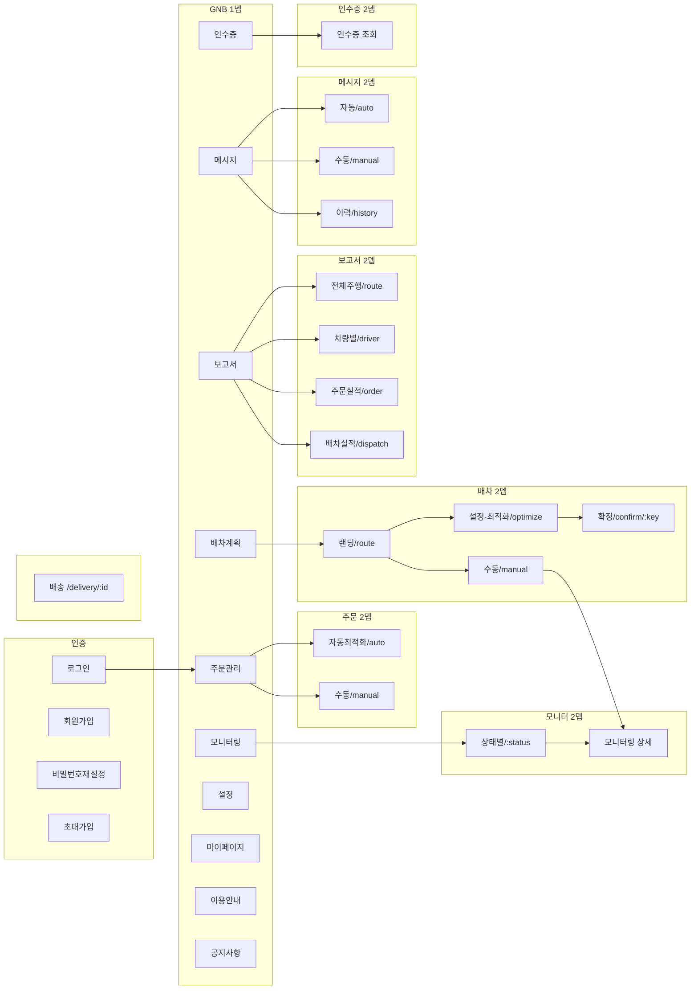

# 메뉴구조(권한)

## 1. roleId

| id  | 설명         | 비고       |
| --- | ------------ | ---------- |
| 1   | ADMIN        | 관리자     |
| 2   | MANAGER      | 매니저     |
| 3   | 기사         |            |
| 4   | investigator | -          |
| 5   | SALES        | 영업매니저 |

## 2. pricingId

| id  | 상품명              | 노출여부 | 비고                                                                     |
| --- | ------------------- | -------- | ------------------------------------------------------------------------ |
| 1   | Free                | O        | 무료 한도 등 추가 제한                                                   |
| 2   | 수동 배차 전용 플랜 | X        | 설정 리소스 관리에서 권역 관리 메뉴 비노출                               |
| 5   | Lite                | O        | 배차 계획 등에서 플랜명·쿼타 표시                                        |
| 6   | Standard            | O        | 팀 추가 불가 (Pro/Custom만 가능). 보고서/정산은 위 GNB 로직상 사용 가능. |
| 7   | Pro                 | O        | 팀 추가 가능. 보고서 사용 가능, 정산은 전체 비활성.                      |
| 8   | Custom              | O        | 팀 추가 가능. 요금제 변경은 “별도 문의”로만 가능.                        |
| 13  | Starter             | O        | Free 와 Lite 사이                                                        |
| 14  | 특수 티어           | X        | Custom 연간 등으로 추정, 코드에 이름 없음                                |

## 3. 추가 서비스 (백오피스에서 관리)

| id  | 서비스명                | 비고                                                                                                                                                                      |
| --- | ----------------------- | ------------------------------------------------------------------------------------------------------------------------------------------------------------------------- |
| 1   | 메시지 관리 추가 서비스 | 메시지 관리 추가 서비스 미가입 또는 결제 제한 시 GNB 비활성·유료 안내.                                                                                                    |
| 4   | 인수증 추가 서비스      | 일반 인수증. 서비스 가입시 주문관리·배차확정 상세의 인수증 컬럼/버튼 노출 및 인수증 관리 메뉴 사용가능. (설정 LNB의 "인수증 관리" 메뉴는 항상 노출)                       |
| 6   | 통합 인수증 추가 서비스 | 통합 인수증. 가입 회사는 배차 종료 시 차량 단위 1건의 통합 인수증이 자동 발행되며, 운영자 인수증 메뉴(GNB)·외부 서명 링크 발송·서명 봉인 후 재발행 차단 흐름이 함께 노출. |

## 4. 전체 메뉴 구조

### 전체 메뉴 흐름도

### 메뉴별 요약 표

| 메뉴명                        | 경로                                               | roleId      | pricingId | 비고                                                                                                                                                               |
| ----------------------------- | -------------------------------------------------- | ----------- | --------- | ------------------------------------------------------------------------------------------------------------------------------------------------------------------ |
| 랜딩                          | /landing                                           |             |           | 비로그인 진입 페이지. roouty.com 으로 이동                                                                                                                         |
| 회원가입                      | /signup                                            |             |           | 회원가입 폼·제출 후 처리.                                                                                                                                          |
| 회원가입-초대                 | /invite/:key                                       |             |           | 초대 링크로 가입 완료.                                                                                                                                             |
| 로그인                        | /signin                                            |             |           | 아이디·비밀번호 로그인, 토큰·유저 정보 저장 후 메인 이동. 이미 로그인 시 / 로 리다이렉트.                                                                          |
| 비밀번호-재설정               | /resetpassword, /resetpassword/:key                |             |           | 이메일 입력·키로 재설정.                                                                                                                                           |
| 배송-상태(카카오톡)           | /delivery/:id                                      |             |           | 카카오톡 등 외부 링크. (카카오톡 이외에 메일 발송이 가능한지 문의필요)                                                                                             |
| 마이페이지-계정정보관리       | /mypage (탭: 정보)                                 |             |           | 개인정보 조회·수정.                                                                                                                                                |
| 마이페이지-사용량및요금제     | /mypage (탭: 구독/요금제)                          |             |           | 사용량·요금제 확인.                                                                                                                                                |
| 마이페이지-결제관리           | /mypage (탭: 결제), state.head=payment             |             |           | 결제·구독. 결제 정지/만료 시 해당 탭 포커스·안내.                                                                                                                  |
| 주문관리-자동배차             | /manage/order/auto, /manage/order/auto/:status     |             | x(2)      | 자동 배차 주문 조회, 등록, 수정, 삭제 변경.                                                                                                                        |
| 주문관리-수동배차             | /manage/order/manual, /manage/order/manual/:status |             |           | 수동 배차 주문 조회, 등록, 수정, 삭제.                                                                                                                             |
| 배차계획-자동\|다회전         | /manage/route, /manage/route/optimize              | o(1,2) x(5) |           | 자동 최적화·다회전 실행 후 확정으로 이동.                                                                                                                          |
| 배차계획-수동                 | /manage/route/manual                               | x(5)        |           | 수동 경로·엑셀·배차 요청 후 확정으로 이동.                                                                                                                         |
| 배차계획-확정                 | /manage/route/confirm/:key                         | x(5)        |           | 배차 결과 확인·수정·재계산·임시저장·배차 등록.                                                                                                                     |
| 모니터링                      | /manage/control, /manage/control/:status           | o(1,2) x(5) |           | 탭별 배차 목록(저장된 배차·주행대기·주행중·주행종료).                                                                                                              |
| 모니터링-상세                 | (행 클릭 시 동일 경로 내 상세 영역)                | o(1,2) x(5) |           | 지도·배차 상세·차량·주문·주행 현황·히스토리.                                                                                                                       |
| 보고서-주행기록               | /manage/report/route, /manage/report/route/driver  | x(5)        | x(1,13)   | 전체 주행 기록, 차량별 주행 기록, 목록·필터·엑셀 다운로드 다운로드.                                                                                                |
| 보고서-대시보드               | /manage/report/order, /manage/report/dispatch      |             |           | 주문 실적·배차 실적 대시보드. 부가 옵션 가입 회사의 슈퍼어드민·배차매니저·영업매니저 노출. 일반 권한은 메뉴 미노출 (URL 직접 입력 시 진입 가능 — 정책 보강 대상).  |
| 메세지관리-수동발송           | /manage/message/manual                             | x(5)        |           | 수동 발송(기본 진입). (메시지 관리 추가 서비스 미가입 또는 결제 제한 시 GNB 비활성·유료 안내.)                                                                     |
| 메세지관리-알림메세지자동설정 | /manage/message/auto                               | x(5)        |           | 알림 메시지 자동 설정·관리.                                                                                                                                        |
| 메세지관리-발송이력조회       | /manage/message/history                            | x(5)        |           | 발송 이력 조회.                                                                                                                                                    |
| 인수증-조회                   | /manage/receipt                                    |             |           | 운영자 인수증 목록·발행·외부 서명 링크 발송·서명 봉인 확인. 부가서비스(4 일반 또는 6 통합) 가입 시 노출, 미가입 회사 영업매니저(5) 도 메뉴 클릭 시 가입 안내 노출. |
| 공지사항                      | /notice, /notice/:id                               |             |           | 공지 목록·제목 클릭 시 상세.                                                                                                                                       |
| 이용안내                      | /faq                                               |             |           | FAQ 목록·질문 클릭 시 답변 보기.                                                                                                                                   |
| 설정-팀관리                   | /setting > 팀관리                                  | o(1)        |           | 팀 CRUD.                                                                                                                                                           |
| 설정-메니저관리               | /setting > 매니저관리                              | o(1,2)      |           | 매니저 CRUD.                                                                                                                                                       |
| 설정-영업매니저관리           | /setting > 영업매니저                              | o(1,2)      |           | 영업매니저 CRUD.                                                                                                                                                   |
| 설정-이메일관리               | /setting > 이메일관리                              | o(1,2)      |           | 이메일 설정.                                                                                                                                                       |
| 설정-차량관리                 | /setting > 차량관리                                | o(1,2)      |           | 차량 CRUD.                                                                                                                                                         |
| 설정-권역관리                 | /setting > 권역관리                                | o(1,2)      | x(2)      | 권역 CRUD.                                                                                                                                                         |
| 설정-앱관리                   | /setting > 앱관리                                  | o(1,2)      | x(1)      | 앱 설정.                                                                                                                                                           |
| 설정-납품처관리               | /setting > 납품처관리                              | o(1,2)      | x(1)      | 납품처 CRUD.                                                                                                                                                       |
| 설정-특수조건관리             | /setting > 특수조건관리                            | o(1,2)      | x(1)      | 특수조건 CRUD.                                                                                                                                                     |
| 설정-팔레트용적량관리         | /setting > 팔레트용적량관리                        | o(1,2)      |           | 팔레트용적량 CRUD.                                                                                                                                                 |
| 설정-주문분할관리             | /setting > 주문분할관리                            | o(1,2)      |           | 주문분할 CRUD.                                                                                                                                                     |
| 설정-인수증관리               | /setting > 인수증관리                              | o(1,2)      |           | 인수증 CRUD.                                                                                                                                                       |
| 설정-작업사진관리             | /setting > 작업사진관리                            | o(1,2)      |           | 작업사진 CRUD.                                                                                                                                                     |

---

## 메뉴별 상세 문서

| 메뉴명                        | 문서                                                                      |
| ----------------------------- | ------------------------------------------------------------------------- |
| 랜딩                          | [01.랜딩](./01.랜딩.md)                                                   |
| 로그인                        | [02.로그인](./02.로그인.md)                                               |
| 회원가입                      | [03.회원가입](./03.회원가입.md)                                           |
| 회원가입-초대                 | [04.회원가입-초대](./04.회원가입-초대.md)                                 |
| 비밀번호-재설정               | [05.비밀번호-재설정](./05.비밀번호-재설정.md)                             |
| 주문관리-자동배차             | [10.주문관리-자동배차](./10.주문관리-자동배차.md)                         |
| 주문관리-수동배차             | [11.주문관리-수동배차](./11.주문관리-수동배차.md)                         |
| 배차계획-자동\|다회전         | [21.배차계획-자동-다회전](./21.배차계획-자동-다회전.md)                   |
| 배차계획-수동                 | [22.배차계획-수동](./22.배차계획-수동.md)                                 |
| 배차계획-확정                 | [23.배차계획-확정](./23.배차계획-확정.md)                                 |
| 모니터링                      | [30.모니터링](./30.모니터링.md)                                           |
| 모니터링-상세                 | [31.모니터링-상세](./31.모니터링-상세.md)                                 |
| 보고서-주행기록               | [40.보고서-주행기록](./40.보고서-주행기록.md)                             |
| 보고서-대시보드               | [41.보고서-대시보드](./41.보고서-대시보드.md)                             |
| 메세지관리-수동발송           | [50.메세지관리-수동발송](./50.메세지관리-수동발송.md)                     |
| 메세지관리-알림메세지자동설정 | [51.메세지관리-알림메세지자동설정](./51.메세지관리-알림메세지자동설정.md) |
| 메세지관리-발송이력조회       | [52.메세지관리-발송이력조회](./52.메세지관리-발송이력조회.md)             |
| 인수증-조회                   | [53.인수증-조회](./53.인수증-조회.md)                                     |
| 마이페이지-계정정보관리       | [60.마이페이지-계정정보관리](./60.마이페이지-계정정보관리.md)             |
| 마이페이지-사용량및요금제     | [61.마이페이지-사용량및요금제](./61.마이페이지-사용량및요금제.md)         |
| 마이페이지-결제관리           | [62.마이페이지-결제관리](./62.마이페이지-결제관리.md)                     |
| 설정-팀관리                   | [70.설정-팀관리](./70.설정-팀관리.md)                                     |
| 설정-메니저관리               | [71.설정-메니저관리](./71.설정-메니저관리.md)                             |
| 설정-영업매니저관리           | [72.설정-영업매니저관리](./72.설정-영업매니저관리.md)                     |
| 설정-이메일관리               | [73.설정-이메일관리](./73.설정-이메일관리.md)                             |
| 설정-차량관리                 | [74.설정-차량관리](./74.설정-차량관리.md)                                 |
| 설정-권역관리                 | [75.설정-권역관리](./75.설정-권역관리.md)                                 |
| 설정-앱관리                   | [76.설정-앱관리](./76.설정-앱관리.md)                                     |
| 설정-납품처관리               | [77.설정-납품처관리](./77.설정-납품처관리.md)                             |
| 설정-특수조건관리             | [78.설정-특수조건관리](./78.설정-특수조건관리.md)                         |
| 설정-팔레트용적량관리         | [79.설정-팔레트용적량관리](./79.설정-팔레트용적량관리.md)                 |
| 설정-주문분할관리             | [80.설정-주문분할관리](./80.설정-주문분할관리.md)                         |
| 설정-인수증관리               | [81.설정-인수증관리](./81.설정-인수증관리.md)                             |
| 설정-작업사진관리             | [82.설정-작업사진관리](./82.설정-작업사진관리.md)                         |
| 공지사항                      | [84.공지사항](./84.공지사항.md)                                           |
| 이용안내                      | [85.이용안내](./85.이용안내.md)                                           |
| 배송-상태(카카오톡)           | [86.배송-상태(카카오톡)](<./86.배송-상태(카카오톡).md>)                   |
| 정산                          | [87.정산](./87.정산.md)                                                   |

---

## API

| 순서 | Method | Path                                                                                                 | 설명                                          | 트리거                         |
| ---- | ------ | ---------------------------------------------------------------------------------------------------- | --------------------------------------------- | ------------------------------ |
| 1    | GET    | [`/payment/my`](../../../interface/00.roouty/payment.md#get-paymentmy)                               | 내 결제 정보 (요금제별 메뉴 활성/비활성 제어) | GNB 마운트 시                  |
| 2    | GET    | [`/member/profile/my`](../../../interface/00.roouty/member.md#get-memberprofilemy)                   | 내 프로필                                     | GNB 마운트 시                  |
| 3    | GET    | [`/team/list`](../../../interface/00.roouty/team.md#get-teamlist)                                    | 팀 목록 (GNB 팀 전환 드롭다운)                | GNB 마운트 시                  |
| 4    | PUT    | [`/member/move/manager/:teamId`](../../../interface/00.roouty/member.md#put-membermovemanagerteamid) | 팀 전환 (현재 사용자를 다른 팀으로 이동)      | GNB 팀 드롭다운에서 팀 선택 시 |
| 5    | PUT    | [`/auth/signout`](../../../interface/00.roouty/auth.md#put-authsignout)                              | 로그아웃                                      | 프로필 드롭다운 → 로그아웃     |

> **참고**: `/company/authority`는 GNB가 아닌 로그인 프로세스에서 호출된다. GNB에서는 `payment/my`의 paymentStatus, pricingId와 `member/profile/my`의 roleId로 메뉴 접근 제어를 수행한다.
