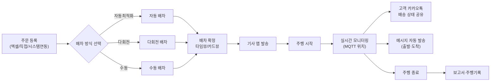
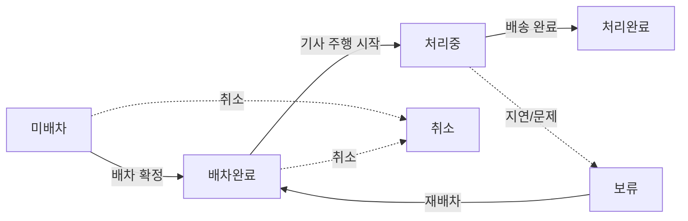
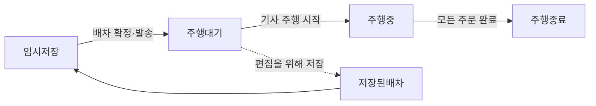

# 비즈니스

## 1. 서비스 한눈에

루티는 **물류 운영 매니저·배차 담당자가 쓰는 SaaS 형 배차 최적화 웹 플랫폼**. 주문을 등록하면 알고리즘이 차량별 최적 경로를 자동으로 짜 주고, 확정된 배차는 실시간 위치로 모니터링되며, 고객·기사에게 메시지가 자동 발송되고, 고객은 비로그인 카카오톡 링크로 자기 화물 위치를 확인. **주문 등록 → 자동/수동 배차 → 실시간 모니터링 → 메시지 발송** 까지 하나의 흐름으로 처리되는 점이 핵심.

핵심 차별 요소 두 가지:

- **배차 최적화 알고리즘** — 자동 최적화·다회전·수동 세 방식을 랜딩 화면에서 선택, 권역·균등배차·유류비·다회전 등 옵션 세트로 차량별 경로를 계산하고 타임뷰/카드뷰로 결과 비교.
- **SaaS 요금제 모델** — Free 부터 Custom 까지 6단계 기본 플랜에 가입 즉시 무료체험. 메뉴·기능·팀 수가 플랜에 따라 단계적으로 열림.

---

## 2. 사용자·역할

루티는 **역할(role) 5종 + 요금제별 추가 서비스 가입 여부** 가 결합해 메뉴 노출이 결정됨. 역할은 고정.

| 역할명     | 화면 접근 범위                                             | 주된 일                                        |
| ---------- | ---------------------------------------------------------- | ---------------------------------------------- |
| 관리자     | 전체 메뉴. 요금제 변경·결제·팀/매니저/영업매니저 전체 관리 | 최상위 결정 — 조직·요금제·결제 관리            |
| 매니저     | 주문·배차·모니터링·보고서·메시지·설정 대부분               | 일선 실무 — 배차계획·운행 모니터링·메시지 발송 |
| 영업매니저 | 주문 관리·인수증 조회 접근. 배차계획·모니터링 비노출       | 주문 등록·요청사항 반영·인수증 조회(최소 권한) |
| 기사       | 별도 웹 접근 없음. 기사 앱으로 배차 수신·주행              | 실제 배송 수행                                 |

회원가입은 두 경로: **자체 회원가입**(이메일 인증 + 사업자정보 입력 → 가입 즉시 Free 플랜 자동 적용), **초대 가입**(관리자가 매니저/영업매니저를 이메일 초대 링크로 등록 후 이메일 인증). 추가 서비스(**메시지 관리·일반 인수증·통합 인수증**)는 별도 가입·결제 상태에 따라 관련 메뉴가 활성/비활성 전환. 통합 인수증 가입 회사는 GNB **인수증** 메뉴와 자동 발행·외부 서명 링크·봉인 흐름이 함께 노출.

---

## 3. 핵심 개념 — 비즈니스 엔티티

### 주문

화주·고객으로부터 발생한 **개별 배송 의뢰**. 배송지(인수자) 한 곳을 기본으로, 우선순위(높/중/낮)·용적량 1·2·3 다중 단위·특수조건·요청사항·담당 차량 등을 담음. 등록 즉시 배차 대상이 되며, 자동배차용·수동배차용 두 탭이 별도로 존재해 처리 흐름이 갈림.

### 배차 / 경로

**1대 차량의 하루치 작업 경로**. 주문 여러 건을 시간 순으로 묶은 묶음으로, 경로명·주행 일자·시작/종료 시각을 가짐. 시각은 자정 넘김(익일 06:00) 까지 표현 가능(00:00 ~ 35:59).

### 차량 운영유형 5종

| 유형     | 의미                                                |
| -------- | --------------------------------------------------- |
| 고정차   | 자사 보유·자사 운영의 정규 차량                     |
| 지입차   | 자사에 등록되어 있으나 차주가 별도 소유한 운영 차량 |
| 고정용차 | 특정 업체가 정기적으로 운영하는 임차 차량           |
| 자가배송 | 화주사가 직접 배송 수행                             |
| 용차     | 일회성 외부 차량                                    |

차량마다 근무시간·휴게시간·출발/도착지·용적량 1~3·특수조건·배송가능요일을 입력해 배차 최적화 조건의 입력값이 됨. 다회전 가능 차량은 별도로 회전 수·회전 작업시간을 설정.

### 기사

차량을 운전하는 실제 사람. 차량 1대에 1명. 매니저가 [설치 문자 발송] 으로 기사 앱 다운로드 링크를 SMS 로 전송.

### 납품처

배송지 마스터 데이터. 인수자·화주사·중개사·예상작업시간·특수조건·담당차량·제외차량·희망시간(이전/이후)·배송가능요일·하위구분·비고 1~5 까지 풍부한 필드. 주소 검색 외에 **좌표 직접 수정** 가능. 팔레트 용적량 그룹에 묶여 있으면 삭제 제한.

### 권역

지도 위의 **행정구역 묶음**. 권역 한 개에 담당 차량을 배정하면 배차 최적화 시 그 차량은 권역 안의 주문만 받음(권역 옵션에 따라 유연 적용 가능). TopoJSON 기반 행정구역 지도에서 시·군·구를 직접 클릭해 그림.

### 매니저 / 영업매니저 / 팀

매니저는 배차·모니터링 등 운영 담당, 영업매니저는 주문 등록 중심. 둘 다 팀에 소속. 팀은 조직 내 운영 단위로, **Pro/Custom 요금제에서만 다중 팀** 가능. Free/Starter/Lite/Standard 는 단일 팀.

### 요금제

루티의 SaaS 구독 단위. 기본 6단계(Free·Lite·Starter·Standard·Pro·Custom) 와 추가 서비스(메시지 관리·일반 인수증·통합 인수증) 가 별도 가입·결제. 플랜에 따라 GNB 메뉴·기능·팀 수가 달라짐.

| 요금제   | 핵심 차이                                                |
| -------- | -------------------------------------------------------- |
| Free     | 무료 한도 제한. 앱 관리·납품처 관리 일부 업그레이드 안내 |
| Lite     | 쿼타 표시. 다중 팀 불가                                  |
| Starter  | Free 와 Lite 사이 위치                                   |
| Standard | 보고서 미사용 한정                                       |
| Pro      | 보고서 사용 가능. 다중 팀 가능. 정산은 비활성            |
| Custom   | 다중 팀 가능. 요금제 변경은 "별도 문의"만                |

### 인수증

배송 완료 증빙 서류. 화주사 단위로 주소·연락처·템플릿을 등록해 두면 배차에 자동 첨부. **첨부 파일 최대 10개, 각 5MB** (SVG/JPG/JPEG/WEBP/HEIF/HEIC/PNG). 인수증 관리는 별도 추가 서비스 가입이 필요 — 일반 인수증 가입 회사는 주문 단위 발행, 통합 인수증 가입 회사는 배차 종료 시 차량 단위 1건이 자동 발행.

운영자 인수증 흐름은 GNB **인수증 조회** 메뉴에서 처리. 목록에서 미발행 건을 골라 운영자가 직접 발행하거나, 외부 서명 링크를 인수자에게 발송해 비로그인으로 서명을 받음. 서명 완료 건은 **봉인 완료** 상태로 잠겨 재발행·재서명 불가.

### 수량 조절 사유 마스터

기사가 작업 완료 보고(PoD) 시점에 실제 인수 수량이 주문 수량과 다른 경우 선택하는 사유 목록. 운영자가 사유 마스터를 사전 등록해 두면 기사 앱에서 드롭다운으로 노출.

### 주문·배차 실적 대시보드

운영자가 일·주 단위 운영 결과를 한눈에 확인할 수 있는 보고서 2종 — **주문 실적** (총 주문·완료·수량 변경·보류·완료 처리율, 수량 변경 사유 분포, 일/주별 추이, 팀별 상세 표) 과 **배차 실적** (운영 차량·배차 수·평균 적재율, 운영 유형별 차량 분포, 일/주별 추이). 데이터는 매일 0시 자동 집계되어 어제까지 누적된 결과를 노출. 부가 옵션 가입 회사의 슈퍼어드민·배차매니저·영업매니저 권한에 GNB 메뉴 노출.

### 팔레트 용적량 / 주문 분할

루티의 배차 최적화에서 사용하는 **용적 계산 규칙 세트**. 팔레트 용적량은 납품처 그룹별로 용적량 1~3 의 배분 비율을 정의하고, 주문 분할은 차량 용적 한계에 맞춰 주문을 자동/수동으로 쪼개는 규칙(팔레트 규칙·수량·아이템·납품처유형 기준).

### 특수조건

차량과 주문에 부여하는 **태그**. 차량의 특수조건이 주문의 특수조건을 모두 만족해야 배차 가능. 팀별로 자유 정의.

---

## 4. 주요 업무 흐름

### 일반 흐름 — 주문 한 건이 카카오톡 공유까지 가는 길

| 단계        | 책임자                 | 다음 단계 트리거                                                                                                      |
| ----------- | ---------------------- | --------------------------------------------------------------------------------------------------------------------- |
| 주문 등록   | 영업매니저 또는 매니저 | 엑셀 업로드, 붙여넣기, [주문 등록] 단건 입력, 시스템 연동 자동 수신                                                   |
| 배차 방식   | 매니저                 | 배차계획 랜딩에서 자동최적화·다회전·수동 중 선택                                                                      |
| 배차 확정   | 매니저                 | 확정 화면에서 [확정] — 임시저장 → 주행대기 전이. 기사 앱으로 배차 발송                                                |
| 주행 시작   | 기사 또는 자동         | 기사 앱에서 [주행 시작] 또는 스마트주행 자동 시작                                                                     |
| 모니터링    | 매니저                 | 모니터링 상세 자동 재호출(주행대기 5분/주행중 1분) — 다중 선택 일괄 액션 가능                                         |
| 자동 메시지 | 시스템                 | 설정시 4단계 카카오 알림톡 자동 발송. 고객 알림톡에는 비로그인 배송 상태 페이지 링크 포함 — 지도·타임라인 실시간 확인 |
| 주행 종료   | 기사 또는 자동         | 마지막 주문 처리완료 또는 차고지 진입 시 자동 종료                                                                    |
| 보고서      | 매니저                 | 주행 종료 후 보고서·주행기록 화면에서 집계(Pro/Custom 요금제)                                                         |

### 배차 최적화 흐름

자동 최적화는 **차량 수 최소** 또는 **업무시간 최소** 기준으로 차량별 경로를 산출. 다회전은 차량 수 최소만 적용되고 픽업 주문은 제외. 자동·다회전 옵션 토글:

- 권역 — 권역 무관 / 기본 권역 / 유연한 권역
- 균등배차 — 균등 업무시간 / 균등 주문개수
- 유류비·통행료 자동 계산 여부
- 자동 분할 — 팔레트 규칙·수량·아이템·납품처유형 기준 주문 분할

확정 화면에서 **타임뷰**(드라이버별 타임라인)와 **카드뷰**(주문 카드 목록)를 전환하며 결과를 검토하고, **재계산** 시 [임의순서변경] ON 이면 주문 순서까지 재배치, OFF 면 시간·거리만 다시 계산. 결과는 복수 탭으로 나란히 비교 가능.

### 메시지 자동발송 흐름

조직 단위 자동발송 규칙을 미리 설정해 두면, 배차 진행 중 이벤트(출발·도착·픽업·처리완료 등)가 발생할 때마다 정해진 수신인 종류(고객·기사·중개사·화주사) 에게 자동 발송. 발송예외 시간(자정 포함 시 익일까지)을 두면 그 시간대에는 발송 보류.

---

## 5. 상태와 전이

### 주문 상태

- 미배차 — 신규 주문. 배차 대상.
- 배차완료 — 배차에 들어가 차량이 정해진 상태.
- 처리중 — 기사가 주행을 시작한 상태.
- 처리완료 — 모든 배송이 끝난 상태.
- 보류 — 지연 또는 문제로 잠시 정지. 재배차 가능.
- 취소 — 무효 처리.

### 배차 주행 상태

- 임시저장 — 확정 전. 기사 앱에 미발송.
- 주행대기 — 확정·기사 앱 발송 완료. 기사가 시작하기 전.
- 주행중 — 기사가 주행을 시작한 상태.
- 주행종료 — 운행 완료.
- 저장된배차 — 재편집을 위해 보관된 상태.

모니터링 상세 자동 재호출은 주행대기 **5분**, 주행중 **1분** 주기.

---

## 6. 단위·계량

| 항목                         | 단위·범위                                    | 비고                                                              |
| ---------------------------- | -------------------------------------------- | ----------------------------------------------------------------- |
| 차량 운영유형                | 고정차 · 지입차 · 고정용차 · 자가배송 · 용차 | 5종 분류                                                          |
| 차량 연락처                  | 10~13자 숫자                                 |                                                                   |
| 주문 우선순위                | 높음 · 중간 · 낮음                           | 자동 최적화 시 정렬 가중치                                        |
| 용적량 단위                  | 1·2·3 다중 단위. 소수점 3자리                | 팀별 자유 정의. 팔레트 규칙으로 그룹 적용                         |
| 시간 범위 표현               | 00:00 ~ 35:59                                | 익일 06:00까지 자정 넘김 표현                                     |
| 모니터링 상세 자동 재호출    | 주행대기 5분 · 주행중 1분                    | 주행종료·저장된배차는 재호출 없음. MQTT 실시간 위치 수신과는 별개 |
| MQTT 위치 갱신               | 약 10초                                      | 실시간 위치 구독                                                  |
| 인수증 첨부                  | 파일 최대 10개 · 각 5MB                      | SVG/JPG/JPEG/WEBP/HEIF/HEIC/PNG                                   |
| 파일 일괄 업로드 총량        | 100MB                                        |                                                                   |
| 메시지 제목                  | 40자                                         |                                                                   |
| 메시지 내용                  | 90자 초과 시 LMS 전환                        | 단문/장문 자동 구분                                               |
| 메시지 예약 발송             | 현재 + 최소 10분 이후                        |                                                                   |
| 메시지 수신인 종류           | 고객 · 기사 · 중개사 · 화주사                |                                                                   |
| 결제담당자 인증              | 인증번호 발송 180초 타이머                   |                                                                   |
| 사업자등록번호               | 3-2-5 자(10자리)                             |                                                                   |
| 인수자/결제담당자 이름       | 2~20자                                       |                                                                   |
| 팀명/납품처명                | 20~30자 이내                                 |                                                                   |
| 권역명                       | 20자 이내                                    |                                                                   |
| 다중 팀 가능                 | Pro · Custom 만                              | Free/Starter/Lite/Standard 는 단일 팀                             |
| 보고서 접근 가능             | Pro · Custom                                 | Standard 이하 비활성                                              |
| 카카오톡 배송 링크 자동 갱신 | 10초                                         |                                                                   |

---

## 7. 외부 연동·생태계

| 외부 시스템                | 연동 방식                                                                                 | 사용처                  |
| -------------------------- | ----------------------------------------------------------------------------------------- | ----------------------- |
| MQTT 실시간 위치           | 로케이션 서버에서 차량 GPS 좌표를 약 10초마다 구독해 모니터링 지도에 표시                 | 모니터링·모니터링 상세  |
| 카카오톡 배송 상태 링크    | `/delivery/:id` 비로그인 URL 을 고객 카카오톡으로 발송 — 지도·타임라인을 10초마다 갱신    | 고객 발송용 외부 진입점 |
| 외부 검수(KT 등)           | 작업사진 검수 시스템과 연동 — 확정 화면 [검수요청] 버튼, 모니터링 검수 상태 컬럼          | 배차 확정·모니터링      |
| 시스템 연동 주문 수신      | 외부 WMS/ERP 등에서 주문 자동 수신 — 매니저가 확인 후 [미배차 주문 생성] 으로 배차 대상화 | 주문관리                |
| 카카오 알림톡(메시지 자동) | 자동발송 규칙의 단일 채널                                                                 | 메시지 자동발송 설정    |
| 인수증 외부 서명 링크      | 인수자에게 비로그인 URL 을 발송해 모바일 서명을 받는 경로 — 서명 완료 시 봉인 상태로 잠금 | 인수증 조회             |
| 기사 앱 설치 문자          | 차량 등록 시 [설치문자 발송] 으로 기사에게 SMS 전송                                       | 차량 관리               |
| 엑셀                       | 주문 일괄 등록·차량 등록·납품처·발송 이력 등 거의 모든 목록에서 업로드/다운로드 지원      | 주문관리·설정 전반      |
| 결제(요금제)               | 결제수단 등록·결제 내역 명세서 PDF 다운로드                                               | 마이페이지 결제관리     |

---

## 8. 가나다순 용어 사전

| 용어                | 정의                                                                                                                | 어디서 보이는지                          | 비슷한 표현             |
| ------------------- | ------------------------------------------------------------------------------------------------------------------- | ---------------------------------------- | ----------------------- |
| 강제 주행종료       | 모니터링에서 다중 선택한 배차를 즉시 종료 상태로 변경하는 액션                                                      | 30.모니터링                              |                         |
| 검수 요청           | 작업사진을 KT 등 외부 검수 시스템에 보내는 액션. 확정 화면에서 노출                                                 | 23.배차계획-확정·30.모니터링             |                         |
| 결제담당자          | 요금제 결제 시 인증을 받는 담당자. 이름·휴대폰·이메일 등록 필수                                                     | 62.마이페이지-결제관리                   |                         |
| 경로                | 1대 차량의 하루치 작업 묶음. 주문 여러 건의 시간 순 묶음                                                            | 배차계획·모니터링                        | 배차의 다른 표현        |
| 경로명              | 배차에 붙는 이름                                                                                                    | 배차계획                                 | 주행이름·배차명         |
| 고객                | 배송을 받는 최종 인수자                                                                                             | 주문관리·메시지                          | 인수자                  |
| 고정용차            | 특정 업체가 정기적으로 운영하는 임차 차량 운영유형                                                                  | 74.설정-차량관리                         |                         |
| 고정차              | 자사 보유·자사 운영의 정규 차량 운영유형                                                                            | 74.설정-차량관리                         |                         |
| 공지사항            | 서비스 내 공지 노출 화면                                                                                            | GNB                                      |                         |
| 관리자              | 전체 메뉴 편집 가능한 최상위 권한 등급                                                                              | 71.설정-매니저관리                       | ADMIN                   |
| 권역                | 시·군·구 등 행정구역 묶음. 담당 차량 배정으로 배차 범위 제한                                                        | 75.설정-권역관리                         |                         |
| 권역 무관           | 자동 배차 시 차량 담당 권역을 무시하고 전 권역 주문을 묶는 옵션                                                     | 21.배차계획-자동-다회전 옵션             | 기본 권역·유연한 권역   |
| 균등배차            | 자동 최적화에서 차량 간 업무량을 고르게 분배하는 옵션 (균등 업무시간 / 균등 주문개수)                               | 21.배차계획-자동-다회전 옵션             |                         |
| 기간 유형           | 주문·배차 검색의 날짜 기준 선택 (작업희망일·작업완료일·주행일자 3종)                                                | 10·11.주문관리 검색바                    |                         |
| 기본 권역           | 차량 담당 권역 내 주문만 묶는 자동 배차 옵션                                                                        | 21.배차계획-자동-다회전 옵션             | 권역 무관·유연한 권역   |
| 기사                | 차량을 운전하는 실제 사람. 차량 1대에 1명                                                                           | 74.설정-차량관리·30.모니터링             | 드라이버                |
| 기사 앱             | 기사가 사용하는 모바일 앱. 배차 수신·주행 처리·PoD 작성                                                             | 차량관리에서 설치문자 발송               | 루티앱                  |
| 납품처              | 배송지 마스터 데이터. 인수자·화주사·중개사·특수조건·담당차량 등 풍부한 필드                                         | 77.설정-납품처관리                       |                         |
| 다음결제금액        | 현재 요금제 기준 다음 정기 결제 시 청구 예정 금액                                                                   | 61.마이페이지-사용량및요금제             |                         |
| 다음결제예정일      | 다음 정기 결제가 일어나는 날짜                                                                                      | 61.마이페이지·62.마이페이지-결제관리     |                         |
| 다회전              | 한 차량이 하루에 여러 경로를 연속 수행하는 배차 방식                                                                | 20.배차계획-랜딩·21.배차계획-자동-다회전 |                         |
| 다회전 가능 차량    | 다회전 배차 후보 차량 (차량관리에서 회전 작업 시간이 설정된 차량)                                                   | 21.배차계획-자동-다회전                  |                         |
| 담당 권역           | 차량에 배정된 영업 지역                                                                                             | 74.설정-차량관리·75.설정-권역관리        |                         |
| 담당 차량           | 납품처에 사전 배정해 두면 배차 시 우선 적용되는 차량                                                                | 77.설정-납품처관리                       |                         |
| 드라이버            | 기사와 같은 의미                                                                                                    | 30.모니터링·23.배차계획-확정 타임뷰      | 기사                    |
| 드로어              | 화면 우측에서 슬라이드로 열리는 상세·편집 패널                                                                      | 75.권역관리·77.납품처관리 등 다수        | 상세 패널·사이드 패널   |
| 매니저              | 배차·모니터링 담당 권한 등급                                                                                        | 71.설정-매니저관리                       | MANAGER                 |
| 메시지              | 고객·기사·중개사·화주사에게 보내는 문자·카카오톡                                                                    | 50·51·52.메시지관리                      |                         |
| 명세서              | 결제 내역의 부가세 포함 청구서 PDF                                                                                  | 62.마이페이지-결제관리                   | 요금명세서              |
| 모니터링 상세       | 한 배차의 지도·도넛차트·실시간안내·주문·차량 테이블을 한 화면에서 보는 페이지                                       | 31.모니터링-상세                         |                         |
| 무료 한도           | Free 플랜의 월 사용량 제한                                                                                          | 61.마이페이지-사용량및요금제             |                         |
| 미배차              | 신규 주문 상태. 배차 대상                                                                                           | 10·11.주문관리                           |                         |
| 발송예외 시간       | 메시지 자동발송에서 발송을 미루는 시간대 — 자정 포함 시 익일 적용                                                   | 51.메세지관리-알림메세지자동설정         |                         |
| 발송이력            | 자동발송·수동(예약)발송·발송제외 3탭의 메시지 발송 기록                                                             | 52.메세지관리-발송이력조회               |                         |
| 발송제외            | 발송예외 시간 또는 정책으로 발송되지 않은 메시지 묶음 (발송이력의 한 탭)                                            | 52.메세지관리-발송이력조회 탭            |                         |
| 배송 가능 요일      | 납품처별로 배송 가능한 요일                                                                                         | 77.납품처관리·74.차량관리                |                         |
| 배송 상태           | 카카오톡 배송 링크 진입 시 노출되는 외부 화면 (진행률·타임라인)                                                     | 86.배송-상태(카카오톡)                   | 카카오톡 배송 링크 화면 |
| 배송 첨부 서류      | 주문에 첨부하는 인수증·증빙 파일 묶음                                                                               | 10·11.주문관리 추가 시                   |                         |
| 배차 기준           | 자동 최적화의 입력 옵션 묶음 (권역·우선순위·다회전·픽업·유류비 등)                                                  | 21.배차계획-자동-다회전                  |                         |
| 배차 담당자         | 한 배차의 책임자로 표시되는 매니저. 메시지 발송·운영 책임 단위                                                      | 30.모니터링·50.메시지                    |                         |
| 배차 우선순위       | 주문에 매기는 높음·중간·낮음                                                                                        | 10·11.주문관리                           |                         |
| 배차 확정           | 임시저장된 배차를 기사 앱에 발송하고 주행대기 상태로 전환하는 액션                                                  | 23.배차계획-확정                         |                         |
| 배차계획            | 자동최적화·다회전·수동 세 방식으로 주문을 차량에 묶는 작업                                                          | GNB 배차계획                             |                         |
| 보고서              | 주행 완료된 배차·차량의 통계 화면. Pro/Custom 요금제에서만 사용                                                     | GNB 보고서                               |                         |
| 보류                | 지연·문제로 주문을 잠시 멈춘 상태. 재배차 가능                                                                      | 10·11.주문관리                           |                         |
| 봉인 완료           | 인수자 서명이 완료된 인수증의 잠금 상태. 재발행·재서명 불가                                                         | 55.인수증-조회                           |                         |
| 보류 사유           | 주문을 보류 상태로 전환할 때 입력하는 텍스트 사유                                                                   | 10·11.주문관리 보류 모달                 |                         |
| 분할 비율           | 주문 분할 시 그룹별 용적 분배 비율                                                                                  | 80.설정-주문분할관리                     |                         |
| 분할 조건           | 자동 주문 분할의 규칙 (수량·팔레트·아이템·납품처유형 4종)                                                           | 80.설정-주문분할관리                     |                         |
| 사업자 정보         | 회원가입 시 입력하는 회사명·사업자번호·산업분야                                                                     | 03.회원가입                              |                         |
| 사용량              | 기간별 총 도착지 수·라우트 수. 팀별로도 조회                                                                        | 61.마이페이지-사용량및요금제             |                         |
| 사진 필수 여부      | 작업사진관리에서 팀별로 PoD 사진 첨부를 필수로 두는 토글                                                            | 82.설정-작업사진관리                     |                         |
| 산업분야            | 회원가입 시 선택하는 업종 구분                                                                                      | 03.회원가입                              |                         |
| 설치문자            | 차량 등록 시 기사에게 보내는 기사 앱 다운로드 안내 SMS                                                              | 74.설정-차량관리                         |                         |
| 수동 배차           | 엑셀·경로를 수동 입력해 배차하는 방식                                                                               | 22.배차계획-수동                         |                         |
| 수동(예약)발송      | 수동 입력 또는 예약 등록된 메시지 발송 묶음 (발송이력의 한 탭)                                                      | 52.메세지관리-발송이력조회 탭            |                         |
| 수량 조절 사유      | 기사가 작업 완료 보고 시 실제 인수 수량이 주문 수량과 다를 때 선택하는 사유. 운영자가 마스터로 사전 등록            | 10·11.주문관리 작업 완료 상세            |                         |
| 수신인 종류         | 메시지 자동발송 대상 — 고객·기사·중개사·화주사                                                                      | 51.메세지관리-알림메세지자동설정         |                         |
| 스마트 주행         | 기사 앱의 4동작 묶음 (자동 출발·자동 도착·자동 주행 시작·자동 주행 종료). 76.설정-앱관리에서 팀별 토글              | 76.설정-앱관리                           |                         |
| 시·도·시군구·읍면동 | 권역관리에서 묶음의 단위가 되는 행정 단위 3계층                                                                     | 75.설정-권역관리                         | 행정구역                |
| 시스템 연동 주문    | 외부 WMS·ERP 등에서 자동으로 들어온 주문. 매니저가 확인 후 배차 대상으로 확정                                       | 10·11.주문관리                           |                         |
| 실시간 안내         | 출발·도착·픽업 등 이벤트를 시간 순으로 표시하는 패널                                                                | 31.모니터링-상세                         |                         |
| 실제 용적량         | 기사가 작업 완료 시 보고한 실측 적재량                                                                              | 10·11.주문관리·40.보고서-주행기록        |                         |
| 업체유형            | 납품처 분류 (할인점·할인점 물류센터·SSM·CVS·대리점·온라인·직거래·기타 8종)                                          | 77.설정-납품처관리                       |                         |
| 연료                | 차량의 사용 연료 종류 (없음·경유·휘발유·LPG·전기). 유류비 자동 계산용                                               | 74.설정-차량관리                         |                         |
| 연비                | 차량 km당 연료 소비량. 유류비 자동 계산용                                                                           | 74.설정-차량관리                         |                         |
| 영업 특기사항       | 영업매니저 전용 메모. 주문 상세의 별도 탭에 노출                                                                    | 10·11.주문관리 상세                      |                         |
| 영업매니저          | 주문 등록·인수증 조회 접근 가능한 최소 권한 등급                                                                    | 72.설정-영업매니저관리                   | SALES                   |
| 완료 보고           | 기사 앱에서 작성하는 PoD 묶음 (사진·서명·실수량·완료 사유). 매니저용은 작업 완료 상세에서 조회                      | 10·11.주문관리·기사 앱                   |                         |
| 외부 서명 링크      | 인수자에게 비로그인 URL 로 발송해 모바일에서 직접 서명을 받는 인수증 서명 경로                                      | 55.인수증-조회                           | 링크 서명               |
| 요금제              | 루티의 SaaS 구독 단위. Free·Lite·Starter·Standard·Pro·Custom 6단계                                                  | 61.마이페이지-사용량및요금제             |                         |
| 용적량 1·2·3        | 차량·주문에 매기는 부피·무게 단위. 팀별 자유 정의 가능                                                              | 74.차량관리·10·11.주문관리               |                         |
| 용적량 차이 사유    | 예상 용적량과 실제 용적량이 다를 때 기사가 입력하는 사유                                                            | 10·11.주문관리 작업 완료 상세            |                         |
| 용차                | 차량 등록 없이 일회성으로 사용하는 외부 차량                                                                        | 74.설정-차량관리                         |                         |
| 우선 처리           | 우선순위 높음 주문을 자동 최적화에서 먼저 배차하는 동작                                                             | 21.배차계획-자동-다회전 옵션             |                         |
| 운영유형            | 차량의 소속·운영 형태 5종 분류 — 고정차·지입차·고정용차·자가배송·용차                                               | 74.설정-차량관리                         | 운행 유형               |
| 유류비·통행료       | 보고서·배차의 비용 측정 항목 (자동 계산 또는 사용자 입력)                                                           | 21.배차계획·40.보고서                    |                         |
| 유연한 권역         | 차량 담당 권역 외 주문도 가용 시 일부 배차 허용 옵션                                                                | 21.배차계획-자동-다회전 옵션             | 권역 무관·기본 권역     |
| 인수자              | 배송을 실제로 받는 사람                                                                                             | 10·11.주문관리·77.납품처관리             | 고객                    |
| 인수증              | 배송 완료 증빙 서류. 화주사 정보·템플릿·첨부 사진(10개·5MB)                                                         | 81.설정-인수증관리·55.인수증-조회        | PoD                     |
| 인수증 조회         | 운영자용 인수증 목록·발행·외부 서명 링크 발송 화면. 부가서비스(일반 또는 통합) 가입 회사만 노출                     | 55.인수증-조회                           |                         |
| 인증번호            | 결제 담당자 인증·이메일 인증 시 발송되는 SMS 6자리 코드 (180초 유효)                                                | 61.마이페이지·62.마이페이지-결제관리     |                         |
| 임시저장            | 배차계획 확정 전 단계 — 기사 앱 미발송                                                                              | 23.배차계획-확정·30.모니터링             |                         |
| 임의 순서 변경      | 기사가 매니저 지정 주문 순서를 변경할 수 있게 허용하는 앱관리 토글                                                  | 76.설정-앱관리                           |                         |
| 자가배송            | 화주사가 직접 배송 수행하는 차량 운영유형                                                                           | 74.설정-차량관리                         |                         |
| 자동 배차           | 알고리즘이 차량별 최적 경로를 자동 계산하는 방식                                                                    | 20.배차계획-랜딩·21.배차계획-자동-다회전 | 자동최적화              |
| 작업 상태           | 모니터링 상세의 주문 상태 (작업대기·처리중·처리완료 / 지연·지연 예상 등 ETA 단계 포함)                              | 31.모니터링-상세                         |                         |
| 작업사진관리        | 팀별 완료보고·PoD 필수 여부 토글                                                                                    | 82.설정-작업사진관리                     |                         |
| 저장된배차          | 편집을 위해 보관된 상태의 배차                                                                                      | 30.모니터링                              |                         |
| 정산                | GNB 메뉴는 있으나 클릭 시 프리미엄 모달만 — 실질 미구현                                                             | GNB                                      |                         |
| 제외 차량           | 납품처에 대해 배차 시 사용을 막을 차량                                                                              | 77.설정-납품처관리                       |                         |
| 좌표 변경           | 납품처의 GPS 좌표를 운영자가 수동 보정한 기록                                                                       | 77.설정-납품처관리                       |                         |
| 주문                | 화주·고객에게서 발생한 개별 배송 의뢰                                                                               | 10·11.주문관리                           |                         |
| 주문 분할           | 차량 용적 한계에 맞춰 한 주문을 여러 건으로 쪼개는 기능. 자동(팔레트·수량·아이템·납품처유형) 또는 수동(아이템 이동) | 80.설정-주문분할관리                     |                         |
| 주행기록            | 보고서 메뉴의 주행 완료 배차 통계 화면                                                                              | 40.보고서-주행기록                       |                         |
| 주행대기            | 배차가 확정·발송됐고 기사 주행 시작 전 단계                                                                         | 30.모니터링                              |                         |
| 주행중              | 기사가 주행을 시작한 단계                                                                                           | 30.모니터링                              |                         |
| 주행종료            | 배차의 모든 주문이 끝난 단계                                                                                        | 30.모니터링                              |                         |
| 중개사              | 화주와 운영사를 잇는 중간 업체. 메시지 수신인 종류 중 하나                                                          | 77.납품처관리·메시지                     |                         |
| 지연 상태           | 모니터링 상세 ETA 기반의 배차 진행 상태 필터 (전체·지연·지연 예상 3단계)                                            | 31.모니터링-상세 필터                    |                         |
| 지입차              | 자사에 등록되어 있으나 차주가 별도 소유한 운영 차량                                                                 | 74.설정-차량관리                         |                         |
| 차고지              | 차량의 출발·도착 기준 주소                                                                                          | 74.설정-차량관리                         |                         |
| 차량                | 자사 등록된 가동 자원. 운영유형 5종 중 하나로 분류                                                                  | 74.설정-차량관리                         |                         |
| 차량 주문 검수      | 76.설정-앱관리 토글. 켜진 팀의 기사는 배차 확정 전 주문 순서·내용을 사전 점검·검수 처리                             | 76.설정-앱관리 / 기사 앱                 |                         |
| 처리완료            | 배송이 모두 끝난 주문 상태                                                                                          | 10·11.주문관리                           |                         |
| 처리중              | 기사가 주행을 시작해 배송 중인 주문 상태                                                                            | 10·11.주문관리                           |                         |
| 초대                | 매니저·영업매니저를 이메일 초대 링크로 등록하는 가입 경로                                                           | 04.회원가입-초대                         |                         |
| 추가 서비스         | 기본 요금제와 별도로 가입·결제하는 부가 기능. 메시지 관리(1)·일반 인수증(4)·통합 인수증(6)                          | 61.마이페이지-사용량및요금제             |                         |
| 추정 결제 금액      | 다운그레이드·업그레이드 변경 시 사전 계산되는 결제 금액                                                             | 61.마이페이지-사용량및요금제             |                         |
| 카드뷰              | 배차 확정 화면에서 주문을 카드 형태로 보는 뷰                                                                       | 23.배차계획-확정                         |                         |
| 카카오 알림톡       | 카카오 비즈 채널을 통해 발송되는 자동·수동 메시지                                                                   | 50·51·52.메시지관리                      |                         |
| 카카오톡 배송 링크  | 비로그인 고객이 자기 화물의 위치·타임라인을 보는 외부 진입 URL                                                      | 86.배송-상태(카카오톡)                   | 배송 상태 공유          |
| 쿼타                | 요금제별 월 사용량 한도 (Lite 등에서 표시)                                                                          | 61.마이페이지·배차계획                   |                         |
| 타임뷰              | 배차 확정 화면에서 드라이버별 타임라인으로 보는 뷰                                                                  | 23.배차계획-확정                         |                         |
| 통합 인수증         | 배차 종료 시 차량 단위 1건이 자동 발행되는 인수증. 가입 회사에 한해 노출되며 서명 완료 후 봉인                      | 55.인수증-조회                           |                         |
| 특수조건            | 차량과 주문에 부여하는 태그. 차량의 특수조건이 주문의 특수조건을 모두 만족해야 배차 가능. 팀별 자유 정의            | 78.설정-특수조건관리                     | 스킬                    |
| 팀                  | 조직 내 운영 단위. Pro/Custom 만 다중 팀 가능                                                                       | 70.설정-팀관리                           |                         |
| 팔레트 용적량       | 납품처 그룹별 용적량 1~3 배분 비율을 정의하는 기준                                                                  | 79.설정-팔레트용적량관리                 |                         |
| 픽업                | 차량이 화물을 수거하는 동작. 다회전 배차에서 제외 대상                                                              | 21.배차계획-자동-다회전                  |                         |
| 하위구분            | 납품처를 더 세분하는 사용자 정의 분류                                                                               | 77.설정-납품처관리                       |                         |
| 합산 용적량         | 보고서 측정의 차량별 용적 합산값 (용적량 1·2·3 각각)                                                                | 40.보고서-주행기록                       |                         |
| 행정구역            | 권역에 묶는 단위 (시·도·시군구·읍면동 3계층을 합쳐 부르는 용어)                                                     | 75.설정-권역관리                         | 시·도·시군구·읍면동     |
| 화주사              | 화물의 소유 회사. 인수증 발행 주체. 메시지 수신인 종류 중 하나                                                      | 77.납품처관리·81.인수증관리·메시지       |                         |
| 활성 상태           | 차량·이메일·인수증 등 사용여부 토글의 결과 (활성·비활성)                                                            | 73~82.설정 다수                          | 사용여부                |
| 회전                | 다회전 차량의 1회차·2회차 등 작업 단위                                                                              | 74.차량관리·배차계획                     | 회차                    |
| 회전 작업 시간      | 다회전 배차의 회전 간 작업 소요 시간 (차량별 기본값 설정)                                                           | 74.설정-차량관리                         |                         |
| 희망시간            | 납품처가 원하는 배송 도착 시간 범위(이전·이후)                                                                      | 77.설정-납품처관리                       |                         |
| LMS                 | 80자 초과 메시지 발송 시 자동 적용되는 외부 SMS 타입                                                                | 50.메세지관리-수동발송                   | 장문                    |
