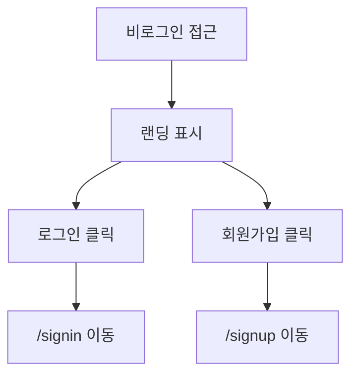

# 랜딩

## 개요

- **경로**: `/landing`
- **역할**: 비로그인 사용자 진입 페이지. 로그인·회원가입으로 유도.
- **진입 경로**: 비로그인 상태에서 보호된 경로 접근 시 `/landing`으로 리다이렉트(개발/비프로덕션). 프로덕션에서는 외부 URL(예: roouty.com)로 리다이렉트될 수 있음.
- **권한**: 비로그인 전용. 토큰 없을 때만 노출.

## ScreenShot

## Actions

- **로그인 이동**
  - **트리거**: 상단 또는 CTA [로그인] 버튼 클릭.
  - **플로우**: 클릭 → `/signin`으로 라우팅.
  - **최종 동작**: 로그인 페이지 표시.
  - **실패/예외**: (라우팅만 수행.)
- **회원가입 이동**
  - **트리거**: [회원가입] 버튼 클릭.
  - **플로우**: 클릭 → `/signup`으로 라우팅.
  - **최종 동작**: 회원가입 페이지 표시.
  - **실패/예외**: (라우팅만 수행.)

## User Flow

---

## API

Landing 컴포넌트는 순수 UI 페이지로, 백엔드 API를 호출하지 않는다. 버튼 클릭 시 `/signup`, `/signin` 등으로 클라이언트 라우팅만 수행한다.
