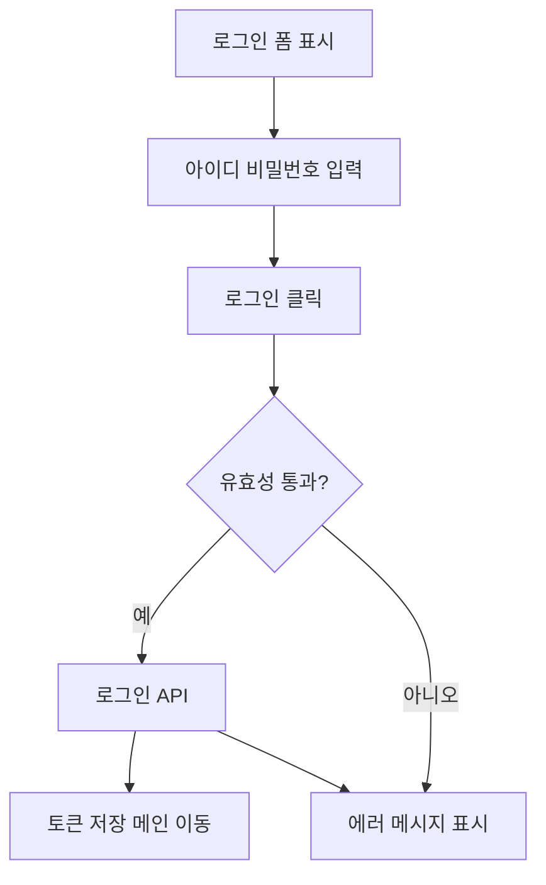

# 로그인

## 개요

- **경로**: `/signin`
- **역할**: 아이디·비밀번호 로그인. 토큰·유저 정보 저장 후 메인(주문관리)으로 이동.
- **권한**: 인증 전용. 이미 로그인(accessToken 있음) 시 `/`로 리다이렉트되어 로그인 화면 미노출.

## ScreenShot

## 구성

- 표시정보:
  - 필드: 이메일, 비밀번호, 아이디저장
  - 버튼: [로그인], [회원가입하고 루티 무료 체험하기], [비밀번호 찾기]

## Actions

- 로그인
  - [로그인] 버튼 클릭.
  - 아이디(이메일)·비밀번호 입력 → 유효성 검사 → 로그인 API 호출 → 성공 시 토큰·유저 정보·권한 저장 → 주문관리로 이동.
- 회원가입 / 비밀번호 찾기:
  - 링크 클릭 → 해당 경로 이동.

## User Flow

## ETC

- 비밀번호: 영문·숫자·지정 특수문자 중 **2종류 이상** 포함, 8~64자. (한 종류만으로 된 비밀번호는 불가.)

---

## API

| 순서 | Method | Path                                                                                 | 설명                    | 트리거                                      |
| ---- | ------ | ------------------------------------------------------------------------------------ | ----------------------- | ------------------------------------------- |
| 1    | POST   | [`/auth/signin`](../../../interface/00.roouty/auth.md#post-authsignin)               | 로그인 (JWT 발급)       | [로그인] 버튼 클릭 또는 비밀번호 필드 Enter |
| 2    | GET    | [`/member/profile/my`](../../../interface/00.roouty/member.md#get-memberprofilemy)   | 내 프로필 조회          | 로그인 성공 후 자동                         |
| 3    | GET    | [`/company/authority`](../../../interface/00.roouty/company.md#get-companyauthority) | 접근 권한/요금제 조회   | 로그인 성공 후 자동                         |
| 4    | GET    | [`/auth/tutorial`](../../../interface/00.roouty/auth.md#get-authtutorial)            | 튜토리얼 표시 여부 확인 | 로그인 성공 후 자동                         |
