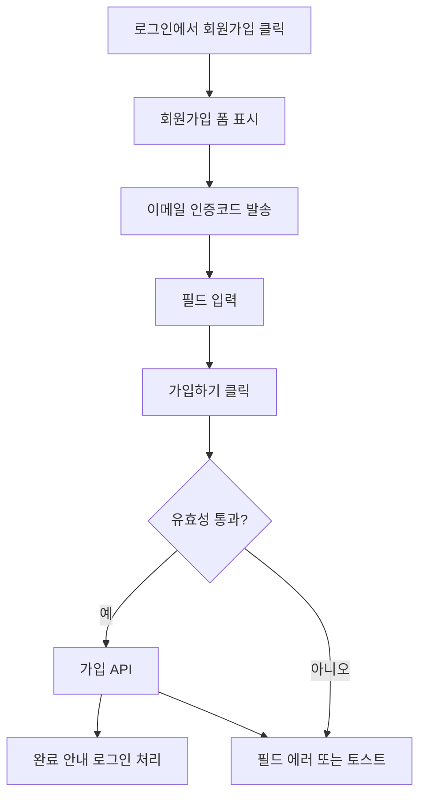

# 회원가입

## 개요

- **경로**: `/signup`
- **역할**: 신규 회원 가입.
- **권한**: 비로그인 사용자. 이미 로그인 시 주문관리로 이동.

## ScreenShot

## 구성

- 필드: 회사명, 이름, 이메일, 비밀번호 설정, 가입경로, 기타(가입경로 타입이 직접입력일 경우), 휴대폰 번호, 약관동의
- 버튼: [이메일인증코드발송], [이메일인증코드재발송], [회원가입완료], [로그인하기]

## Actions

- 가입하기
  - [회원가입완료] 클릭.
  - 필드 입력
  - 이메일 인증 코드

    
    - 발송: 재발송 시 요청 횟수 제한(3회 단위로 초과 모달 등).
    - 응답 후: 3분이내에 입력완료 처리 필요.
    - 검증: 코드 일치 시에만 다음 단계(가입 완료 버튼) 진행.

  - [회원가입 완료] 클릭 → 유효성 검사(필수·형식·비밀번호 일치·이메일 중복 등) → 가입 API 호출.
  - 성공 시 가입 완료 안내 후 로그인 처리 및 주문관리로 이동.

- 로그인하기: 링크 클릭 → `/signin` 이동.

## User Flow

## ETC

- 비밀번호: 영문·숫자·지정 특수문자 중 2종류 이상 포함, 8~64자. (한 종류만으로 된 비밀번호는 불가.)
- 가입 경로: "직접입력" 시 추가 텍스트 필수.
- 약관: 약관 동의 후에만 가입 완료 가능 (실제로는 마케팅수신동의 필드값 전송).

---

## API

| 순서 | Method | Path                                                                                                            | 설명                   | 트리거                            |
| ---- | ------ | --------------------------------------------------------------------------------------------------------------- | ---------------------- | --------------------------------- |
| 1    | GET    | [`/company/industryType/list`](../../../interface/00.roouty/company.md#get-companyindustrytypelist)             | 업종 목록 조회         | 페이지 진입 시                    |
| 2    | GET    | [`/auth/referer-code`](../../../interface/00.roouty/auth.md#get-authreferer-code)                               | 가입 경로 코드 목록    | 페이지 진입 시                    |
| 3    | GET    | [`/auth/check/account`](../../../interface/00.roouty/auth.md#get-authcheckaccount)                              | 이메일 계정 중복 확인  | 이메일 입력 후 blur/keyUp         |
| 4    | GET    | [`/company/check/name`](../../../interface/00.roouty/company.md#get-companycheckname)                           | 회사명 중복 확인       | 회사명 입력 후 blur               |
| 5    | GET    | [`/company/validate/businessNumber`](../../../interface/00.roouty/company.md#get-companyvalidatebusinessnumber) | 사업자번호 유효성 검증 | 사업자번호 입력 후                |
| 6    | GET    | [`/company/check/businessNumber`](../../../interface/00.roouty/company.md#get-companycheckbusinessnumber)       | 사업자번호 중복 확인   | 사업자번호 입력 후                |
| 7    | POST   | [`/auth/send/code`](../../../interface/00.roouty/auth.md#post-authsendcode)                                     | 이메일 인증코드 발송   | [이메일 인증 코드 발송] 버튼 클릭 |
| 8    | GET    | [`/auth/check/code`](../../../interface/00.roouty/auth.md#get-authcheckcode)                                    | 인증코드 확인          | 인증코드 모달에서 코드 입력 확인  |
| 9    | POST   | [`/auth/signup/owner`](../../../interface/00.roouty/auth.md#post-authsignupowner)                               | 회원가입 완료          | [회원가입 완료] 버튼 클릭         |
| 10   | POST   | [`/payment/trial`](../../../interface/00.roouty/payment.md#post-paymenttrial)                                   | 무료체험 결제 등록     | 회원가입 성공 후 자동             |
| 11   | POST   | [`/auth/signin`](../../../interface/00.roouty/auth.md#post-authsignin)                                          | 가입 후 자동 로그인    | 회원가입 성공 후 자동             |
| 12   | GET    | [`/member/profile/my`](../../../interface/00.roouty/member.md#get-memberprofilemy)                              | 내 프로필 조회         | 로그인 성공 후 자동               |
