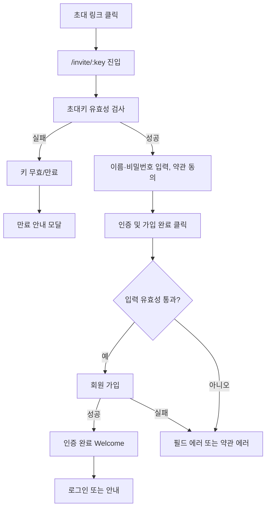

# 회원가입-초대

## 개요

- **경로**: `/invite/:key` (매니저/영업매니저 초대 시 `:key`에 초대 키 전달)
- **역할**: 매니저·영업매니저 초대 링크로 진입한 사용자가 비밀번호·이름 입력 및 약관 동의 후 가입 완료(초대 수락·계정 활성화).
- **권한**: 비로그인. 이미 로그인 시 `/`로 리다이렉트될 수 있음. 키 만료·무효 시 안내만 표시.

## ScreenShot

## 구성

- 필드: 이름, 비빌번호 설정, 전체 약관 동의, 서비스 이용 약관, 개인정보 처리 방침.
- 버튼: [인증 및 가입 완료]

## Actions

- 가입
  - [인증 및 가입 완료] 버튼 클릭.
  - 필드 입력 및 약관 동의 → api 호출
  - 성공 시 Welcome 화면
  - 로그인 처리 또는 로그인 페이지 안내.
    - [로그인] → `/signin` 이동.

## User Flow

## ETC

- key 형식: 매니저 `0dTWDtKX8N`, 영업매니저 `sales_manager_0dTWDtKX8N`
- 이름: 2~20자리
- 비밀번호: 영문/숫자/특수문자 중 2종류 이상 포함
- 서비스 이용 약관: `https://policy.roouty.io/tos`
- 개인정보처리방침: `https://policy.roouty.io/policy_privacy`

---

## API

| 순서 | Method | Path                                                                                                                  | 설명                    | 트리거                                |
| ---- | ------ | --------------------------------------------------------------------------------------------------------------------- | ----------------------- | ------------------------------------- |
| 1    | GET    | [`/member/invite/check/:invitationKey`](../../../interface/00.roouty/member.md#get-memberinvitecheckinvitationkey)    | 초대 키 유효성 확인     | 페이지 진입 시                        |
| 2    | GET    | [`/company/industryType/list`](../../../interface/00.roouty/company.md#get-companyindustrytypelist)                   | 업종 목록 조회          | 페이지 진입 시                        |
| 3    | POST   | [`/member/invite/accept/:invitationKey`](../../../interface/00.roouty/member.md#post-memberinviteacceptinvitationkey) | 초대 수락 (가입 완료)   | [인증 및 가입 완료] 버튼 클릭         |
| 4    | POST   | [`/auth/signin`](../../../interface/00.roouty/auth.md#post-authsignin)                                                | 로그인 (JWT 발급)       | Welcome 화면에서 [시작하기] 버튼 클릭 |
| 5    | GET    | [`/member/profile/my`](../../../interface/00.roouty/member.md#get-memberprofilemy)                                    | 내 프로필 조회          | 로그인 성공 후 자동                   |
| 6    | GET    | [`/company/authority`](../../../interface/00.roouty/company.md#get-companyauthority)                                  | 접근 권한/요금제 조회   | 로그인 성공 후 자동                   |
| 7    | GET    | [`/auth/tutorial`](../../../interface/00.roouty/auth.md#get-authtutorial)                                             | 튜토리얼 표시 여부 확인 | 로그인 성공 후 자동                   |
