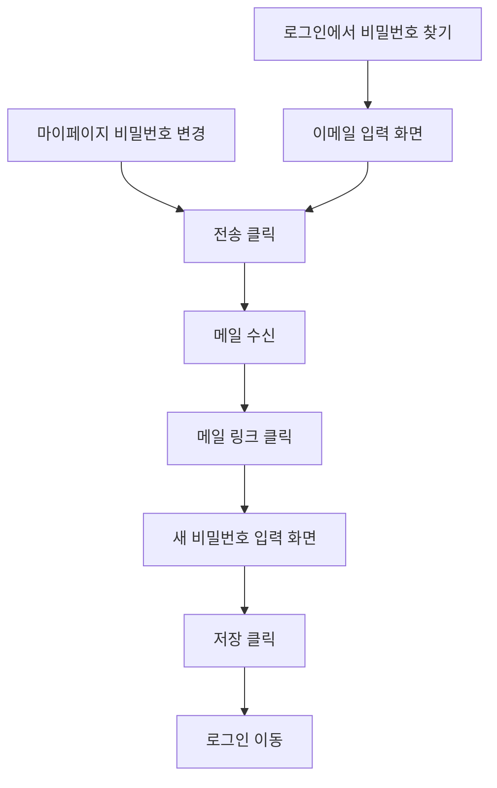

# 비밀번호-재설정

## 개요

- **경로**: `/resetpassword`(이메일 입력), `/resetpassword/:key`(새 비밀번호 입력)
- **역할**: 비밀번호 재설정
- **진입 경로**:
  - 로그인 화면 "비밀번호 찾기" 링크 → `/resetpassword`.
  - 이메일 내 링크 → `/resetpassword/:key`. 이미 로그인 시 메인 리다이렉트될 수 있음.

## ScreenShot

### 메일 보내기(1단계/비로그인시)

### 새 비밀번호 저장(2단계)

### 비밀번호 재설정 완료

## 구성

### 메일 보내기(1단계/비로그인시)

- 필드: 이메일
- 버튼: [인증메일발송], [취소]

### 새 비밀번호 저장(2단계)

- 필드: 비밀번호
- 버튼: [확인]

## Actions

### 메일 보내기(1단계)

- `/resetpassword`에서 이메일 입력 후 [인증메일발송] 클릭
- 이메일 형식 검사(정규식 + 도메인) → 가입 여부 체크 → 재설정 메일 발송.
- 사용자는 메일에서 링크 클릭 후 `/resetpassword/:key`로 이동.

### 새 비밀번호 저장(2단계)

- `/resetpassword/:key`에서 새 비밀번호 입력 후 [확인] 클릭
- 비밀번호 형식 검사(정규식, 8~64자, 2종류 이상) → 키 검증 → 비밀번호 변경.
- [로그인하기] 또는 로그인 화면 링크 클릭 → `/signin` 이동.

## User Flow

## ETC

- 비밀번호: 영문·숫자·지정 특수문자 중 2종류 이상 포함, 8~64자. (한 종류만으로 된 비밀번호는 불가.)

---

## API

### 1단계: 이메일 입력 (`/resetpassword` — ValidateEmail)

| 순서 | Method | Path                                                                                                             | 설명                           | 트리거                               |
| ---- | ------ | ---------------------------------------------------------------------------------------------------------------- | ------------------------------ | ------------------------------------ |
| 1    | POST   | [`/auth/password-reset/:loginAccount`](../../../interface/00.roouty/auth.md#post-authpassword-resetloginaccount) | 비밀번호 재설정 인증 메일 발송 | [인증메일 발송] 버튼 클릭 또는 Enter |

### 2단계: 새 비밀번호 입력 (`/resetpassword/:key` — ResetPassword)

| 순서 | Method | Path                                                                                                       | 설명                      | 트리거                      |
| ---- | ------ | ---------------------------------------------------------------------------------------------------------- | ------------------------- | --------------------------- |
| 1    | GET    | [`/member/password/check/:urlKey`](../../../interface/00.roouty/member.md#get-memberpasswordcheckurlkey)   | 재설정 URL 키 유효성 확인 | 페이지 진입 시              |
| 2    | PUT    | [`/member/password/change/:urlKey`](../../../interface/00.roouty/member.md#put-memberpasswordchangeurlkey) | 비밀번호 변경             | [확인] 버튼 클릭 또는 Enter |
