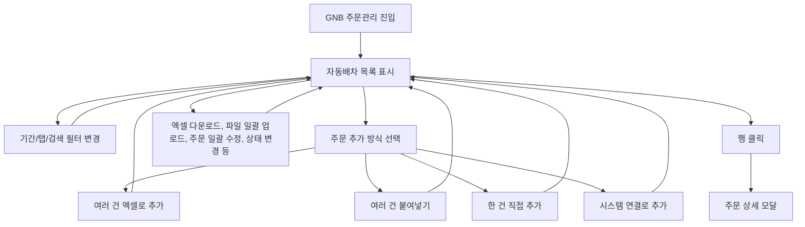

# 주문관리-자동배차

## 개요

- **경로**: `/manage/order/auto`, `/manage/order/auto/:status`
- **역할**: 자동 최적화 배차용 주문 목록 관리. 엑셀 업로드/다운로드, 일괄 수정 처리, 상태 변경 등.
- **진입 경로**: GNB "주문관리" → "자동 최적화 배차" 선택. 기본은 auto.
- **권한**: GNB 주문관리 노출 시 접근. SALES(5)는 주문관리(자동/수동)만 사용. pricing id 2일 때 `/manage/order/auto` 접근 시 `/manage/order/manual/all`로 리다이렉트. 결제 정지/만료 시 GNB 주문관리 비활성 또는 유료 안내.

## ScreenShot

## 검색

### **탭 노출 조건**

- 전체 주문, 미배차, 배차 완료, 처리 완료, 보류, 취소: 모든 접근 권한 사용자.
- 자가 배송: SALES는 탭 비노출.
- 영업 특기사항: **동서 + (ADMIN 또는 MANAGER)** 만.
- **주요 버튼/기능**
  - 주문 추가: SALES일 때 라벨 "요청사항 반영", 추가 방식은 여러 건 엑셀로 추가·여러 건 붙여넣기만 노출.
  - 파일 일괄 업로드: 미배차 탭, **SALES만**.
  - 경로 확정, 주문 일괄 수정, 주문 취소, 처리완료, 보류, 주문 복사, 배차완료, 미배차, 주문 삭제: **비SALES만**.

### 검색 필드

- **주문 상태(탭)**: URL `:status` 연동, 단일 선택. [검색], [초기화] 버튼.
- **키워드 검색**: 텍스트 + 검색 대상 셀렉트. **탭별로 옵션이 바뀌지 않고**, 일반 탭은 모두 동일한 **공통 옵션**, 영업 특기사항 탭만 **영업용 옵션** 사용.
  - **공통 옵션**: 주문 ID, 업체 주문 번호, 담당 차량 지정, 아이템명, 주행 이름, 경로 ID, 고객명, 주소, 특수 조건, 비고1~5, 하위구분, 수정자. (동서 시 선적번호 포함.)
  - **영업용 옵션**: 영업 특기사항 탭 전용. 납품 문서, 납품처, 하위 구분, 팔레트 개수 지정, 주소, 필요 소비기한, 낱박스 구성, 고객 전달사항.
- **조회 기간**: 기간 유형 셀렉트(주문접수일, 작업희망일, 작업완료일, 주행일자) + 기간선택. 초기화 시 기간 유형·기간 리셋(자가 배송 탭은 처리완료 등 기본값 유지).
- **주문 상태**: 전체, 미배차, 배차완료, 처리중, 처리완료, 보류, 취소.
- **주문 유형**: 전체, 배송, 수거.
- **배차 우선순위**: 전체, 높음, 보통, 낮음.
- **경로 상태**: 전체, 임시저장, 주행대기, 주행중, 주행종료, 미배정

### 탭별 검색 필드 노출

| 검색 필드     | 전체      | 미배차                   | 배차완료                          | 처리완료  | 보류                     | 취소                     | 자가배송  | 영업특기사항             |
| ------------- | --------- | ------------------------ | --------------------------------- | --------- | ------------------------ | ------------------------ | --------- | ------------------------ |
| 키워드 검색   | 공통 옵션 | 공통 옵션                | 공통 옵션                         | 공통 옵션 | 공통 옵션                | 공통 옵션                | 공통 옵션 | 영업용 옵션              |
| 조회 기간     | O         | O(주문접수일/작업희망일) | O(주문접수일/작업희망일/주행일자) | O         | O(주문접수일/작업희망일) | O(주문접수일/작업희망일) | O         | O(주문접수일/작업희망일) |
| 주문 상태     | O         | -                        | O (전체/배차완료/이동중/작업중)   | -         | -                        | -                        | -         | -                        |
| 주문 유형     | O         | O                        | O                                 | O         | O                        | O                        | O         | -                        |
| 배차 우선순위 | O         | O                        | O                                 | O         | O                        | O                        | O         | -                        |
| 경로 상태     | O         | -                        | O (주행대기·주행중만)             | -         | -                        | -                        | -         | -                        |

## 목록

### 공통

- **컬럼 구성**
  - **공통 컬럼**: 체크박스, 반영 상태, 주문 ID, 업체 주문 번호, 주문 접수일, 아이템명, 담당 차량 지정, 고객명, 주소, 상세주소, 주문 상태, 작업 희망일, 주문 유형, 배차 우선순위, 희망 시간(이후), 희망 시간(이전), 아이템 코드, 아이템 수량, 합산 용적량1-3, 특수 조건, 실제 용적량, 예상 작업 시간, 고객 연락처, 화주사명, 화주사 연락처, 중개사명, 중개사 연락처, 비고1-5, 하위구분, 수정자. 담당 차량 지정 컬럼은 단일 지정 시 차량명 노출, 다중 지정 시 '차량명 외 N대' 형태 노출, **지정 안함**으로 저장된 행은 '-' 노출.
  - **확장 컬럼**(미배차 제외 탭만): 경로 상태, 경로 ID, 보류 사유, 보류 일시, 보류 주행 이름, 실제 작업 시간, 완료 사유, 용적량 차이 사유, 작업 완료 일시, 주행 일자, 주행 이름, 회전, PoD 사진 개수, 고객 전달사항. 미배차 탭에는 확장 컬럼이 없음.
  - **영업전용**: 이메일 전송 여부, 납품 문서(업체주문번호), 납품처(고객명), 희망 시간(이후/이전), 하위 구분(별도피킹), 팔레트 개수 지정(합산 용적량3), 주문 접수일, 작업 희망일(배송희망일), 주소, 상세주소, 필요 소비기한(비고1), 낱박스 구성(비고2), 고객 전달사항.
- **행 선택**: 다중 선택. 선택 건에 대해 아래 탭별 버튼으로 일괄 액션 가능. 페이지 이동·필터 변경 시 선택 일관 유지(필터 변경은 초기화).
- **용적량 합산 패널**: 미배차 탭에서 행 선택 시 화면 우측 하단에 **선택 주문 총 용적량** 패널 노출. 펼침 시 '용적량1 + 팔레트1', '용적량2 + 팔레트2', '용적량3 + 팔레트3' 3행으로 합산 노출. 우측 [X] 또는 행 선택 변경 시 자동 축소.
- **행 클릭**: 해당 주문 상세를 조회한 뒤 주문 상세 모달이 열림. 상세 필드 확인 후 [닫기] 또는 배경 클릭 시 모달 닫힘.
  - **인수증 버튼(행 내)**: 인수증이 노출되는 탭에서는 결제 접근 권한 및 행 상태(전체 탭인 경우 해당 행이 미배차/보류/취소가 아닐 때)에 따라 버튼 활성/비활성된다. 클릭 시 인수증 모달.
- **공통 버튼**: 엑셀 다운로드, 컬럼 설정(피커) — 모든 탭. (엑셀 다운로드: 현재 검색·필터 조건으로 목록을 엑셀 파일로 내보냄. 실패 시 에러 안내.)

### 버튼

- 다운로드 버튼은 모든 탭에 공통 버튼.

| 탭            | 컬럼                 | 버튼                                             | SALES(5)(탭노출, 버튼)      |
| ------------- | -------------------- | ------------------------------------------------ | --------------------------- |
| 전체          | 공통 + 확장 + 인수증 | 다운로드                                         | 노출(다운로드)              |
| 미배차        | 공통                 | 배차계획, 주문일괄수정, 주문 취소, 다운로드      | 노출(파일 업로드, 다운로드) |
| 배차 완료     | 공통 + 확장 + 인수증 | 완료로변경, 보류로변경, 주문복사, 다운로드       | 노출(다운로드)              |
| 처리 완료     | 공통 + 확장 + 인수증 | 배차완료로변경, 주문복사, PoD다운로드, 다운로드  | 노출(PoD다운로드, 다운로드) |
| 보류          | 공통 + 확장          | 배차완료로변경, 미배차로변경, 주문취소, 다운로드 | 노출(다운로드)              |
| 취소          | 공통 + 확장          | 주문삭제, 다운로드                               | 노출(다운로드)              |
| 자가 배송     | 공통 + 확장 + 인수증 | 미배차로변경, 다운로드                           | -                           |
| 영업 특기사항 | 영업전용             | 이메일전송, 다운로드                             | -                           |

## Actions

- **주문 추가** (자동 배차만. SALES(5) 권한 시 버튼 라벨 "요청사항 반영")
  - **트리거**: 헤더 [주문 추가](또는 [요청사항 반영]) 버튼 클릭.
  - **플로우**: 클릭 → 추가 방식 선택 모달 오픈.
  - **최종 동작**: 방식 선택 모달 닫힘. 각 방식 완료 시 목록 갱신 또는 해당 모달 내 성공 안내.
- **파일 일괄 업로드**: 파일 일괄 업로드 시 **총 용량 100MB** 제한이 있으며, 초과 시 '100MB 이상 업로드할 수 없습니다.' 메시지가 표시.

## User Flow

## 모달 상세

### 주문 추가 방식 선택 모달

- **진입 경로**: 헤더 [주문 추가](또는 [요청사항 반영]) 클릭.
- **내부 구성**: 추가 방식 4가지
  - (1) **여러 건 엑셀로 추가** → 엑셀 업로드 모달 오픈 → 파일 선택 → 검증(헤더·필수 컬럼·형식) → 업로드 처리 → 성공 시 결과 안내(성공/실패 행) 및 목록 갱신.
  - (2) **여러 건 붙여넣기** → 붙여넣기 모달 오픈("주문을 붙여 넣어 주세요.") → 텍스트(엑셀 등에서 복사한 행) 붙여넣기 → 검증 후 [주문 확인] → 등록 처리 → 성공/실패 안내 및 목록 갱신. (SALES 시 "요청사항" 붙여넣기·요청사항 확인 플로우, 성공 후 파일 일괄 업로드 모달로 이어질 수 있음.)
  - (3) **한 건 직접 추가** (SALES 비노출) → 주문 등록 모달 오픈 → 주문·고객·아이템 등 필드 입력 → [저장] → 등록 처리.
  - (4) **시스템 연결로 추가** (SALES 비노출) → 시스템 연동 모달 오픈 → 연동 설정·연동 실행 → 연동 후 목록 갱신.

  

### (1) 여러건 엑셀로 추가

- **내부 구성**: 파일 선택(드래그 또는 선택) -> 업로드 진행 -> 검증 결과(성공/실패 행 안내, 수정가능) -> 주문등록 -> 성공 시 목록 갱신, 실패 행 있으면 필드/행 단위 에러 표시. [닫기].

  

  

### (2) 여러건 붙여넣기로 추가

- **내부 구성**: 텍스트 붙여넣기 영역(엑셀 등에서 복사한 행 데이터 붙여넣기) → 형식 안내·검증, [등록] 또는 [저장]. 검증 통과 시 등록 처리 → 성공/실패 행 안내, 성공 시 목록 갱신. [닫기].
- **붙여넣기 컬럼 매핑**: **담당차량지정** 사용. 영업매니저용에서는 **고객명(납품처)** 컬럼은 제거(미매핑).

  

### (3) 한 건 직접 추가

- **주문 정보**
  - 주문 유형(필수): 배송/수거 스위치. (SALES 시 비활성)
  - 배차 우선순위(필수): 높음/보통/낮음. (SALES 시 비활성)
  - 업체 주문 번호(선택)
  - 주문 접수일(필수): DatePicker, 오늘포함 이전만 허용.
  - 작업 희망일(선택): 오늘 포함 이후만 허용.
  - 예상 작업 시간(분)(필수): 숫자 셀렉트.
  - 희망 시간(이후)·(이전)(선택): 둘 다 입력 시 이후 ≤ 이전 검사.
  - 담당 차량 지정(선택): 드라이버 검색 셀렉트(자가 배송·용차 제외) 또는 **지정 안함** 옵션. **(옵션: 설정 > 차량 관리에서 등록된 차량만 조회·선택 가능.)** 지정 안함 선택 시 목록·상세에 '-' 노출. (SALES 시 비활성)
- **고객 정보**
  - 고객명(필수)
  - 고객 연락처(선택): 전화 형식(000-0000-0000 등) 또는 10~11자리 숫자.
  - 주소(필수): 최대 200자. 주소+상세주소.
  - 상세주소(선택): 최대 100자.
  - 고객 전달사항(선택)
- **기타 정보**
  - 비고1~5(선택)
- **아이템 정보**
  - 아이템 목록(필수): 최소 1개. [아이템 추가]로 행 추가·수정·삭제. (SALES 시 용적량 합계 자동 계산 비활성)
  - 아이템(행): 아이템명(최대 255자), 수량(정수 1 이상), 코드, 용적량(합산 용적량1~3), 화주사명/연락처, 중개사명/연락처. 예상 용적량 합 1 이상.
  - 합산 용적량1-3: 아이템별 용적량 합계(자동). SALES는 합산 용적량3 직접 입력 가능. **주문 수정** 시에는 영업 사용자 외에도 **합산 용적량3**를 편집할 수 있다. **주문 생성** 시에는 합산 용적량3는 비활성(또는 영업 전용)이다.
  - 팔레트 용적량1-3: 주문 수정시에만 입력가능(소수점 3자리까지)
- **특수 조건 정보**
  - 특수 조건(선택): 다중 검색 셀렉트. **(옵션: 설정 > 특수 조건 관리에서 등록. 팀별로 관리되며, 주문 등록 시 소속 팀에 등록된 항목만 선택 가능.)** (SALES 시 비활성)
- **하위 구분 정보**
  - 하위 구분(선택): 다중 검색 셀렉트. **(옵션: 설정 > 팀 관리에서 팀별 하위 구분 등록. 소속 팀에 등록된 하위 구분만 선택 가능.)** (SALES 시 비활성)
- **배송 첨부 서류**
  - 파일 목록(선택): [파일 업로드] — .zip, .png, .jpg, .jpeg, .pdf, .xlsx, .docx, .txt. 최대 10개, 5MB. 행별 [삭제] 가능.

  

### (4) 시스템 연결로 추가

- **설명**: 외부 시스템(WMS, ERP 등)과의 연동을 통한 주문 데이터를 대상. 웹훅을 통해 내부 DB에 임시 저장 후 주문추가 모달에서 관리자가 미배차 주문생성을 통해 미배차로 등록됨. (백오피스에서 API 키 발급 후 사용)
- **조회**
  - **조회 기간 유형**: 주문 접수일 / 작업 희망일. 기본값 주문 접수일.
  - **조회 기간**: 오늘, 1주일, 1개월, 3개월 등 빠른 선택 + 시작일·종료일. 초기값: 전날~오늘(과거 1주).
  - **키워드 검색**: 검색 대상 셀렉트 + 텍스트. 검색 대상: 고객명, 업체 주문 번호, 아이템명, 아이템코드, 담당 차량 지정, 특수조건, 비고1~5. 키워드 입력 시에만 검색에 반영.
  - **주문 유형**: 전체/배송/수거.
  - **배차 우선순위**: 전체/높음/보통/낮음.
- **목록**: 연동으로 조회된 주문 목록. 행 다중 선택(체크박스). 컬럼 표시/순서는 컬럼 설정으로 변경 가능.
  - **표시 항목 예**: 주소, 용적량, 업체 주문 번호, 수취인 연락처, 고객명, 화주사 명/연락처, 비고 1~5, 희망 시간·날짜, 상세 주소, 차량, 우선순위, 상품 코드/명/수량, 주문 접수일, 요구사항, 중개사 명/연락처, 서비스 시간, 배송 유형 등.
  - **[미배차 주문 생성]**: 선택한 행을 미배차 주문으로 생성.
  - **[주문 준비 삭제]**: 선택한 대기 주문 삭제. 확인 모달 후 삭제 처리되며 목록이 다시 조회됨. 선택 없으면 비활성.
- **미배차 주문 생성 후**: 검증 결과가 테이블로 표시됨(순번, 성공/실패, 필드별 오류 등). 행 단위로 수정·등록·삭제 가능. 등록 완료 시 메인 주문 목록이 갱신되며 시스템 연동 모달을 닫을 수 있음. (미배차 탭이 아니면 미배차 탭으로 이동하는 동작이 있음.)

  

### 단건 주문 상세 모달

- **진입 경로**: 목록 행 클릭 → 해당 주문 상세 조회 후 모달 오픈. [닫기] 또는 배경 클릭 시 모달 닫힘.
- **푸터(주문 상태별)**: [닫기]는 항상 노출. **주문 상태가 미배차일 때만** [수정하기] 추가 노출(클릭 시 주문 수정 모달). 그 외 상태(배차완료, 처리완료, 보류, 취소 등)는 [닫기]만.
- **모달 내부 탭별 구성**
  | 탭 | 구성 | 화면 |
  | -------------- | --------------------------------------------------------------------------------------------------------------------------------------------------------------------------------------------------------------------------------------------------------------------------------------------------------- | ------------------------------------------------------------------------------ |
  | 주문 기본 정보 | **주문 정보**: 업체 주문 번호, 주문 접수일, 주문 유형, 배차 우선순위, 작업 희망일, 예상 작업 시간, 희망 시간(이후/이전), 담당 차량 지정, 등록자, 수정자. **고객 정보**: 고객명, 고객 연락처, 주소, 상세주소, 고객 전달사항. **납품처 차량 정보**: 담당 차량 지정, 제외 차량 지정. **기타 정보**: 비고1~5. |  |
  | 주행/배송 정보 | **주행 정보**: 담당 차량 지정, 경로 ID, 회전, 경로 상태, 주행 일자, 주행 이름. **특수 조건 정보**, **하위 구분 정보**, **배송 첨부 서류**(다운로드). |  |
  | 아이템 정보 | **용적량 합계**(합산 용적량1-3), **아이템 정보**(제품 목록·코드·수량·용적 등). |  |
  | 처리 이력 | **작업 완료 상세**: 완료 보고, 완료 일시, 실제 작업 시간, 실제 용적량, 용적량 차이 사유. **PoD 사진**, **인수증**(다운로드/뷰어). **보류 이력** 테이블. |  |

### 주문 일괄 수정

- **진입 경로**: 미배차 탭에서 행 다중 선택 후 [주문 일괄 수정] 클릭.
- **내부 구성**: 선택 건에 공통으로 수정 가능한 필드(주문 유형, 배차 우선순위, 희망일 등)를 설정. [저장] [취소]. 유효성 검사 후 일괄 수정 처리, 성공 시 모달 닫힘·목록 갱신. 부분 실패 시 결과 안내.

  

### 인수증 상세보기

- **진입**: 자동배차 목록 행 인수증 컬럼의 **[상세보기]**
  - **인수증 보기·노출**
    - **시스템 기본 템플릿 인수증**: 주문·배송 데이터로 채워진 **HTML 형태** 미리보기.
      - 배송 정보: 도착지(고객명, 고객연락처, 도착지주소), 출발지(팀명, 팀 연락처, 팀주소)
      - 주문 정보: 화주명, 화주연락처, 화주주소(인수증 관리: 같은팀, 납품처명, 전화번호가 동일한 경우 해당 주소 사용), 중개사명, 중개사연락처, 주문 아이템 리스트(아이템명, 아이템코드, 수량), 주문건 합계, 수량합계
      - 운전자 정보: 드라이버명, 드라이버 연락처
      - 인수 정보: 인수 일시, 인수처, 서명란
      - 출발지 등 일부는 **설정 > 인수증 관리**에 등록된 화주 정보와 매칭되면 채워질 수 있음.
    - **직접 업로드 파일**: 등록된 **이미지**는 **미리보기**(여러 장이면 **이전/다음·페이지**). 스캔·촬영본으로 템플릿을 대체·보완하는 용도.
    - **인쇄·PDF**: [인쇄하기]는 브라우저 인쇄, 대화상자에서 **PDF로 저장** 가능.
  - **파일 업로드 제한**
    - SVG, JPG, JPEG, WEBP, HEIF, HEIC, PNG.
    - 최대 10개, 각 5MB 이하.
  - **인수증 직접 업로드**
    - **미리보기**: 선택 파일 **미리보기**(여러장·페이지 이동).
    - **업로드 리스트**: **드래그 핸들**로 **순서 변경**, 행 [삭제], [파일 추가하기]로 추가.
    - [저장하기]로 반영. 업로드가 없으면 저장 등이 비활성일 수 있음.
  - **기본 인수증 생성하기**: **업로드한 이미지가 없을 때** 안내와 함께 [기본 인수증 생성하기]가 노출되며, 누르면 시스템 **기본 템플릿 인수증**을 생성해 좌측 미리보기에 표시.

| 인수증 보기                                                         | 직접 업로드 클릭                                                         | 업로드 파일 관리                                                                    | 기본 인수증 생성                                                                 |
| ------------------------------------------------------------------- | ------------------------------------------------------------------------ | ----------------------------------------------------------------------------------- | -------------------------------------------------------------------------------- |
|  |  |  |  |

### 자가 배송 정보 설정 모달

- **진입 경로**: 미배차 탭에서 자가 배송 대상 행 다중 선택 후 자가 배송 처리 액션.
- **타이틀**: '자가 배송 정보 설정'.
- **필드**
  - 배송일(필수): 단일 날짜 선택. 오늘 이후만 허용. 오늘 선택 시 현재 시각, 미래 일자 선택 시 해당 일자의 00:00 으로 저장.
  - 자가 배송 차량(필수): 소속 팀에 등록된 자가 배송 차량 라디오 선택.
- **버튼**: [닫기], [확인]. 배송일과 차량 모두 선택해야 [확인] 활성. [확인] 클릭 시 선택된 주문이 자가 배송 등록 처리되고 모달 닫힘, 목록 갱신.

## ETC

- 주문 추가시 납품처 관리에 등록된 납품처명, 주소, (상세주소)가 일치하는 주문일 경우 연락처, 좌표, 예상작업시간, 담당차량지정, 비고1~5 정보중 비어 있는 필드 자동채움기능 있음.
- SALES 주문 요청사항 반영시 관리자가 해당 내용을 영업특기사항 탭에서 확인할 수 있음. 영업 특기사항은 배차 매니저가 배차 계획전 영업매니저가 수정한 내용을 확인하고 관련자에서 이메일을 보낼 수 있는 기능임. 이메일은 이메일 관리 설정에 해당 팀으로 설정된 모든 이메일 주소로 변경된 리스트중 선택된 내용을 발송한다.
- 시스템 연결로 추가 (이지메디컴 등)를 사용해서 미배차를 생성하는것과 외부에서 직접 API를 이용해서 미배차 주문 생성(동서)하는 방법은 별도로 동작함. "시스템 연결로 추가"는 외부에서 들어온 데이터를 관리자가 확인하고 등록하는 방식이고, API 직접 연동방식은 직접 주문을 생성할 수 있음.
- 엑셀 업로드: 허용 확장자 `.xlsx`/`.xls`, 컬럼 순서 고정(템플릿 기준), 에러 행이 1건이라도 있으면 전체 등록 차단(부분 등록 불가). 붙여넣기도 동일 검증 경로를 거침.

## API

### 주문 목록/상세 조회

| 순서 | Method | Path                                                                                                       | 설명                               | 트리거                                      |
| ---- | ------ | ---------------------------------------------------------------------------------------------------------- | ---------------------------------- | ------------------------------------------- |
| 1    | GET    | [`/order/list`](../../../interface/00.roouty/order.md#get-orderlist)                                       | 주문 목록 조회 (creationType=auto) | 페이지 진입, 탭 전환, 검색, 필터 변경       |
| 2    | GET    | [`/order/detail/:orderId`](../../../interface/00.roouty/order.md#get-orderdetailorderid)                   | 주문 상세 조회                     | 목록 행 클릭                                |
| 2-1  | POST   | [`/v2/order/capacity-summary`](../../../interface/00.roouty/order-list-v2.md#post-v2ordercapacity-summary) | 선택 주문 용적량 합산              | 미·매배차 탭 행 다중 선택 시 합산 패널 노출 |

### 주문 생성/수정/복사

| 순서 | Method | Path                                                                        | 설명                        | 트리거                       |
| ---- | ------ | --------------------------------------------------------------------------- | --------------------------- | ---------------------------- |
| 3    | POST   | [`/order`](../../../interface/00.roouty/order.md#post-order)                | 주문 생성 (한 건 직접 추가) | 주문 등록 모달 [저장]        |
| 4    | PUT    | [`/order/:orderId`](../../../interface/00.roouty/order.md#put-orderorderid) | 주문 수정                   | 주문 수정 모달 [저장]        |
| 5    | POST   | [`/order/copy`](../../../interface/00.roouty/order.md#post-ordercopy)       | 주문 복사                   | [주문 복사] 버튼             |
| 6    | PUT    | [`/order/batch`](../../../interface/00.roouty/order.md#put-orderbatch)      | 주문 일괄 수정              | [주문 일괄 수정] 모달 [저장] |

### 주문 상태 변경

| 순서 | Method | Path                                                                       | 설명                                               | 트리거           |
| ---- | ------ | -------------------------------------------------------------------------- | -------------------------------------------------- | ---------------- |
| 7    | PUT    | [`/order/delete`](../../../interface/00.roouty/order.md#put-orderdelete)   | 주문 취소                                          | [주문 취소] 버튼 |
| 8    | PUT    | [`/order/clear`](../../../interface/00.roouty/order.md#put-orderclear)     | 주문 영구 삭제                                     | [주문 삭제] 버튼 |
| 9    | PUT    | [`/order/:status`](../../../interface/00.roouty/order.md#put-orderorderid) | 주문 상태 변경 (completed/skip/scheduled/unassign) | 상태 변경 버튼   |

### 엑셀 업로드 (일반 주문)

| 순서 | Method | Path                                                                                                                                      | 설명                | 트리거                         |
| ---- | ------ | ----------------------------------------------------------------------------------------------------------------------------------------- | ------------------- | ------------------------------ |
| 10   | POST   | [`/v2/order/temporary/excel`](../../../interface/00.roouty/temporary-order-v2.md#post-v2ordertemporaryexcel)                              | 엑셀 파일 업로드    | 여러 건 엑셀로 추가 / 붙여넣기 |
| 11   | GET    | [`/v2/order/temporary/row-status/:id`](../../../interface/00.roouty/temporary-order-v2.md#get-v2ordertemporaryrow-statustemporaryorderid) | 검증 상태 폴링      | 업로드 후 인터벌 폴링          |
| 12   | POST   | [`/v2/order/temporary/register/:id`](../../../interface/00.roouty/temporary-order-v2.md#post-v2ordertemporaryregistertemporaryorderid)    | 임시 주문 확정 등록 | 검증 모달 [주문 등록]          |

### 엑셀 업로드 (SALES 요청사항)

| 순서 | Method | Path                                                                                                                                                                 | 설명                       | 트리거                        |
| ---- | ------ | -------------------------------------------------------------------------------------------------------------------------------------------------------------------- | -------------------------- | ----------------------------- |
| 13   | POST   | [`/v2/order/update/temporary/excel`](../../../interface/00.roouty/order-update-excel-v2.md#post-v2orderupdatetemporaryexcel)                                         | SALES 요청사항 엑셀 업로드 | 요청사항 반영 > 엑셀/붙여넣기 |
| 14   | POST   | [`/v2/order/update/temporary/register/:temporaryOrderId`](../../../interface/00.roouty/order-update-excel-v2.md#post-v2orderupdatetemporaryregistertemporaryorderid) | SALES 요청사항 확정 등록   | 검증 모달 [주문 등록]         |

### 엑셀 다운로드/템플릿

| 순서 | Method | Path                                                                          | 설명                    | 트리거                      |
| ---- | ------ | ----------------------------------------------------------------------------- | ----------------------- | --------------------------- |
| 15   | POST   | [`/order/download`](../../../interface/00.roouty/order.md#post-orderdownload) | 주문 목록 엑셀 다운로드 | [다운로드] 버튼             |
| 16   | GET    | `/excel/template/download`                                                    | 엑셀 템플릿 다운로드    | 엑셀 모달에서 양식 다운로드 |

### 파일 업로드/POD

| 순서 | Method | Path                                                                                                       | 설명                   | 트리거              |
| ---- | ------ | ---------------------------------------------------------------------------------------------------------- | ---------------------- | ------------------- |
| 17   | POST   | [`/order/files/batch`](../../../interface/00.roouty/order.md#post-orderfilesbatch)                         | 파일 일괄 업로드       | [파일 일괄 업로드]  |
| 18   | POST   | [`/order/pod/file/download/bulk`](../../../interface/00.roouty/order-pod.md#post-orderpodfiledownloadbulk) | PoD 파일 일괄 다운로드 | [PoD 다운로드] 버튼 |

### 자가배송/영업 특기사항

| 순서 | Method | Path                                                                                                                     | 설명                | 트리거                   |
| ---- | ------ | ------------------------------------------------------------------------------------------------------------------------ | ------------------- | ------------------------ |
| 19   | GET    | [`/member/list/driver?pickupFilter=only`](../../../interface/00.roouty/member.md#get-memberlistdriver)                   | 셀프 픽업 기사 목록 | 자가배송 모달 오픈 시    |
| 20   | POST   | [`/order/self-pickup`](../../../interface/00.roouty/order.md#post-orderself-pickup)                                      | 셀프 픽업 등록      | 자가배송 모달 확인       |
| 21   | POST   | [`/v2/sales-manager/email/send`](../../../interface/00.roouty/sales-manager-email-v2.md#post-v2sales-manageremailsend)   | 이메일 발송         | [이메일 전송] 버튼       |
| 22   | GET    | [`/v2/sales-note/email/has-emails`](../../../interface/00.roouty/sales-note-email-v2.md#get-v2sales-noteemailhas-emails) | 이메일 존재 여부    | 영업 특기사항 탭 진입 시 |

### 기타

| 순서 | Method | Path                                                                 | 설명          | 트리거                      |
| ---- | ------ | -------------------------------------------------------------------- | ------------- | --------------------------- |
| 23   | GET    | [`/skill/list`](../../../interface/00.roouty/skill.md#get-skilllist) | 특수조건 목록 | 주문 일괄 수정 모달 진입 시 |

### 보조 API

| 순서 | Method | Path                                                                                                                                                                         | 설명                       | 트리거                               |
| ---- | ------ | ---------------------------------------------------------------------------------------------------------------------------------------------------------------------------- | -------------------------- | ------------------------------------ |
| 24   | GET    | [`/order/delivery-receipt/:orderId`](../../../interface/00.roouty/order.md#get-orderdelivery-receiptorderid)                                                                 | 인수증 조회                | 인수증 버튼 클릭                     |
| 25   | GET    | [`/v2/order/temporary/:temporaryOrderId`](../../../interface/00.roouty/temporary-order-v2.md#get-v2ordertemporarytemporaryorderid)                                           | 임시 주문 상세 (엑셀 검증) | 엑셀 업로드 후 검증 모달             |
| 26   | POST   | [`/order/list/download`](../../../interface/00.roouty/order.md#post-orderlistdownload)                                                                                       | 주문 목록 엑셀 다운로드    | [다운로드] 버튼                      |
| 27   | POST   | [`/order/pod/delivery-receipt/:orderId/file`](../../../interface/00.roouty/order-pod.md#post-orderpoddelivery-receiptorderidfile)                                            | 인수증 사진 업로드         | 인수증 모달 > 파일 업로드            |
| 28   | PUT    | [`/order/pod/delivery-receipt/:orderId/file`](../../../interface/00.roouty/order-pod.md#put-orderpoddelivery-receiptorderidfile)                                             | 인수증 사진 수정           | 인수증 모달 > 파일 수정              |
| 29   | PUT    | [`/order/skip`](../../../interface/00.roouty/order.md#put-orderskip)                                                                                                         | 주문 보류 처리             | [보류로변경] 버튼                    |
| 30   | PUT    | [`/v2/order/temporary/:id/row/:rowId/edit-update`](../../../interface/00.roouty/temporary-order-v2.md#put-v2ordertemporarytemporaryorderidrowtemporaryorderrowidedit-update) | SALES 임시주문 행 수정     | SALES 요청사항 검증 모달에서 행 수정 |
| 31   | POST   | [`/v2/pallet-capacities/calculate`](../../../interface/00.roouty/pallet-capacity-v2.md#post-v2pallet-capacitiescalculate)                                                    | 팔레트 용적량 계산         | 주문 등록/수정 시 팔레트 자동 계산   |
| 32   | GET    | [`/team/category`](../../../interface/00.roouty/team.md#get-teamcategory)                                                                                                    | 팀 카테고리 목록           | 주문 필터/등록 시 팀 선택            |
| 33   | POST   | [`/order/excel`](../../../interface/00.roouty/order.md#post-orderexcel)                                                                                                      | 주문 엑셀 업로드 (v1)      | 여러 건 엑셀로 추가                  |

### 시스템 연결 (주문상품)

| 순서 | Method | Path                                                                                                                         | 설명                  | 트리거                               |
| ---- | ------ | ---------------------------------------------------------------------------------------------------------------------------- | --------------------- | ------------------------------------ |
| 34   | GET    | [`/orderproduct/list`](../../../interface/00.roouty/orderproduct.md#get-orderproductlist)                                    | 시스템 연동 상품 목록 | 시스템 연결 모달 오픈 시             |
| 35   | POST   | [`/orderproduct/temporary/validate`](../../../interface/00.roouty/orderproduct.md#post-orderproducttemporaryvalidate)        | 임시 상품 검증        | 시스템 연결 모달 > 상품 선택 후 검증 |
| 36   | POST   | [`/orderproduct/temporary/:id/editrow`](../../../interface/00.roouty/orderproduct.md#post-orderproducttemporaryrowideditrow) | 임시 상품 행 수정     | 검증 모달에서 행 수정                |
| 37   | POST   | [`/orderproduct/temporary`](../../../interface/00.roouty/orderproduct.md#post-orderproducttemporary)                         | 임시 상품 등록 확정   | 검증 모달 > [등록] 버튼              |
| 38   | DELETE | [`/orderproduct/temporary`](../../../interface/00.roouty/orderproduct.md#delete-orderproducttemporary)                       | 임시 상품 삭제        | 검증 모달 > [취소] 또는 모달 닫기    |
