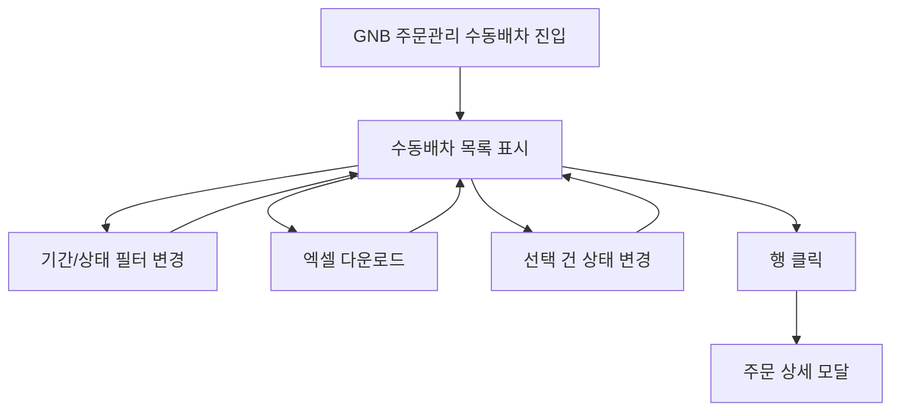

# 주문관리-수동배차

## 개요

- **경로**: `/manage/order/manual`, `/manage/order/manual/:status`
- **역할**: 수동 배차용 주문 목록 관리. 엑셀 다운로드, 목록 조회·필터·상태 변경 등. **주문 등록·엑셀 업로드는 배차계획(수동)에서 수행.**
- **진입 경로**: GNB "주문관리" → "수동 배차" 선택.
- **권한**: GNB 주문관리 노출 시 접근. SALES(5)는 주문관리(자동/수동)만 사용. 결제 정지/만료 시 GNB 주문관리 비활성 또는 유료 안내.

## ScreenShot

## 검색

### 검색 필드

- **주문 상태(탭)**: URL `:status` 연동, 단일 선택. [검색], [초기화] 버튼.
- **키워드 검색**: 텍스트 + 검색 대상 셀렉트. 탭별 검색 대상 옵션 상이.
  - **전체 주문 / 배차 완료 주문 / 처리 완료 주문**: 주문 ID, 업체 주문 번호, 담당 차량 지정, 아이템명, 담당 차량, 주행 이름, 경로 ID, 고객명, 주소, 특수 조건, 비고1, 비고2, 비고3, 비고4, 비고5, 하위구분, 수정자. (동서 시 선적번호 포함.)
  - **보류 주문 / 취소 주문**: 위 항목 중 담당 차량·주행 이름·경로 ID 제외. (주문 ID, 업체 주문 번호, 담당 차량 지정, 아이템명, 고객명, 주소, 특수 조건, 비고1~5, 하위구분, 수정자. 동서 시 선적번호 포함.)
- **조회 기간**: 기간 유형 셀렉트 + 기간 선택. 수동배차에서는 **작업 희망일 옵션 없음**(모든 탭에서 제외). 초기화 시 기간 유형·기간 리셋.
  - **전체 주문**: 주문 접수일, 작업 완료일, 주행 일자.
  - **배차 완료 주문**: 주문 접수일, 주행 일자.
  - **처리 완료 주문**: 주문 접수일, 작업 완료일, 주행 일자.
  - **보류 주문 / 취소 주문**: 주문 접수일.
- **주문 상태**: 배차 완료 탭에서만 노출. 옵션: 전체, 배차 완료, 이동중, 작업중.
- **주문 유형**: 전체, 배송, 수거. (모든 탭에서 노출.)
- **경로 상태**: 전체, 임시저장, 주행대기, 주행중, 주행종료, 미배정. **전체 주문·배차 완료 탭에서만 노출.** 배차 완료 탭에서는 주행대기·주행중만 선택 가능.

### 탭별 검색 필드 노출

| 검색 필드   | 전체 주문                         | 배차 완료 주문                  | 처리 완료 주문                    | 보류 주문                   | 취소 주문                   |
| ----------- | --------------------------------- | ------------------------------- | --------------------------------- | --------------------------- | --------------------------- |
| 키워드 검색 | 공통 옵션                         | 공통 옵션                       | 공통 옵션                         | 담당 차량·주행·경로 ID 제외 | 담당 차량·주행·경로 ID 제외 |
| 조회 기간   | O(주문접수일/작업완료일/주행일자) | O(주문접수일/주행일자)          | O(주문접수일/작업완료일/주행일자) | O(주문접수일)               | O(주문접수일)               |
| 주문 상태   | -                                 | O (전체/배차완료/이동중/작업중) | -                                 | -                           | -                           |
| 주문 유형   | O                                 | O                               | O                                 | O                           | O                           |
| 경로 상태   | O                                 | O(주행대기·주행중만)            | -                                 | -                           | -                           |

## 목록

### 공통

- **컬럼 구성**: 자동배차와 동일하게 탭별 컬럼 구성을 사용한다. 담당 차량 지정 컬럼 표기 규칙(차량명 / '차량명 외 N대' / 지정 안함은 '-' 노출)도 자동배차와 동일.
- **행 선택**: 다중 선택. 선택 건에 대해 아래 탭별 버튼으로 일괄 액션 가능. 페이지 이동·필터 변경 시 선택 일관 유지(필터 변경은 초기화).
- **행 클릭**: 해당 주문 상세를 조회한 뒤 주문 상세 모달이 열림. 상세 필드 확인 후 [닫기] 또는 배경 클릭 시 모달 닫힘.
  - **인수증 버튼(행 내)**: 인수증 컬럼은 전체 주문·배차 완료·처리 완료·자가 배송 탭에만 노출되며, 미배차·보류·취소 탭에는 노출되지 않는다. 노출 탭에서는 탭·권한 및 행 상태에 따라 버튼 활성/비활성된다. 클릭 시 인수증 모달.
- **버튼**: 엑셀 다운로드, 컬럼 설정(피커) — 모든 탭. (엑셀 다운로드: 현재 검색·필터 조건으로 목록을 엑셀 파일로 내보냄. 실패 시 에러 안내.)
  - 배차 완료: 처리완료, 보류, 주문 복사
  - 처리 완료: 배차완료, 주문 복사 + PoD 다운로드(공통)
  - 보류: 배차완료, 주문 취소
  - 취소: 주문 삭제
- **주문 복사 모달 안내 문구**: 자동배차는 "미배차 주문 관리 탭에서 확인할 수 있습니다." 수동배차는 미배차 탭이 없으므로 "**전체** 주문 관리 탭에서 확인할 수 있습니다." 로 분기 노출.

## User Flow

## ETC

- **업체별 예외/분기**: 검색 대상 셀렉트 옵션은 동서일 때 선적번호 포함됨.
- **수동 배차 주문 등록**: 이 목록 화면이 아닌 **배차계획(수동)** 에서 수행. GNB "배차 계획" → 랜딩에서 [수동] 선택 → `/manage/route/manual` 진입 → 경로·주문 수동 입력 또는 엑셀 업로드 → [배차 요청] → 확정 화면 이동.

## API

자동배차(10.주문관리-자동배차)와 동일한 API 세트를 사용한다. 차이점은 `getOrderList` 호출 시 `creationType=manual` 파라미터가 전달되는 것뿐이다.

전체 API 목록은 [10.주문관리-자동배차 > API](./10.주문관리-자동배차.md#api) 참조.

| 순서 | Method | Path                                                                                                                                                   | 설명                                 | 트리거                                |
| ---- | ------ | ------------------------------------------------------------------------------------------------------------------------------------------------------ | ------------------------------------ | ------------------------------------- |
| 1    | GET    | [`/order/list`](../../../interface/00.roouty/order.md#get-orderlist)                                                                                   | 주문 목록 조회 (creationType=manual) | 페이지 진입, 탭 전환, 검색, 필터 변경 |
| 2    | GET    | [`/order/detail/:orderId`](../../../interface/00.roouty/order.md#get-orderdetailorderid)                                                               | 주문 상세 조회                       | 목록 행 클릭                          |
| 3    | POST   | [`/order`](../../../interface/00.roouty/order.md#post-order)                                                                                           | 주문 생성                            | 주문 등록 모달 [저장]                 |
| 4    | PUT    | [`/order/:orderId`](../../../interface/00.roouty/order.md#put-orderorderid)                                                                            | 주문 수정                            | 주문 수정 모달 [저장]                 |
| 5    | POST   | [`/order/copy`](../../../interface/00.roouty/order.md#post-ordercopy)                                                                                  | 주문 복사                            | [주문 복사] 버튼                      |
| 6    | PUT    | [`/order/batch`](../../../interface/00.roouty/order.md#put-orderbatch)                                                                                 | 주문 일괄 수정                       | [주문 일괄 수정] 모달 [저장]          |
| 7    | PUT    | [`/order/delete`](../../../interface/00.roouty/order.md#put-orderdelete)                                                                               | 주문 취소                            | [주문 취소] 버튼                      |
| 8    | PUT    | [`/order/clear`](../../../interface/00.roouty/order.md#put-orderclear)                                                                                 | 주문 영구 삭제                       | [주문 삭제] 버튼                      |
| 9    | PUT    | [`/order/:status`](../../../interface/00.roouty/order.md#put-orderorderid)                                                                             | 주문 상태 변경                       | 상태 변경 버튼                        |
| 10   | POST   | [`/v2/order/temporary/excel`](../../../interface/00.roouty/temporary-order-v2.md#post-v2ordertemporaryexcel)                                           | 엑셀 업로드                          | 여러 건 엑셀 추가                     |
| 11   | GET    | [`/v2/order/temporary/row-status/:id`](../../../interface/00.roouty/temporary-order-v2.md#get-v2ordertemporaryrow-statustemporaryorderid)              | 검증 상태 폴링                       | 업로드 후 폴링                        |
| 12   | POST   | [`/v2/order/temporary/register/:id`](../../../interface/00.roouty/temporary-order-v2.md#post-v2ordertemporaryregistertemporaryorderid)                 | 임시 주문 확정                       | 검증 모달 [주문 등록]                 |
| 13   | POST   | [`/v2/order/update/temporary/excel`](../../../interface/00.roouty/order-update-excel-v2.md#post-v2orderupdatetemporaryexcel)                           | SALES 요청사항 엑셀 업로드           |                                       |
| 14   | POST   | [`/v2/order/update/temporary/register/:id`](../../../interface/00.roouty/order-update-excel-v2.md#post-v2orderupdatetemporaryregistertemporaryorderid) | SALES 요청사항 확정                  |                                       |
| 15   | POST   | [`/order/download`](../../../interface/00.roouty/order.md#post-orderdownload)                                                                          | 주문 엑셀 다운로드                   | [다운로드] 버튼                       |
| 16   | GET    | `/excel/template/download`                                                                                                                             | 엑셀 템플릿 다운로드                 |                                       |
| 17   | POST   | [`/order/files/batch`](../../../interface/00.roouty/order.md#post-orderfilesbatch)                                                                     | 파일 일괄 업로드                     |                                       |
| 18   | POST   | [`/order/pod/file/download/bulk`](../../../interface/00.roouty/order-pod.md#post-orderpodfiledownloadbulk)                                             | PoD 다운로드                         |                                       |
| 19   | GET    | [`/member/list/driver?pickupFilter=only`](../../../interface/00.roouty/member.md#get-memberlistdriver)                                                 | 셀프 픽업 기사 목록                  |                                       |
| 20   | POST   | [`/order/self-pickup`](../../../interface/00.roouty/order.md#post-orderself-pickup)                                                                    | 셀프 픽업 등록                       |                                       |
| 21   | POST   | [`/v2/sales-manager/email/send`](../../../interface/00.roouty/sales-manager-email-v2.md#post-v2sales-manageremailsend)                                 | 이메일 발송                          |                                       |
| 22   | GET    | [`/v2/sales-note/email/has-emails`](../../../interface/00.roouty/sales-note-email-v2.md#get-v2sales-noteemailhas-emails)                               | 이메일 존재 여부                     |                                       |
| 23   | GET    | [`/skill/list`](../../../interface/00.roouty/skill.md#get-skilllist)                                                                                   | 특수조건 목록                        | 일괄 수정 모달 진입 시                |
| 24   | POST   | [`/v2/order/capacity-summary`](../../../interface/00.roouty/order-list-v2.md#post-v2ordercapacity-summary)                                             | 선택 주문 용적량 합산                | 행 다중 선택 시 합산 패널 노출        |
