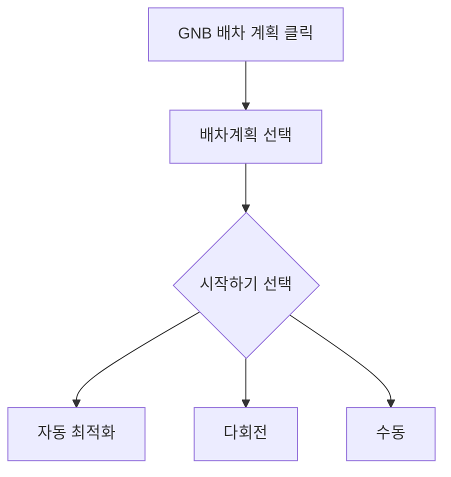

# 배차계획-랜딩

## 개요

- **경로**: `/manage/route`
- **역할**: 수행 방식(자동 최적화 / 다회전 / 수동) 선택
- **권한**:
  - `관리자(1), 매니저(2)` 만 활성.
  - `수동 배차 전용 플랜(2)` 인 요금제는 자동 최적화·다회전 카드 미노출(수동만 노출).
  - 결제 정지/만료 시 GNB 비활성 또는 유료 안내.

## ScreenShot

## 구성

- 버튼: [자동최적화], [다회전], [수동]

## Actions

### 자동 최적화

- 자동최적화 카드내 [시작하기] 클릭
- 메모리에 저장된 주문 목록 필터 초기화 후 자동배차계획으로 이동

### 다회전

- 다회전 카드내 [시작하기] 클릭
- 다회전 차량이 있는지 확인 후 존재하면 자동배차계획(다회전)로 이동

### 수동

- 수동 카드내 [시작하기] 클릭
- 수동배차계획으로 이동

## User Flow

## API

| 순서 | Method | Path                                                                                                 | 설명                       | 트리거         |
| ---- | ------ | ---------------------------------------------------------------------------------------------------- | -------------------------- | -------------- |
| 1    | GET    | [`/payment/my`](../../../interface/00.roouty/payment.md#get-paymentmy)                               | 요금제 조회 (pricingId)    | 페이지 진입 시 |
| 2    | GET    | [`/v2/route/check/multi/route`](../../../interface/00.roouty/route-v2.md#get-v2routecheckmultiroute) | 다회전 차량 설정 여부 확인 | 페이지 진입 시 |
