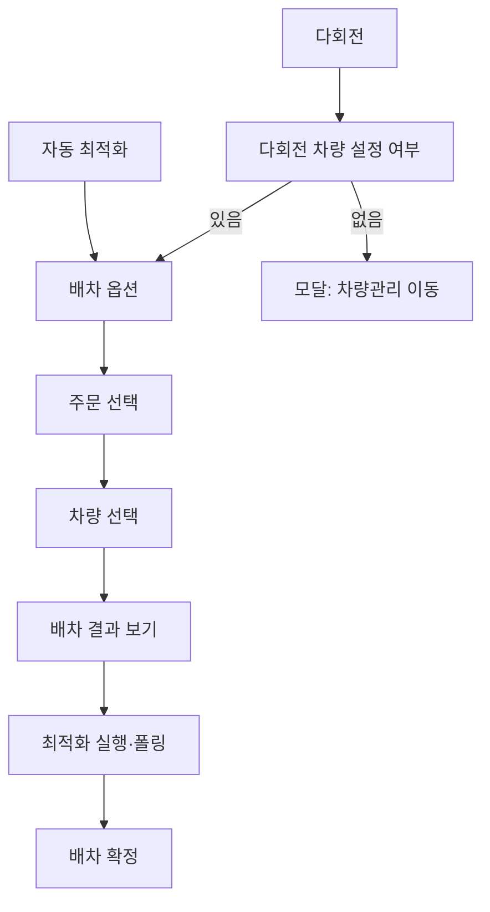

# 배차계획-자동·다회전

## 개요

- **경로**: `/manage/route/optimize` (쿼리 `?type=multi-round` 시 다회전)
- **역할**: 옵션 설정 → 주문 선택 → 차량 선택 → 최적화 실행 → 확정 화면으로 이동.
- **권한**: `관리자(1), 매니저(2)`만 활성.

## 구성

### 자동 최적화 vs 다회전 요약

| 항목      | 자동 최적화                                | 다회전                                        |
| --------- | ------------------------------------------ | --------------------------------------------- |
| 배차 기준 | 차량 수 최소 / 업무시간 최소               | 차량 수 최소만                                |
| 균등 배차 | 선택 안함 / 균등 업무시간 / 균등 주문 개수 | 미노출(고정)                                  |
| 주문 유형 | 배송, 수거                                 | 배송                                          |
| 차량 제약 | -                                          | **다회전가능 차량, 동일 출발지** 만 선택 가능 |

### 배차옵션설정

- 필드:
  - 주행일자, 주행시작 시간지정, 주행종료 시간지정, 주행이름
  - 배차기준: 차량수 최소, 업무시간최소
  - 균등배차: 선택안함, 균등업무시간, 균등주문개수
  - 권역: 권역무관, 기본권역, 유연한권역
  - 유류비/통행료: 선택안함, 자동계산
- 유효성: 주행 **시작/종료 시간**이 없어도 다음 스텝으로 이동할 수 있다. **배차명**과 **배차일**만 필수 검증한다. 단, 시작/종료 시간이 입력된 경우 시작 ≤ 종료 검증 통과 시에만 다음 스텝 진행 가능하며, 부적합 시 안내 문구 노출 + [다음] 비활성. 옵션 ↔ 다음 단계 ↔ 옵션 복귀 시 입력값 잔존.
- 다회전:
  - 배차기준 > 업무시간최소 제외
  - 균등배차 제외

### 주문선택

- 검색
  - 필드:
    - 키워드유형: 주문ID, 업체주문번호, 담당차량지정, 아이템명, 고객명, 주소, 특수조건, 비고1~5, 하위구분, 수정자
    - 키워드
    - 조회유형: 주문접수일, 작업희망일
    - 조회기간
    - 주문유형: 전체, 배송, 수거
    - 배차 우선순위: 전체, 높음, 보통, 낮음
  - 버튼: [조회하기], [초기화], [오늘], [1주일], [1개월], [3개월]
- 목록
  - 행 선택: 배차계획에 전달할 주문 적재. 페이지 이동·뒤로가기 후 옵션 복귀 시 선택 일관 유지(검색·필터 변경은 초기화).
  - 컬럼: 주문ID, 업체주문번호, 주문접수일, 아이템명, 주소, 상세주소, 배차우선순위, 주문상태, 작업희망일, 주문유형, 담당차량지정, 특수조건, 희망시간(이전), 희망시간(이후), 아이템코드, 아이템수량, 실제용적량, 합산용적량1, 합산용적량2, 합산용적량3, 용적량차이사유, 예상작업시간, 실제작업시간, PoD사진수, 담당차량, 작업완료일시, 완료사유, 주행일자, 주행이름, 보류사유, 보류일시, 보류주행이름, 경로ID, 경로상태, 고객명, 고객연락처, 화주사명, 화주사연락처, 중개사명, 중개사연락처, 고객전달사항, 비고1, 비고2, 비고3, 비고4, 비고5
- 다회전
  - 주문유형은 배송으로 고정
  - 다회전 배차 시 주문 목록에서 **픽업 주문은 제외**된다.

### 차량선택

- 검색
  - 필드:
    - 키워드유형(차량, 권역, 특수조건)
    - 키워드
    - 주문상태: 전체, 임시저장, 주행대기, 주행중, 주행종료, 미배정
    - 운영유형: 전체, 고정차, 지입차, 고정용차, 용차
  - 버튼: [조회하기], [초기화]
- 목록
  - 행 선택: 배차계획에 전달할 차량 적재.
  - 컬럼: 차량, 주행상태, 주문대기건수, 주문종료건수, 운영유형, 용적량1, 용적량2, 용적량3, 담당권역, 출발지주소, 특수조건, 근무시작시간, 근무종료시간
- 다회전
  - 컬럼에 회전, 회전작업시간 노출
  - 선택한 차량의 출발지가 동일해야함

## Actions

### 진입시:

- 진입시 진행중인 배차 여부확인.
- 존재 확인하고 무시하고 진행하면 기존 데이터 삭제 API 호출

### 배차 결과 보기:

- 선택 차량 중 이미 최적화된 주행 중/대기 차량 여부 확인 → 최적화 API 호출
- 배송요일 무시경고 모달 노출시

  
  - 주행일과 납품처의 배송 가능 요일이 상이할때 노출.
  - 제시된 텍스트(예. 주문추가)를 입력하면 진행가능.

- 계산 완료후 배차확정 페이지로 이동

## User Flow

## API

### 진입/사전 확인

| 순서 | Method | Path                                                                                           | 설명                        | 트리거                              |
| ---- | ------ | ---------------------------------------------------------------------------------------------- | --------------------------- | ----------------------------------- |
| 1    | GET    | [`/v2/route/exist-request`](../../../interface/00.roouty/route-v2.md#get-v2routeexist-request) | 진행 중 배차 요청 존재 확인 | 페이지 진입 시                      |
| 2    | POST   | [`/v2/route/cancel/all`](../../../interface/00.roouty/route-v2.md#post-v2routecancelall)       | 기존 배차 전체 취소         | 진행 중 배차 존재 시 취소 모달 확인 |
| 3    | GET    | [`/area/list`](../../../interface/00.roouty/area.md#get-arealist)                              | 권역 목록 조회              | 페이지 진입 시                      |

### 배차 옵션 설정 (Step 1)

| 순서 | Method | Path                                                                            | 설명                       | 트리거           |
| ---- | ------ | ------------------------------------------------------------------------------- | -------------------------- | ---------------- |
| 4    | GET    | [`/route/when`](../../../interface/00.roouty/route.md#get-routewhen)            | 날짜별 경로 스케줄 조회    | 주행일자 선택 시 |
| 5    | GET    | [`/route/check/name`](../../../interface/00.roouty/route.md#get-routecheckname) | 경로명(주행이름) 중복 확인 | 주행이름 입력 후 |

### 주문 선택 (Step 2)

| 순서 | Method | Path                                                                 | 설명                  | 트리거                                 |
| ---- | ------ | -------------------------------------------------------------------- | --------------------- | -------------------------------------- |
| 6    | GET    | [`/order/list`](../../../interface/00.roouty/order.md#get-orderlist) | 미배차 주문 목록 조회 | 주문 선택 단계 진입, 검색/필터 변경 시 |

### 차량 선택 (Step 3)

| 순서 | Method | Path                                                                                                  | 설명                    | 트리거                                 |
| ---- | ------ | ----------------------------------------------------------------------------------------------------- | ----------------------- | -------------------------------------- |
| 7    | GET    | [`/member/driver/list/optimize`](../../../interface/00.roouty/member.md#get-memberdriverlistoptimize) | 최적화용 기사/차량 목록 | 차량 선택 단계 진입, 검색/필터 변경 시 |
| 8    | GET    | [`/area/list`](../../../interface/00.roouty/area.md#get-arealist)                                     | 권역 목록 조회          | 차량 선택 필터에서 권역 드롭다운       |

### 최적화 실행 (배차 결과 보기)

| 순서 | Method | Path                                                                                                            | 설명                               | 트리거                                 |
| ---- | ------ | --------------------------------------------------------------------------------------------------------------- | ---------------------------------- | -------------------------------------- |
| 9    | POST   | [`/member/driver/isOptimized`](../../../interface/00.roouty/member.md#post-memberdriverisoptimized)             | 선택 차량 중 이미 배차된 차량 확인 | [배차 결과 보기] 클릭 시 사전 검증     |
| 10   | POST   | [`/v2/route/optimize/equal`](../../../interface/00.roouty/route-v2.md#post-v2routeoptimizeequal)                | 자동 균등 최적화 요청              | [배차 결과 보기] 최종 실행 — 일반 모드 |
| 11   | POST   | [`/v2/route/multi/optimize/equal`](../../../interface/00.roouty/route-v2.md#post-v2routemultioptimizeequal)     | 다회전 균등 최적화 요청            | [배차 결과 보기] — 다회전 모드         |
| 12   | GET    | [`/v2/route/response`](../../../interface/00.roouty/route-v2.md#get-v2routeresponse)                            | 엔진 응답 결과 조회                | 최적화 요청 후 결과 대기               |
| 13   | POST   | [`/v2/route/preview/products`](../../../interface/00.roouty/route-v2.md#post-v2routepreviewproducts)            | 적재 데이터 미리보기               | 최적화 완료 후 prefetch                |
| 14   | POST   | [`/v2/route/multi/preview/products`](../../../interface/00.roouty/route-v2.md#post-v2routemultipreviewproducts) | 다회전 적재 데이터 미리보기        | 다회전 최적화 완료 후 prefetch         |

### 보조 API (배차 확정 후 조회)

| 순서 | Method | Path                                                                                                           | 설명                                               | 트리거               |
| ---- | ------ | -------------------------------------------------------------------------------------------------------------- | -------------------------------------------------- | -------------------- |
| 15   | GET    | [`/route/detail/:routeId`](../../../interface/00.roouty/route.md#get-routedetailrouteid)                       | 배차 상세 조회 (`getRouteDetail`)                  | 배차 행 클릭         |
| 16   | GET    | [`/route/list/boundary`](../../../interface/00.roouty/route.md#get-routelistboundary)                          | 배차 목록 경계값 — 캘린더 (`getRouteListBoundary`) | 날짜 변경 시         |
| 17   | GET    | [`/route/excel-download/:routeStatus`](../../../interface/00.roouty/route.md#get-routeexcel-downloadactivated) | 배차 엑셀 다운로드                                 | [엑셀 다운로드] 버튼 |
