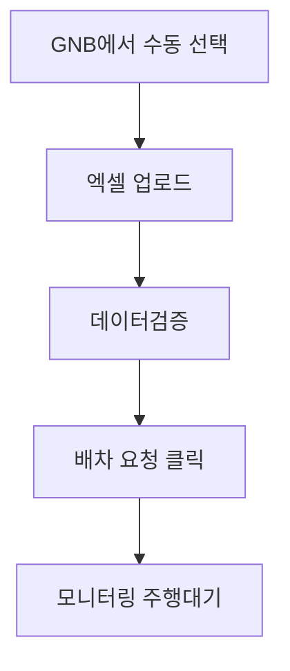

# 배차계획-수동

## 개요

- **경로**: `/manage/route/manual`
- **역할**: 주문정보를 수동으로 엑셀 업로드 후 배차 요청 → `[모니터링 > 주행대기]` 으로 이동.
- **권한**: `관리자(1), 매니저(2)`만 활성.

## ScreenShot

## 구성

- 필드: 주행일자, 주행이름
- 정보: 주문수, 차량수
- 버튼: [주문엑셀업로드], [배차계획저장]

## Actions

### 엑셀업로드

- 구성
  - 필드: 오류 및 수정건만보기
  - 버튼: [결증결과다운로드], [닫기], [주문등록]
  - 컬럼: 순번, 오류메세지, 업체주문번호, 주문접수일, 고객명, 고객연락처, 주소, 상세주소, 고객전달사항, 합산용적량1-3, 화주사명, 화주사연락처, 중개사명, 중개사연락처, 아이템명, 아이템코드, 아이템수량, 주문유형, 예상작업소요시간(분), 담당차량지정, 비고1-5
- 플로우
  - 엑셀업로드 → 데이터 검증 상태 표시

    

  - 오류메세지 존재시 → 컬럼을 클릭 → 해당 컬럼으로 이동 가능

    

  - 셀클릭후 데이터 변경 후 엔터키 > 데이터 변경 후 검증내용 확인
  - 모든 오류데이터를 변경 후 [주문등록]
  - 요약내용 / 맵 상의 마커확인

    
    

  - [배차계획저장] → `[모니터링 > 주행대기]`에서 배차계획 등록확인

## User Flow

## API

### 엑셀 업로드/검증

| 순서 | Method | Path                                                                                                                                                          | 설명                                   | 트리거                          |
| ---- | ------ | ------------------------------------------------------------------------------------------------------------------------------------------------------------- | -------------------------------------- | ------------------------------- |
| 1    | POST   | [`/manual/excel`](../../../interface/00.roouty/manual.md#post-manualexcel)                                                                                    | 수동 주문 엑셀 업로드                  | [주문엑셀업로드] > 파일 선택    |
| 2    | PUT    | [`/v2/manual/temporary/:id/row/:rowId/edit`](../../../interface/00.roouty/manual-order-v2.md#put-v2manualtemporarytemporaryorderidrowtemporaryorderrowidedit) | 에러 행 인라인 수정 + 재검증           | 검증 결과 테이블에서 셀 수정 후 |
| 3    | GET    | [`/v2/manual/temporary/:id/route-request`](../../../interface/00.roouty/manual-order-v2.md#get-v2manualtemporarytemporaryorderidroute-request)                | 경로 요청 상태 조회 — 차량/주문 데이터 | 검증 완료 후 데이터 로딩        |

### 배차 요청 (경로 생성)

| 순서 | Method | Path                                                                                                        | 설명                          | 트리거                           |
| ---- | ------ | ----------------------------------------------------------------------------------------------------------- | ----------------------------- | -------------------------------- |
| 4    | GET    | [`/route/when`](../../../interface/00.roouty/route.md#get-routewhen)                                        | 날짜별 경로 스케줄 조회       | 주행일자 선택 시                 |
| 5    | GET    | [`/route/check/name`](../../../interface/00.roouty/route.md#get-routecheckname)                             | 경로명(배차이름) 중복 확인    | 배차이름 입력 후                 |
| 6    | POST   | [`/member/driver/isOptimized/manual`](../../../interface/00.roouty/member.md#post-memberdriverisoptimized)  | 선택 차량 이미 배차 여부 확인 | [배차계획저장] 클릭 시 사전 검증 |
| 7    | POST   | [`/v2/manual/temporary/route`](../../../interface/00.roouty/manual-order-v2.md#post-v2manualtemporaryroute) | 수동 경로 생성 (배차 요청)    | [배차계획저장] 버튼 클릭         |
