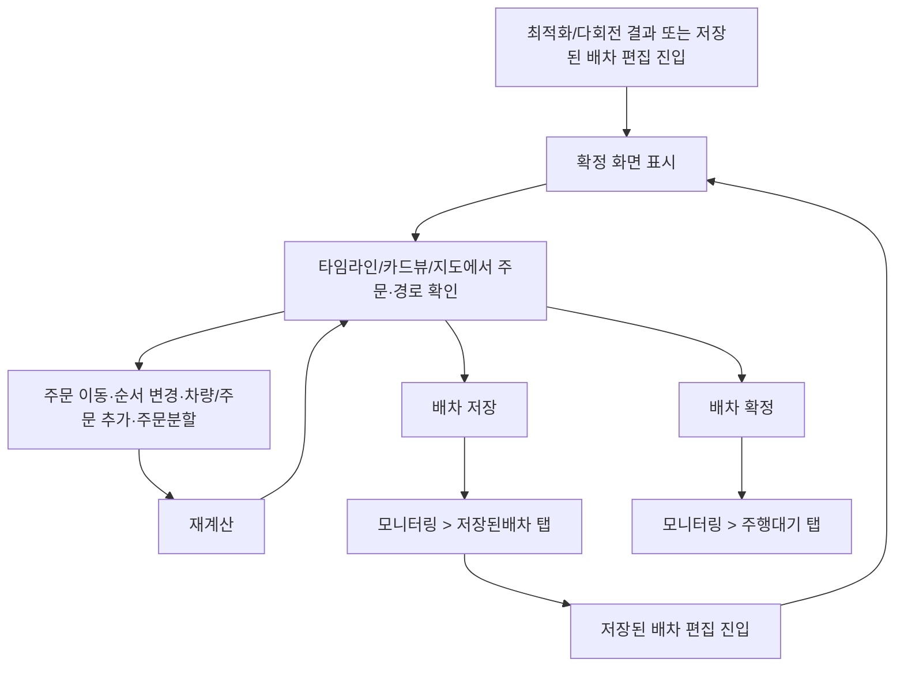

# 배차계획-확정

## 개요

- **경로**: `/manage/route/confirm/:key`
- **역할**: 배차 결과 확인·수정·재계산·배차 저장·배차 확정. 타임라인(드라이버별 주문)과 지도 연동.
- **진입 경로**: 자동최적화/다회전 결과 진입, 저장된 배차 편집 진입.
- **권한**: `관리자(1), 매니저(2)`만 활성.

## ScreenShot

### 타임뷰

### 카드뷰

## 구성

### 공통

- 필드: 배차명, 주행일
- 버튼: [설정다시하기], [재계산], [검수확인요청], [검수요청], [배차저장], [배차확정], [옵션설정]
- 정보: 총배차된 주문, 총배치된 차량, 총예상작업시간, 총예상용적량, 총예상이동거리, 총예상통행료, 총예상유류비
- 탭: 최적화1, 결과2-

### 타임뷰/카드뷰

- 필드: 임의순서변경, 차량정렬, 타임라인단위
- 버튼: [초기화], [차량추가], [주문추가], [카드뷰], [타임뷰], [최대/최소화], [차량정보], [주문분할], [주문분할초기화], [카드뷰 컬럼 설정](카드뷰 진입 시)

### 맵

- mapbox + naver 맵 을 이용한 경로 표시

## Actions

### 공통

- 설정다시하기
  - 자동최적화/다회전 으로 진입한 경우는 설정화면으로 이동.
  - 저장된 배차를 통해서 진입시에는 `[모니터링 > 저장된배차]` 탭으로 이동

- 재계산
  - 차량이 1개 이하면 비활성.
  - 수정된 드라이버가 없으면 재계산 불가.
  - UI에는 [재계산] 버튼 1개. **임의순서변경** 토글 상태에 따라 내부 동작이 달라짐:
    - 임의순서변경 **적용** 시: 주문 순서까지 포함하여 재계산
    - 임의순서변경 **미적용** 시: 기존 주문 순서를 유지한 채 시간/거리만 재계산
  - 재계산 진행 중 **취소 가능** (취소 버튼 활성화).

- 배차 저장
  - 주행일이 오늘 이전이면 비활성.
  - 편집이 있어도 저장 가능(확정은 불가).
  - 임시저장 처리 → 차량에 전달되진 않음. `[모니터링 > 저장된배차]` 탭으로 이동. 해당 탭에서 수정·재편집·배차 확정 가능.

- 배차 확정 (배차 저장과 다름):
  - 주행일 오늘 이전이면 비활성.
  - 편집 사항이 있으면 비활성 (먼저 재계산 또는 배차 저장 후 확정).
  - 확정 처리 → 차량에 즉시 전달. `[모니터링 > 주행대기]` 탭에서 확인.
  - **부수 효과**:
    - 기사에게 푸시 알림 발송:
    - 자동 메시지 트리거 (알림톡/SMS 등 팀별 설정에 따라 발송)
    - 웹훅 호출 (외부 연동 설정된 팀의 경우)
      - ⚠️ 아웃바운드 웹훅 설정 UI가 없으므로 DB에 `WebHook`(url, events) 레코드와 `MessageAutoSetting` 이벤트 코드 활성화가 필요. 새 팀 추가 시 누락 주의.
  - **상태 변경**:
    - 경로 상태: TEMPORARY → ACTIVATED
    - 주문 상태: 미배차(unassigned) → 배차완료(scheduled)

- 검수요청:
  - KT 등 검수 연동 업체를 위한 기능
  - 다회전시 비노출
  - 저장된 배차가 아닐경우 비노출
  - 검수 요청 실행후 `[모니터링 > 저장된 배차]` 탭으로 이동

- 배차명:
  - 이전 배차 계획 카운트 정보를 가지고 자동생성.
  - 수동으로 변경도 가능. (최대 30자)
  - 주행명 변경 시 **주행명만** 갱신하며, 차량 추가·주문 추가 시 기존 배차 데이터가 덮어쓰이지 않음.

- 주행일:
  - 금일 이전일 경우, [재계산], [배차저장], [배차확정] 진행전에 오류 표시.
  - 저장된 배차의 경우, 주행일 변경 가능 (날짜 선택 시 즉시 반영).

- 옵션설정

  
  - 주문/차량은 유지한채 배차옵션 변경/재계산

- 결과탭
  - 5개가 기본이며, 재계산 실행시 결과2~ 부터 탭 활성화.
  - 최적화 탭을 제외하고 결과xx 탭은 삭제가 가능하며, 논리적으로는 5개 이상의 결과를 확인할 수 있음.

- 저장된 배차 편집:
  - 취소 전 검증 수행 (이미 등록된 주문이 있는지 등 확인).
  - 편집 후 [배차저장] 또는 [배차확정]으로 최종 처리.

- 배차 취소 오류 안내 모달:
  - 저장된 배차 편집 진입 또는 화면 이탈 시 기존 경로 취소가 실패하면 별도 오류 모달 노출.
  - 모달 내용에는 실패 원인 안내가 포함되며, [확인] 시 모달 닫힘.

### 타임뷰/카드뷰

- 임의 순서 변경
  - 단일 회전에서만 노출
  - 적용: 동일 차량내에서의 주문 이동제한. 차량별 타임라인으로 주문 이동가능
  - 미적용: 제한 없이 주문 이동 가능.

- 차량정렬
  - 단일회전, 타임뷰 일때만 노출.
  - 옵션: 차량 이름순, 주문 많은 순, 주문 적은 순, 업무 시간 긴/짧은 순, 이동 거리 긴/짧은 순, 용적량 많은/적은 순

- 타임단위
  - 타임뷰에서만 노출
  - 타임라인 가로축의 시간 눈금 간격만 변경(그리드/블록 배치는 동일, 시각적 단위만 변경).
  - 옵션: 60(분), 30(분), 10(분)

- 초기화
  - 이동·편집 이력이 없으면 비활성
  - 실행시 타임라인 기준으로 초기 상태로 복원
  - 주문분할 적용된 주문은 분할된 상태에서 미배차 주문으로 이동. (주문 병합 없음)

- 차량추가

  
  - 구성
    - 필드:
      - 키워드유형: 차량, 권역, 특수조건
      - 키워드
    - 버튼: [조회하기], [초기화], [닫기], [차량추가]
    - 컬럼: 차량, 운영유형, 용적량, 담당권역, 출발지주소, **특수조건**(차량에 등록된 스킬 토큰 노출), 근무시작시간, 근무종료시간
  - 플로우
    - 선택된 조회 차량이 1개 이상이면, [차량추가] 버튼 활성화.
    - 실행되면 타임라인에 주문이 없는 차량 추가됨.

- 주문추가

  
  - 구성
    - 필드:
      - 키워드유형: 주문ID, 아이템명, 고객명, 고객연락처, 주소
    - 버튼: [조회하기], [초기화], [닫기], [주문추가]
  - 플로우
    - 금일 기준으로 과거 1주일 기간의 주문 조회
    - 선택된 조회 주문이 1개 이상이면, [주문추가] 버튼 활성화.
    - 실행되면 미배차 타임라인에 주문 추가됨.
    - 배송요일 무시경고 모달 노출시

      
      - 주행일과 납품처의 배송 가능 요일이 상이할때 노출.
      - 제시된 텍스트(예. 주문추가)를 입력하면 진행가능.

- 주문분할

  
  - 구성 (2패널 모달)
    - **좌측 패널** — 미배차 주문 목록:
      - 미배차 주문 건수 표시
      - 정렬 드롭다운: 납품처명, 납품처 유형, 주소
      - 주문 카드 목록 (클릭하여 우측 패널에 분할 상세 표시)
    - **우측 패널** — 주문 분할 관리:
      - 적용 분할 조건 안내
      - 분할그룹1, 분할그룹2 영역
      - 각 그룹에 차량 선택 (드롭다운, 적재 용량 표시)
      - 분할 비율 입력 (그룹별 % 입력 — 한 쪽 변경 시 나머지 자동 보정), 비율 초기화 버튼(↺) 노출
      - 아이템 이동 화살표 버튼 (◄ ►) — 좌우 그룹 간 아이템 이동
      - 체크박스 선택으로 다건 아이템 일괄 이동
      - 제품 정렬 옵션 (용적량1/2/3 기준 정·역순)
      - 수량 직접 입력
    - 버튼: [닫기], [임시 저장], [자동 주문 분할], [분할 초기화]
  - 플로우
    - 좌측 미배차 주문카드 선택 → 우측 분할 상세 표시
    - 분할그룹1,2에 차량 지정 → [자동 주문 분할] 또는 비율 필드/수기 입력으로 분배
    - [임시 저장] → 지정된 차량에 분할된 주문 추가
    - 다회전 시 회전별 적재 비율 처리
  - 자동 분할 조건:
    1. 아이템 분할 — 설정 > 주문분할 설정에 설정 완료시
    2. 수량 분할 — 아이템별 수량 설정이 있는 경우
    3. 납품처 유형 분할 — useVendorType 활성 시
    4. 기본 용적량 분할 — 차량1을 100% 채운 후 나머지를 차량2에 배분

- 주문분할초기화
  - **개별 초기화**: [분할 초기화] 버튼으로 선택한 주문의 분할만 초기화
  - **전체 초기화**: 모든 분할 주문 삭제, 분할 전 주문만 미배차에 생성
  - [배차저장], [배차확정] 되지 않은 상태에서 화면 이탈시 분할 초기화 진행.

- 뷰변경: 타임뷰/카드뷰 토글
- 카드뷰 컬럼 설정
  - 카드뷰 진입 시 노출되는 [카드뷰 컬럼 설정] 진입.
  - 카드 본문에 노출할 항목을 사용자가 선택. 저장 시 사용자 환경에 영속화되어 페이지 재진입·재로그인 후에도 유지.
  - 표시 항목 후보: 업체주문번호, 주소, 상세주소, 희망시간, 특수조건, 합산용적량, 비고 등.

  

- 최대/최소: 타임뷰에서만 노출
- 타임라인(좌측): 드라이버별 주문 순서. 카드/리스트 뷰 전환 가능. 주문 드래그·순서 변경, 드라이버 간 이동, 주문 취소 등.
- 행 클릭·상세보기 등: 주문 클릭 시 지도에서 해당 주문 위치 강조. 상세 모달/패널이 있으면 진입 경로·내용 기술.

- 차량상세보기:

  
  
  - 구성
    - 정보: 차량 기본 정보, 적재 정보(적재 차트 - 시각적 적재율 확인).
    - 컬럼:
      - 차량 기본 정보: 순번, 배차우선순위, 담당차량지정, 예상출발시간, 예상이동시간, 예상도착시간, 예상유휴시간, 예상작업시간, 예상완료시간, 주문유형, 고객명, 주소, 상세주소, 회전, 합산용적량1, 합산용적량2, 합산용적량3
      - 적재 정보: 고객명, 아이템명, 아이템코드, 아이템수량, 용적량1, 용적량2, 용적량3
  - 플로우
    - 조회된 적재 정보의 행을 선택 > 상단 차량 적재구역중 제안된 위치 정보 및 용적량이 변경됨.
    - 다회전시 회전당 탭으로 선택가능.

## 폼 필드 상세

### 배차 확정 — 공통 필드

| 필드명 | 입력타입   | 필수 | 최대길이 | 포맷/패턴                         | Placeholder      | 검증에러 메시지                    |
| ------ | ---------- | ---- | -------- | --------------------------------- | ---------------- | ---------------------------------- |
| 배차명 | Text       | O    | 255자    | 자유 형식, 자동 생성(카운트 기반) | 자동 생성된 이름 | -                                  |
| 주행일 | DatePicker | O    | -        | `YYYY-MM-DD`, 어제 이후           | -                | 금일 이전 시 재계산/저장/확정 불가 |

### 배차 계산 요청 (OptimizeEqual)

| 필드명                    | 입력타입     | 필수 | 포맷/패턴                         | 검증에러 메시지 |
| ------------------------- | ------------ | ---- | --------------------------------- | --------------- |
| 주행일 (performedDate)    | DatePicker   | O    | `YYYY-MM-DD`, 어제 이후           | -               |
| 출발 시간 (performedTime) | TimeSelect   | -    | `HH:MM` (00:00~35:59)             | -               |
| 종료 시간 (workEndTime)   | TimeSelect   | -    | `HH:MM` (00:00~35:59)             | -               |
| 주문 목록 (orderList)     | CheckboxList | -    | 정수 배열, 최소 1                 | -               |
| 기사 목록 (driverList)    | CheckboxList | -    | `[{driverId, vehicleId}]`, 최소 1 | -               |
| 권역 배분 (distAreaType)  | Select       | -    | `none` (기본) 등                  | -               |
| 균등 배분 (equalizeBy)    | Select       | -    | `none` (기본) 등                  | -               |
| 배차 타입 (dispatchType)  | Select       | -    | `minVehicle` (기본) 등            | -               |

### 경로 확정 (RegisterRoute)

| 필드명                          | 입력타입   | 필수 | 포맷/패턴                         | 검증에러 메시지 |
| ------------------------------- | ---------- | ---- | --------------------------------- | --------------- |
| 배차명 (name)                   | Text       | O    | 최대 255자                        | -               |
| 주행일 (performedDate)          | DatePicker | O    | `YYYY-MM-DD`, 어제 이후           | -               |
| 출발 시간 (performedTime)       | TimeSelect | -    | `HH:MM` (00:00~35:59)             | -               |
| 기사 목록 (driverList)          | -          | O    | 최소 1명                          | -               |
| 기사별 출발시간 (workStartTime) | TimeSelect | -    | `HH:MM` (00:00~35:59)             | -               |
| 주문 타입 (orderList[].type)    | -          | O    | `order`, `break`, `end`, `reload` | -               |
| ETA (route.eta)                 | -          | -    | `YYYYMMDDHHmmss`                  | -               |

### 차량 추가 모달

| 필드명     | 입력타입 | 필수 | 포맷/패턴            | 검증에러 메시지 |
| ---------- | -------- | ---- | -------------------- | --------------- |
| 키워드유형 | Select   | -    | 차량, 권역, 특수조건 | -               |
| 키워드     | Text     | -    | 자유 형식            | -               |

### 주문 추가 모달

| 필드명     | 입력타입 | 필수 | 포맷/패턴                                  | 검증에러 메시지 |
| ---------- | -------- | ---- | ------------------------------------------ | --------------- |
| 키워드유형 | Select   | -    | 주문ID, 아이템명, 고객명, 고객연락처, 주소 | -               |
| 키워드     | Text     | -    | 자유 형식                                  | -               |

> **시간 범위 35:59 설명**: 시간 필드에서 00:00~35:59 범위를 허용하는 이유는 익일 새벽 배송 대응을 위함. 30:00~35:59는 익일 06:00~11:59를 의미한다. 단, 휴식 시간(breakStart/End)은 00:00~23:59만 허용.

## 지도·페이지 연동

- 지도 영역(우측): 경로 라인·주문 마커·드라이버별 색 구분 등 표시. 타임라인에서 드라이버 또는 주문 선택 시 해당 경로·마커 강조.
- 마커/경로 클릭: 주문 마커 클릭 시 해당 주문 상세 또는 타임라인에서 해당 주문 포커스. 경로 클릭 시 동일 연동.
- 타임라인–지도 연동: 타임라인에서 주문 순서 변경·드라이버 간 이동 시 지도 경로·마커 즉시 갱신. 재계산 시 경로·마커 재계산 결과로 갱신.
- 다회전·회차 전환: 다회전 배차 시 회차(회전) 전환 UI가 있으면, 전환 시 해당 회차의 경로·주문만 지도·타임라인에 표시.

## User Flow

## API

### 진입/데이터 로드

| 순서 | Method | Path                                                                                                        | 설명                                    | 트리거                           |
| ---- | ------ | ----------------------------------------------------------------------------------------------------------- | --------------------------------------- | -------------------------------- |
| 1    | GET    | [`/v2/route/response`](../../../interface/00.roouty/route-v2.md#get-v2routeresponse)                        | 엔진 최적화 결과 조회                   | 자동최적화/다회전 결과로 진입 시 |
| 2    | GET    | [`/v2/route/temporary/jobId`](../../../interface/00.roouty/temporary-route-v2.md#get-v2routetemporaryjobid) | 임시 경로의 jobId 조회                  | 저장된 배차에서 jobId 필요 시    |
| 3    | GET    | [`/v2/setting`](../../../interface/00.roouty/setting-v2.md#get-v2setting)                                   | 팀 설정 조회 (검수 요청 버튼 노출 여부) | 페이지 진입 시                   |

### 적재 데이터 조회

| 순서 | Method | Path                                                                                                                              | 설명                             | 트리거                              |
| ---- | ------ | --------------------------------------------------------------------------------------------------------------------------------- | -------------------------------- | ----------------------------------- |
| 4    | POST   | [`/v2/route/preview/products`](../../../interface/00.roouty/route-v2.md#post-v2routepreviewproducts)                              | 적재 데이터 미리보기 (최초 배차) | 차량 상세 > 적재 탭                 |
| 5    | POST   | [`/v2/route/multi/preview/products`](../../../interface/00.roouty/route-v2.md#post-v2routemultipreviewproducts)                   | 다회전 적재 데이터 미리보기      | 다회전 차량 상세 > 적재 탭          |
| 6    | GET    | [`/v2/route/:routeId/products`](../../../interface/00.roouty/route-v2.md#get-v2routerouteidproducts)                              | 저장된 배차 적재 데이터 조회     | 저장된 배차 편집 > 차량 상세        |
| 7    | GET    | [`/v2/route/:routeId/multi/products/:driverId`](../../../interface/00.roouty/route-v2.md#get-v2routerouteidmultiproductsdriverid) | 저장된 다회전 적재 데이터 조회   | 저장된 다회전 배차 편집 > 차량 상세 |

### 재계산

| 순서 | Method | Path                                                                                                                               | 설명                            | 트리거                        |
| ---- | ------ | ---------------------------------------------------------------------------------------------------------------------------------- | ------------------------------- | ----------------------------- |
| 8    | POST   | [`/v2/route/optimize/equal/recalculate`](../../../interface/00.roouty/route-v2.md#post-v2routeoptimizeequalrecalculate)            | 옵션 재설정 재계산              | [재계산] (옵션 재설정 모달)   |
| 9    | POST   | [`/v2/route/multi/optimize/equal/recalculate`](../../../interface/00.roouty/route-v2.md#post-v2routemultioptimizeequalrecalculate) | 다회전 옵션 재설정 재계산       | 다회전 모드 [재계산]          |
| 10   | POST   | [`/v2/route/optimize/edit/auto`](../../../interface/00.roouty/route-v2.md#post-v2routeoptimizeeditauto)                            | 자동 수정 최적화 (순서변경 OFF) | [재계산] 임의순서변경 미적용  |
| 11   | POST   | [`/v2/route/optimize/edit/auto/multi`](../../../interface/00.roouty/route-v2.md#post-v2routeoptimizeeditautomulti)                 | 다회전 자동 수정 최적화         | 다회전 [재계산]               |
| 12   | POST   | [`/v2/route/optimize/edit/manual`](../../../interface/00.roouty/route-v2.md#post-v2routeoptimizeeditmanual)                        | 수동 수정 최적화 (순서변경 ON)  | [재계산] 임의순서변경 적용    |
| 13   | POST   | [`/v2/route/response/edit`](../../../interface/00.roouty/route-v2.md#post-v2routeresponseedit)                                     | 수정 최적화 엔진 응답 조회      | 자동 수정 최적화 후 결과 대기 |
| 14   | POST   | [`/v2/route/cancel/edit`](../../../interface/00.roouty/route-v2.md#post-v2routecanceledit)                                         | 수정 최적화 취소                | 재계산 진행 중 [취소]         |
| 15   | POST   | [`/v2/route/cancel/manual`](../../../interface/00.roouty/route-v2.md#post-v2routecancelmanual)                                     | 수동 최적화 취소                | 수동 재계산 진행 중 [취소]    |

### 배차 저장/확정

| 순서 | Method | Path                                                                                                                  | 설명                                                                      | 트리거                             |
| ---- | ------ | --------------------------------------------------------------------------------------------------------------------- | ------------------------------------------------------------------------- | ---------------------------------- |
| 16   | POST   | [`/v2/route/temporary/save`](../../../interface/00.roouty/temporary-route-v2.md#post-v2routetemporarysave)            | 배차 저장 (임시저장)                                                      | [배차 저장] 버튼                   |
| 17   | POST   | [`/v2/route/temporary/multi/save`](../../../interface/00.roouty/temporary-route-v2.md#post-v2routetemporarymultisave) | 다회전 배차 저장                                                          | 다회전 모드 [배차 저장]            |
| 18   | POST   | [`/route/register`](../../../interface/00.roouty/route.md#post-routeregister)                                         | 배차 확정 (단일 회전)                                                     | [배차 확정] 버튼                   |
| 19   | POST   | [`/v2/route/multi/register`](../../../interface/00.roouty/route-v2.md#post-v2routemultiregister)                      | 다회전 배차 확정                                                          | 다회전 모드 [배차 확정]            |
| 20   | POST   | [`/v2/route/check-cancel`](../../../interface/00.roouty/route-v2.md#post-v2routecheck-cancel)                         | 저장된 배차 취소 가능 확인                                                | 배차 확정 전 사전 검증             |
| 21   | DELETE | [`/route/cancel/:routeId`](../../../interface/00.roouty/route.md#delete-routecancelrouteid)                           | 경로 취소                                                                 | 저장된 배차 편집 시 기존 경로 취소 |
| 22   | PUT    | [`/v2/route/temporary/:routeId`](../../../interface/00.roouty/temporary-route-v2.md#put-v2routetemporaryrouteid)      | 임시 경로 주행일 수정 (BE는 PUT; FE 레거시 PATCH 호출은 미사용 dead code) | 저장된 배차에서 주행일 변경 시     |

### 검수 요청

| 순서 | Method | Path                                                                                                                   | 설명      | 트리거          |
| ---- | ------ | ---------------------------------------------------------------------------------------------------------------------- | --------- | --------------- |
| 23   | POST   | [`/v2/route/temporary/inspection`](../../../interface/00.roouty/temporary-route-v2.md#post-v2routetemporaryinspection) | 검수 요청 | [검수요청] 버튼 |

### 차량/주문 추가 모달

| 순서 | Method | Path                                                                                                                                 | 설명                                                         | 트리거                       |
| ---- | ------ | ------------------------------------------------------------------------------------------------------------------------------------ | ------------------------------------------------------------ | ---------------------------- |
| 24   | GET    | [`/member/driver/list/optimize`](../../../interface/00.roouty/member.md#get-memberdriverlistoptimize)                                | 추가 가능한 차량 목록                                        | [차량 추가] 모달 조회        |
| 25   | GET    | [`/area/list`](../../../interface/00.roouty/area.md#get-arealist)                                                                    | 권역 목록 조회                                               | 차량 추가 모달 권역 검색     |
| 26   | POST   | [`/v2/order/list/exclude`](../../../interface/00.roouty/order-list-v2.md#post-v2orderlistexclude)                                    | 미배차 주문 목록 (선택 제외 페이징, `getOrderExcludeList`)   | [주문 추가] 모달 조회        |
| 26-1 | POST   | [`/v2/order/list/details`](../../../interface/00.roouty/order-list-v2.md#post-v2orderlistdetails)                                    | 선택 주문 상세 일괄 조회 (`postSelectedOrderList`, 최대 200) | [주문추가] 선택 후 상세 로드 |
| 27   | POST   | [`/v2/order/validate-delivery-days`](../../../interface/00.roouty/delivery-days-validation-v2.md#post-v2ordervalidate-delivery-days) | 배송 가능 요일 검증                                          | 주문 추가 시                 |

### 주문 분할

| 순서 | Method | Path                                                                                                               | 설명                  | 트리거                       |
| ---- | ------ | ------------------------------------------------------------------------------------------------------------------ | --------------------- | ---------------------------- |
| 28   | GET    | [`/v2/order/split/settings`](../../../interface/00.roouty/order-split-v2.md#get-v2ordersplitsettings)              | 분할 조건 설정 조회   | [주문 분할] 모달 오픈 시     |
| 29   | POST   | [`/v2/order/split`](../../../interface/00.roouty/order-split-v2.md#post-v2ordersplit)                              | 주문 분할 (임시 저장) | [임시 저장]                  |
| 30   | POST   | [`/v2/order/split/edit`](../../../interface/00.roouty/order-split-v2.md#post-v2ordersplitedit)                     | 수동 분할 (상품 배분) | 수동으로 아이템 이동 후 저장 |
| 31   | GET    | [`/v2/order/split/:orderId`](../../../interface/00.roouty/order-split-v2.md#get-v2ordersplitorderid)               | 분할 주문 목록 조회   | 분할 모달에서 주문 선택 시   |
| 32   | POST   | [`/v2/order/split/confirm/:jobId`](../../../interface/00.roouty/order-split-v2.md#post-v2ordersplitconfirmjobid)   | 분할 주문 확정        | 배차 확정 시 분할 확정 포함  |
| 33   | DELETE | [`/v2/order/split/reset/:jobId`](../../../interface/00.roouty/order-split-v2.md#delete-v2ordersplitresetjobid)     | 분할 전체 초기화      | [주문분할초기화]             |
| 34   | DELETE | [`/v2/order/split/:orderId`](../../../interface/00.roouty/order-split-v2.md#delete-v2ordersplitorderid)            | 개별 분할 취소        | [분할 초기화] (개별)         |
| 35   | POST   | [`/v2/order/split/vehicle`](../../../interface/00.roouty/order-split-v2.md#post-v2ordersplitvehicle)               | 차량 용적 데이터 저장 | 분할 그룹에 차량 지정 시     |
| 36   | POST   | [`/v2/order/split/rollback/:jobId`](../../../interface/00.roouty/order-split-v2.md#post-v2ordersplitrollbackjobid) | 분할 확정 롤백        | 배차 확정 취소/화면 이탈 시  |
| 37   | POST   | [`/v2/order/split/status/:jobId`](../../../interface/00.roouty/order-split-v2.md#post-v2ordersplitstatusjobid)     | 분할 존재 여부 확인   | 배차 확정 전 사전 검증       |

### 주문 상세

| 순서 | Method | Path                                                                                     | 설명           | 트리거                         |
| ---- | ------ | ---------------------------------------------------------------------------------------- | -------------- | ------------------------------ |
| 38   | GET    | [`/order/detail/:orderId`](../../../interface/00.roouty/order.md#get-orderdetailorderid) | 주문 상세 조회 | 타임라인 주문 클릭 > 상세 모달 |

### 다운로드/최적화

| 순서 | Method | Path                                                                                                             | 설명                                                                               | 트리거                 |
| ---- | ------ | ---------------------------------------------------------------------------------------------------------------- | ---------------------------------------------------------------------------------- | ---------------------- |
| 39   | POST   | [`/route/download`](../../../interface/00.roouty/route.md#post-routedownload)                                    | 배차 다운로드                                                                      | [다운로드] 버튼        |
| 40   | POST   | [`/route/download/item`](../../../interface/00.roouty/route.md#post-routedownloaditem)                           | 배차 항목 다운로드                                                                 | [항목 다운로드] 버튼   |
| 41   | POST   | [`/route/driver/download/item`](../../../interface/00.roouty/route.md#post-routedriverdownloaditem)              | 기사별 배차 다운로드                                                               | [기사별 다운로드] 버튼 |
| 42   | POST   | [`/v2/driver-route/list`](../../../interface/00.roouty/driver-route-v2.md#post-v2driver-routelist)               | 기사별 배차 목록 (`RouteOptimizeService`)                                          | 배차 확정 화면 진입 시 |
| 43   | POST   | [`/v2/route/cancel`](../../../interface/00.roouty/route-v2.md#post-v2routecancel)                                | 배차 최적화 취소 (`useCancelOptimize`)                                             | [취소] 버튼            |
| 44   | POST   | [`/v2/route/optimize/edit/:optimizeMode`](../../../interface/00.roouty/route-v2.md#post-v2routeoptimizeeditauto) | 재최적화 — 모드별 (`RouteOptimizeService`, :optimizeMode → auto/auto/multi/manual) | 재최적화 실행          |
