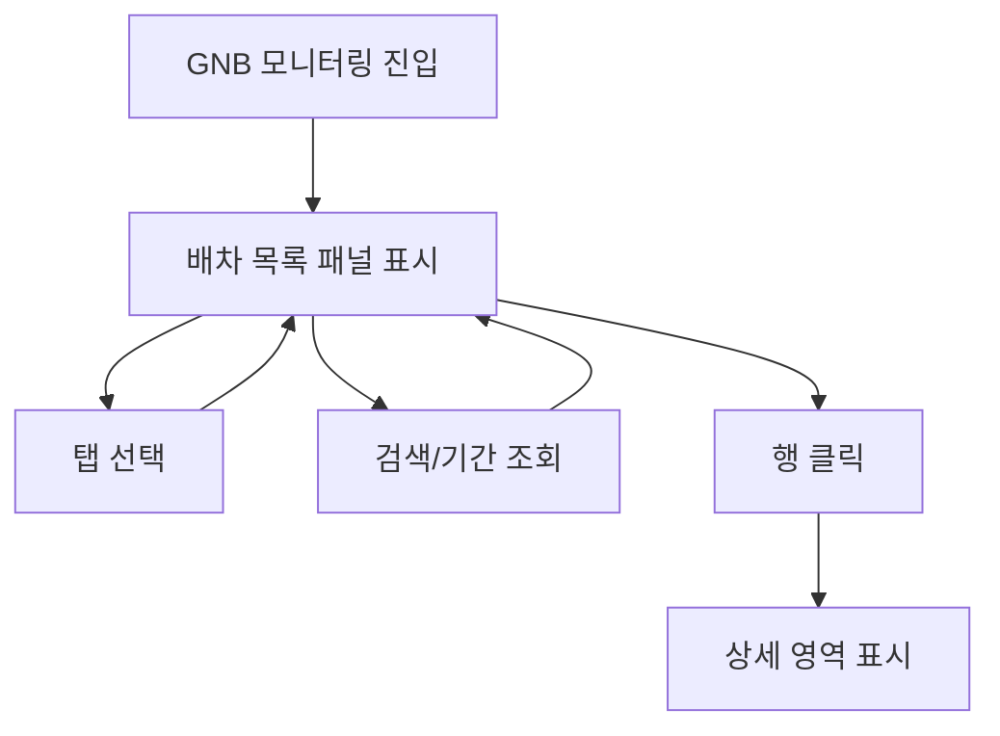

# 모니터링

## 개요

- **경로**: `/manage/control`, `/manage/control/:status`. (주행중, 주행대기, 주행종료, 저장된 배차)
- **역할**: 배차별 주행 상태 모니터링. **탭별 배차 목록** 조회·검색·행 클릭 시 **상세 영역으로 전환**.
- **진입 경로**: GNB "모니터링" 클릭.
- **권한**: `관리자(1), 매니저(2)`만 활성.

## ScreenShot

## 검색

| 라벨(표시명) | 타입                       | 옵션/기본값·초기화                                                                        |
| ------------ | -------------------------- | ----------------------------------------------------------------------------------------- |
| 키워드검색   | 텍스트 + 셀렉트(검색 대상) | 검색 대상: 경로 ID, 주행 이름, 차량, 생성자(배차 담당자). [조회하기] [초기화]             |
| 조회 기간    | 날짜 유형 + 날짜 범위      | **주행종료 탭**에서만 노출. 기간 유형(기간 타입 셀렉트) + 날짜 범위. 그 외 탭에는 미노출. |

## 목록

- **탭 전환**: 탭 클릭 시 URL `../control/:status` 연동, 해당 상태 배차 목록 조회·표시.
- **목록 컬럼**: 진행률, 검수 상태, 배차 일자, 주행 일자, 경로ID, 주행 이름, 총 주문, 총 차량, 보류 주문, 배차 담당자 등.
- **행 선택**: 다중 선택(체크박스). 선택 건 수 표시. 탭별 버튼은 선택 0건 시 비활성.
- **행 클릭 시 동작**: 행 클릭 → 선택한 배차 기준으로 **상세 영역 로드**

## 탭별 화면·목록·버튼

### 주행중

- **목록 영역 버튼**: [다운로드], [강제 주행종료], [컬럼 설정]. 선택 건 0이면 다운로드·강제 주행종료 비활성. Free 플랜 시 다운로드 클릭 시 업그레이드 가이드 모달.

### 주행대기

- **목록 영역 버튼**: [다운로드], [배차 취소](선택 건 있으면 확인 모달 후 API), [컬럼 설정].

### 주행종료

- **화면**: 주행종료 탭 선택 시 표시되는 배차 목록 화면. 이 탭에서만 **조회 기간** 검색이 노출됨.
- **목록 영역 버튼**: [다운로드], [컬럼 설정].

### 저장된 배차

- **목록 영역 버튼**: [배차 계획 취소](선택 건 있으면 확인 모달), [배차 확정](선택 건 있으면 확인 후 API), [컬럼 설정]. (KT 등 검수 연동 시 임시저장 탭 툴팁 노출 가능.)

## User Flow

---

## ETC

- **동서·KT 등 업체별 예외/분기**: KT 등 검수 연동 시 **검수 상태** 컬럼 노출, 임시저장(저장된 배차) 탭 툴팁 노출. 그 외 탭별 버튼·컬럼 구성은 위 탭별 섹션 참조.
- **강제 주행종료, 배차 취소 진행 중 안내**: [강제 주행종료], [배차 취소] 확인 후 처리 중에는 "강제 주행 종료 중입니다.", "배차 취소 진행 중입니다." 로딩 모달 노출, 완료 시 자동 해제.

---

## API

| 순서 | Method | Path                                                                                                    | 트리거                                                      |
| ---- | ------ | ------------------------------------------------------------------------------------------------------- | ----------------------------------------------------------- |
| 1    | GET    | [`/v2/route/list`](../../../interface/00.roouty/route-v2.md#get-v2routelist)                            | 페이지 진입, 탭 전환, 검색, 날짜 변경 (`getRouteList`)      |
| 2    | GET    | [`/route/control/:routeId`](../../../interface/00.roouty/route.md#get-routecontrolrouteid)              | 배차 행 클릭 (`getControlRoute`)                            |
| 3    | DELETE | [`/route/cancel/:routeId`](../../../interface/00.roouty/route.md#delete-routecancelrouteid)             | [배차 취소] 버튼 (`cancelRoute`)                            |
| 4    | DELETE | [`/v2/route/terminate/:jobId`](../../../interface/00.roouty/route-v2.md#delete-v2routeterminaterouteid) | [강제 주행종료] 버튼 (`routeForceDelete`)                   |
| 5    | POST   | [`/route/driver-status`](../../../interface/00.roouty/route.md#post-routedriver-status)                 | 배차 행 선택 시 — 기사 GPS 활성 여부 (`getDriverGpsStatus`) |

> 외부 연동

| 유형     | 대상                                                                                                            | 트리거                                    |
| -------- | --------------------------------------------------------------------------------------------------------------- | ----------------------------------------- |
| Location | [`REACT_APP_LOCATION_SERVER_URL/location/topics/`](../../../interface/00.roouty/location.md#get-locationtopics) | 페이지 진입 시 (`getLocationTopicList`)   |
| MQTT     | `REACT_APP_MQTT_HOST` (토픽: topics.topicList)                                                                  | topics 로드 후 자동 연결·구독 (`useMqtt`) |
