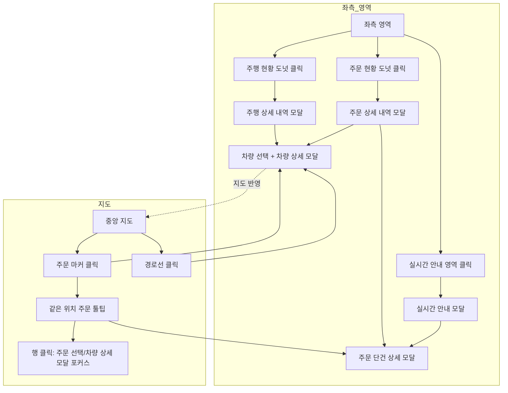
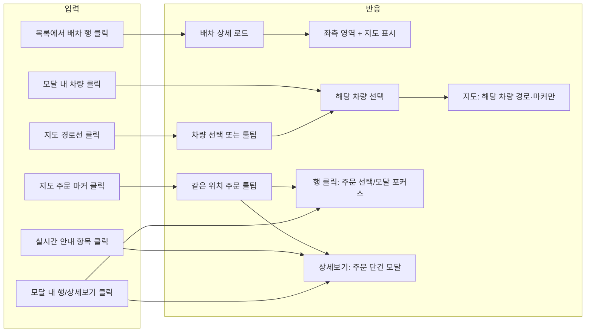

# 모니터링-상세

## 개요

- **경로**: `/manage/control/:status`
- **역할**: 선택한 배차의 **실시간 진행 상황을 한눈에 파악**하기 위한 상세 화면. 지도·주문/차량 진행률·실시간 안내를 통해 해당 배차가 예정대로 수행되는지 모니터링하고, 특정 차량·주문을 골라 위치·상태·이력을 확인·대응.
- **진입 경로**: GNB "모니터링" → 탭 선택 → 배차 목록에서 행 클릭.
- **권한**: `관리자(1), 매니저(2)`만 활성.

## ScreenShot

## 구성

- **좌측 영역**
  - **배차상세정보**
    - 배차명(경로명), 소속 팀, 주행 일자, 경로ID 등 선택한 배차의 기본 정보.
  - **배차현황**
    - **주문 현황**: 도넛 차트로 완료/보류/예정 건수·진행률 표시. 클릭 시 주문 상세 내역 모달 열림.
    - **주행 현황(차량)**: 도넛 차트로 주행중·완료·대기 차량 수·진행률 표시. 클릭 시 주행 상세 내역 모달 열림.
  - **실시간 안내**
    - 최근 주행/도착 등 안내 목록(일부 노출). 항목 클릭 시 해당 주문 상세 모달 열림. **실시간 안내** 영역 클릭 시 주행 히스토리 모달 열림.

- **중앙 지도**
  - 선택한 배차의 모든 경로·차량 마커·주문 마커가 표시됨.
  - 모달은 지도 위에 겹쳐 표시됨.
  - [실주행 경로]: 실제 주행 경로가 표시를 위한 버튼.
  - [다회전]: 다회전 배차일 경우 회차변 경로를 보기 위한 버튼.
  - 지도 전체화면으로 보기 버튼, 줌 버튼

## User Flow

## 모달 상세

### 주행 상세 내역

- **역할**: 선택한 배차의 **차량(드라이버) 목록**을 주행 상태별로 필터링해 보고, 행 클릭 또는 주문 건수 클릭으로 **차량 상세 모달** 오픈.
- **진입 경로**: 좌측 영역 "배차 현황" 중 **주행 현황** 도넛 차트 클릭.
- **내부 구성**
  - **검색**: 검색 항목(차량 / 차량 전화번호) + 키워드. [조회하기], [초기화].
  - **주행 상태 필터**: 전체, 주행대기, 주행중, 주행종료.
  - **목록**
    - **차량(드라이버) 단위** 한 행.
    - 컬럼: 운영 유형, 차량(이름), 주행 상태, 설치 여부, GPS 수신, 총 주문, 완료, 보류, 지연, 예상 지연, 보류(건수), 업무 시간, 거리, 차량 전화번호, 휴게 시간, 수량, 합산용적량1~3.
    - 총 주문·완료·보류·지연·예상 지연·보류 건수는 클릭 가능.
- **동작**
  - **행 클릭**: 해당 차량의 **차량 상세 모달** 열림(필터 초기).
  - **주문 건수(총 주문/완료/보류/지연/예상 지연/보류) 클릭**: 해당 차량 상세 모달을 해당 조건 필터로 열림(예: "완료" 클릭 시 해당 차량 + 처리완료 필터).
  - **[닫기]**: 모달 닫힘.

### 주문 상세 내역

- **역할**: 선택한 배차의 **전체 주문을 한 테이블에서** 작업 상태·지연·시간 기준으로 조회·필터링하고, 행 클릭 시 해당 차량 상세 모달로 이동하거나 주문 단건 상세 모달을 띄우기 위한 모달.
- **진입 경로**: 좌측 영역 "배차 현황" 중 **주문 현황** 도넛 차트 클릭.
- **내부 구성**
  - **검색**: 검색 항목(고객명 / 차량 / 차량 전화번호) + 키워드 입력. [조회하기], [초기화].
  - **조회 시간**: 시간 기준(도착 예정 시간 / 예상 출발 시간 / 처리 완료 시간 / 배송 희망 시간) 선택 + 시간 범위 선택.
  - **작업 상태 필터**: 전체, 작업대기, 처리중, 처리완료, 보류.
  - **지연 상태 필터**: 전체, 지연, 지연 예상.
  - **목록**
    - 배차 내 **주문 단위** 한 행.
    - 컬럼: 차량, 작업 상태, 지연 상태, 출발 시간, 이동 시간, 도착 시간, 희망 시간(이전/이후), 유휴 시간, 작업 소요 시간, 완료 시간, 이동 거리, 주문 유형, 차량 전화번호, 고객명, 주소, 상세 주소, 회전, 상세보기.
    - 컬럼 표시/숨김·정렬 가능.
    - 체크박스로 다중 선택 시 작업 상태 일괄 변경(작업대기/처리중/처리완료/보류) 가능.
- **동작**
  - **행 클릭**: 해당 주문의 차량(driverId) 기준으로 **차량 상세 모달**로 전환.
  - **상세보기 클릭**: 해당 주문의 **주문 단건 상세 모달** 열림.
  - **[닫기]**: 모달 닫힘.

### 차량 상세

- **역할**: **한 대의 차량**에 대한 정보와 해당 차량에 배정된 **주문 목록**을 보고, 주문 행 클릭 시 주문 단건 상세 모달을 띄우거나 지도 포커스를 주기 위한 모달.
- **진입 경로**: 지도 영역에서 주문 마커 클릭. 또는 주행 현황 상세 모달에서 차량 행/주문 건수 클릭 시.
- **내부 구성**
  - **상단 정보**: 차량명(드라이버명), 운영 유형 뱃지(고정차/고정용차/지입차/용차). (용차이고 주행대기일 때 [용차 정보 수정] 버튼 노출.) [주행 내역 다운로드], [닫기].
  - **필터**: 작업 상태 필터(전체/작업대기/처리중/처리완료/보류), 지연 상태 필터(전체/지연/지연 예상).
  - **목록**
    - 해당 차량의 **주문 목록**.
    - 컬럼: 경로 순서, 작업 상태, 지연 상태, 출발 시간, 소요 시간, ETA, 대기 시간, 작업 소요 시간, 완료 시간, 이동 거리, 주문 유형, 고객명, 주소, 상세 주소, 회전, 주문 ID 등.
    - 행 클릭 시 해당 주문 지도 포커스.
    - [상세보기] 클릭시: 주문 상세 모달 열림.
- **동작**
  - **행 클릭**: 해당 주문 지도 포커스.
  - **상세보기 클릭**: 해당 주문의 **주문 단건 상세 모달** 열림.
  - **[닫기]**: 모달 닫힘.
- **도착지 입고 완료 분기**
  - 해당 차량의 일반 주문(도착지/회차지/휴식 제외)이 모두 **처리완료/보류** 인 경우, 행 선택 가능 대상이 **도착지(차고지) 행** 으로 한정.
  - 상태 변경 옵션 중 [완료로 변경]만 활성, [보류로 변경]·[작업대기로 변경]은 비활성.
  - 변경 확인 모달 제목 "차량을 입고 완료 상태로 변경하시겠습니까?", 실패 시 "도착지 상태 변경 실패" 로 분기 노출.

### 실시간 안내

- **역할**: 선택한 배차의 **실시간 이벤트(주문 도착·처리·차고지 이동 등)** 를 시간순 목록으로 보고, 항목 클릭 시 해당 주문의 **주문 단건 상세 모달**을 띄우기 위한 모달.
- **진입 경로**: 좌측 영역 **실시간 안내** 제목 또는 영역 클릭.
- **내부 구성**
  - **목록**: 시각(HH:mm), 차량(색상 박스 + 차량명), 이벤트 문구. 이벤트 종류: "N번 주문" + 상태(출발/도착/픽업 완료 등), "도착지 이동"인 경우 "차고지 입고중" / "차고지 입고 완료" 등. "도착지 이동"이면서 processing/arrived가 아닌 항목은 목록에서 제외. 최근 항목이 위로 오도록 정렬되며, 좌측 실시간 안내와 동일 데이터(historyList)를 사용.
  - **항목 클릭**: "N번 주문" 등 클릭 시 **주문 단건 상세 모달** 열림.

## 지도·목록 연동 및 동작

### 지도에 그려지는 것

- **경로(폴리라인)**: 차량 미선택 시 배차 내 모든 차량 경로가 얇은 선으로 표시. 차량 선택 시 해당 차량 경로만 굵게 강조. 다회전이면 회전별 툴바로 회전을 바꿀 수 있고, 선택한 회전만 강조됨.
- **주문 마커**: 같은 좌표 주문은 묶어서 표시. 차량 미선택 시 전체, 차량 선택 시 해당 차량 주문만 표시.
- **차량 실시간 위치**: 위치 전용 통신으로 수신해 마커로 표시·주기 갱신. 차량 선택 시 해당 차량 마커 강조.
- **실주행 경로**: 차량 선택 시에만 [실주행 경로] 버튼 노출. 켜면 해당 차량의 실제 궤적을 조회해 지도에 표시. 없으면 "실주행 경로 내역이 존재하지 않습니다" 안내.

### 데이터 갱신

- **배차 상세**: 주행대기 5분·주행중 1분 간격 자동 재호출. 주행종료·저장된 배차는 자동 재호출 없음.
- **상태 변경 시**: 배차 상태가 “주행대기 → 주행중”으로 바뀌면 **"주행 중으로 배차 상태가 변경되었습니다."** 모달. “주행종료”로 바뀌면 **"주행 종료로 배차 상태가 변경되었습니다."** 메시지와 함께 **[보고서 바로가기]** 버튼이 있는 모달 오픈.

### 클릭 시 동작

| 동작                              | 결과                                                                                                                                                                            |
| --------------------------------- | ------------------------------------------------------------------------------------------------------------------------------------------------------------------------------- |
| **주문 마커** 클릭                | 같은 위치 주문 리스트 툴팁 표시. **행 클릭** → 해당 주문 선택(차량 상세 모달 주문 테이블 포커스·지도 이동). **[상세보기]** → 주문 단건 상세 모달. 같은 마커 재클릭 → 선택 해제. |
| **경로선** 클릭 (차량 미선택)     | 해당 경로 차량 선택(지도가 해당 차량만 강조, 차량 상세 모달 열림). 여러 경로 겹친 곳이면 툴팁에서 [자세히 보기]로 차량 선택.                                                    |
| **경로선** 클릭 (이미 차량 선택)  | 선택된 차량의 경로선을 다시 클릭하면 차량 선택 해제(전체 보기).                                                                                                                 |
| **차량 선택** 하는 방법           | (1) 지도 경로선 클릭 (2) 주행 상세 내역 모달에서 차량 행·주문 건수 클릭. 선택 시 [실주행 경로]·회전 툴바 사용 가능.                                                             |
| **주문 단건 상세 모달** 여는 방법 | 지도 툴팁 [상세보기], 실시간 안내 "N번 주문", 주문 현황 상세·차량 상세 모달의 상세보기.                                                                                         |

지도에서 주문을 선택하면 열려 있는 차량 상세 모달의 주문 테이블에서 같은 주문이 선택되고, 모달에서 주문 행을 클릭하면 지도가 해당 주문 위치로 이동·마커 강조된다.

### 연동 흐름

---

## API

| 순서 | Method | Path                                                                                                                           | 트리거                                                            |
| ---- | ------ | ------------------------------------------------------------------------------------------------------------------------------ | ----------------------------------------------------------------- |
| 1    | GET    | [`/route/control/:routeId`](../../../interface/00.roouty/route.md#get-routecontrolrouteid)                                     | 배차 선택 시 (`getControlRoute`)                                  |
| 2    | GET    | [`/v2/monitor/:routeId`](../../../interface/00.roouty/side-status-v2.md#get-v2monitorrouteid)                                  | 사이드바 차트 표시 (`getSidebarCharData`)                         |
| 3    | GET    | [`/route/history/:routeId`](../../../interface/00.roouty/route.md#get-routehistoryrouteid)                                     | 히스토리 영역 + 주행 히스토리 탭 (`getControlRouteHistory`)       |
| 4    | GET    | [`/route/last-location/:routeId`](../../../interface/00.roouty/route.md#get-routelast-locationrouteid)                         | 지도 마커 위치 표시 (`getControlRouteLastLocation`)               |
| 5    | GET    | [`/v2/monitor/driving/:routeId`](../../../interface/00.roouty/driving-status-v2.md#get-v2monitordrivingrouteid)                | 주행 상세 내역 — 차량 탭 테이블 (`getVehicleTableData`)           |
| 6    | GET    | [`/v2/monitor/driving/control/:routeId`](../../../interface/00.roouty/driving-status-v2.md#get-v2monitordrivingcontrolrouteid) | 차량 상세 — 기사별 근무시간 계산 (`getDriverDetailData`)          |
| 7    | GET    | [`/v2/monitor/order/:routeId`](../../../interface/00.roouty/order-status-v2.md#get-v2monitororderrouteid)                      | 주문 상세 내역 — 주행 상태 테이블 (`getDrivingStatusTableData`)   |
| 8    | GET    | [`/v2/route/control/temporary/:routeId`](../../../interface/00.roouty/route-v2.md#get-v2routecontroltemporaryrouteid)          | 임시저장 탭에서 배차 선택 (`getTemporaryRouteDetail`)             |
| 9    | POST   | [`/v2/route/temporary/inspection`](../../../interface/00.roouty/temporary-route-v2.md#post-v2routetemporaryinspection)         | [검수 요청] 버튼 — 임시저장 배차 (`postDriverInspection`)         |
| 10   | PUT    | [`/v2/route/temporary/register`](../../../interface/00.roouty/temporary-route-v2.md#put-v2routetemporaryregister)              | [배차 확정] 버튼 — 임시저장 배차 (`temporaryRouteRegister`)       |
| 11   | PUT    | [`/order/:targetStatus`](../../../interface/00.roouty/order.md#put-orderorderid)                                               | 주문 상태 변경 — 완료/보류 등 (`setOrderStatus`)                  |
| 12   | PUT    | [`/v2/driver/single/:driverId`](../../../interface/00.roouty/single-driver-v2.md#put-v2driversingledriverid)                   | 예비차량 기사 정보 수정 (`updateSingleDriver`)                    |
| 13   | POST   | [`/v2/driver/single/check-phone`](../../../interface/00.roouty/single-driver-v2.md#post-v2driversinglecheck-phone)             | 기사 전화번호 중복 검증 (`validateDriverLoginAccount`)            |
| 14   | GET    | [`/route/download/:routeId`](../../../interface/00.roouty/route.md#get-routedownloadrouteid)                                   | [다운로드] 버튼 (`getRouteOrderListDownload`)                     |
| 15   | GET    | [`/route/location/actual/:routeId/:driverId`](../../../interface/00.roouty/route.md#get-routelocationactualrouteiddriverid)    | 주행 이력 탭 선택 시 — 실제 주행 경로 (`getActualRouteByRouteId`) |

> 외부 연동

| 유형     | 대상                                                                                                            | 트리거                                    |
| -------- | --------------------------------------------------------------------------------------------------------------- | ----------------------------------------- |
| Location | [`REACT_APP_LOCATION_SERVER_URL/location/topics/`](../../../interface/00.roouty/location.md#get-locationtopics) | 페이지 진입 시 (`getLocationTopicList`)   |
| MQTT     | `REACT_APP_MQTT_HOST` (토픽: topics.topicList)                                                                  | topics 로드 후 자동 연결·구독 (`useMqtt`) |
