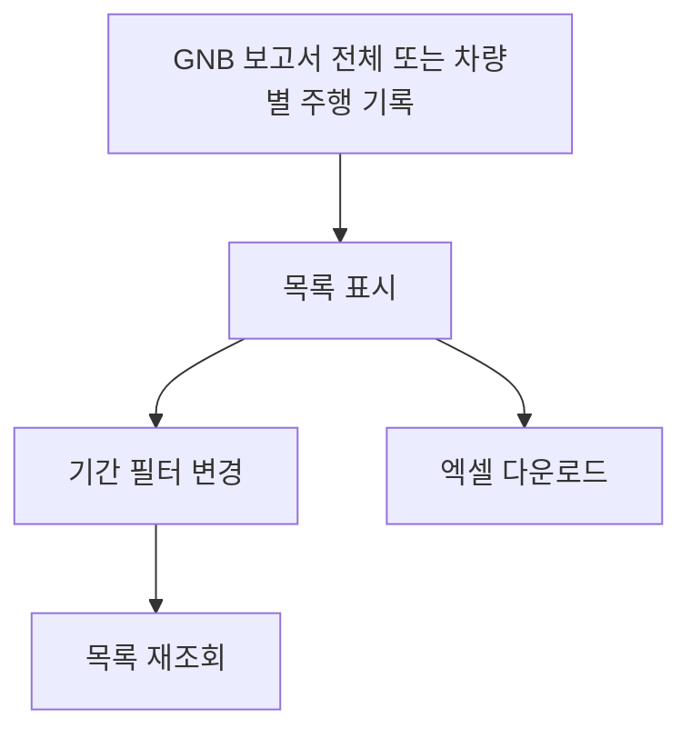

# 보고서-주행기록(전체·차량별)

## 개요

- **경로**: `/manage/report/route`(전체 주행 기록), `/manage/report/route/driver`(차량별 주행 기록).
- **역할**: 주행 기록 목록·필터·엑셀 다운로드. 전체/차량별 두 종류.
- **진입 경로**: GNB "보고서" → "전체 주행 기록" 또는 "차량별 주행 기록".
- **권한**: `Free(1), Starter(13)` 요금제 시 GNB 보고서 비활성 또는 유료 안내(해당 시).

## ScreenShot

### 전체 주행 기록

### 차량별 주행 기록

## 검색

| 라벨(표시명) | 타입      | 옵션/기본값·초기화                                                              |
| ------------ | --------- | ------------------------------------------------------------------------------- |
| 기간         | 날짜 범위 | 시작일·종료일. 기본값: 1주일(오늘 포함 7일). 프리셋: 오늘, 1주일, 1개월, 3개월. |

적용 시 목록 재조회.

## 목록

- **[엑셀 다운로드]** 테이블 상단 — 클릭 시 현재 필터·선택 조건으로 다운로드 API 호출 → 엑셀 파일 다운로드. 실패 시 에러 안내.
- **컬럼 설정(피커)** 톱니/설정 버튼으로 컬럼 노출·순서 변경/저장.

### 전체 주행 기록 — 컬럼

- **측정기준**: 주행 일자, 차량, 경로ID, 주행 이름, 소속 팀.
- **측정항목**: 예상/실제 이동 거리·시간, 예상 유휴 시간, 예상/실제 작업 소요 시간, 실제 용적량, 합산용적량1~3, 주문·완료주문·보류주문 집계, 아이템 수, 주행 횟수 등.

### 차량별 주행 기록 — 컬럼

- **측정기준**: 전체 주행 기록 측정기준과 동일
- **정보항목**: 상태, 차량 연락처, 운영 유형, 용적량1~3, 담당 권역, 휴게시간, 출발/도착 주소, 특수 조건, 메모.
- **측정항목**: 전체 주행 기록 측정항목과 동일

## User Flow

---

## API

| 순서 | Method | Path                                                                                          | 트리거                                                                                                              |
| ---- | ------ | --------------------------------------------------------------------------------------------- | ------------------------------------------------------------------------------------------------------------------- |
| 1    | GET    | [`/report/:type`](../../../interface/00.roouty/report.md#get-reportroute)                     | ReportFilter에서 filter 설정 후 조회 — type=route: 전체 주행 기록, type=driver: 차량별 주행 기록 (`getRouteReport`) |
| 2    | GET    | [`/report/order`](../../../interface/00.roouty/report.md#get-reportorder)                     | ReportFilter 조회 (type=order) — 주문별 주행 기록 (`getOrderReport`)                                                |
| 3    | POST   | [`/report/driver/download`](../../../interface/00.roouty/report.md#post-reportdriverdownload) | [다운로드] 버튼 (차량별)                                                                                            |
| 4    | POST   | [`/report/route/download`](../../../interface/00.roouty/report.md#post-reportroutedownload)   | [다운로드] 버튼 (주행별)                                                                                            |
