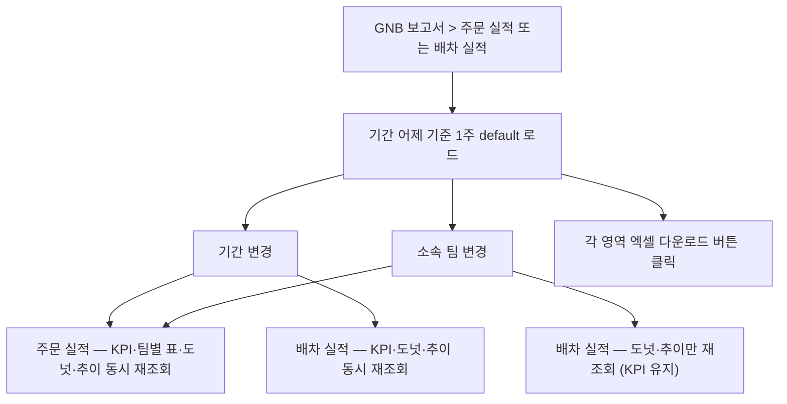

# 보고서-대시보드(주문실적·배차실적)

## 개요

- **경로**: `/manage/report/order`(주문 실적), `/manage/report/dispatch`(배차 실적).
- **역할**: 운영자가 일·주 단위 운영 결과를 한눈에 확인하는 보고서 2종. 주문 실적은 주문 처리 흐름(완료·수량 변경·보류) 중심, 배차 실적은 배차 운영(차량 가동·적재율) 중심.
- **진입 경로**: GNB "보고서" → "주문 실적" 또는 "배차 실적".
- **권한**: 부가 옵션 가입 회사의 슈퍼어드민·배차매니저, 영업매니저 권한 노출. 일반 권한 메뉴 미노출 (단, URL 직접 입력 시 화면 진입 가능 — 정책 보강 대상).
- **데이터 갱신**: 매일 0시 자동 집계. 어제까지 누적된 결과 노출.

## ScreenShot

### 주문 실적

### 배차 실적

## 검색

두 화면 공통.

| 라벨(표시명) | 타입      | 옵션/기본값·초기화                                                                                   |
| ------------ | --------- | ---------------------------------------------------------------------------------------------------- |
| 기간         | 날짜 범위 | 시작일·종료일. 기본값: 어제 기준 1주. 최소: 어제 -3개월. 최대: 어제. 프리셋: 오늘, 1주, 1개월, 3개월 |
| 소속 팀      | 드롭다운  | 회사 내 팀 선택. 슈퍼어드민·영업매니저는 전체 또는 단일 팀 선택 가능. 배차매니저는 본인 팀 고정      |

적용 시 화면 내 모든 영역 재조회.

> **배차 실적의 KPI 카드**는 팀 선택과 무관하게 회사 전체 기준 — 기간 변경에만 반응.

## 구성

### 1. 주문 실적 (`/manage/report/order`)

#### 상단 (KPI 카드 5종) - 기간·팀 기준 한 줄 노출.

| 카드              | 산출 기준                                  |
| ----------------- | ------------------------------------------ |
| 총 주문 수        | 전체 팀 합산. 기간 내 처리 대상 주문 전체  |
| 완료 주문 수      | 완료 처리된 주문                           |
| 수량 변경 주문 수 | 인수증 단계에서 실수량 차이 발생 주문      |
| 보류 주문 수      | 보류 상태로 전이된 주문                    |
| 완료 주문 처리율  | 완료 주문 ÷ 총 주문 (% 표기, 소수점 1자리) |

#### 중단 (주문 처리 실적 — 팀별 상세 표)

- 영역 헤더에 "주문 처리 실적" 라벨 + "조회 항목 N" 배지 + [엑셀 다운로드] 버튼 노출.
- **컬럼**: 소속 팀 / 총 주문 수 / 완료 주문 수 / 수량 변경 주문 수 / 보류 주문 수 / 완료 처리율(진행 바).
- **정렬**: 모든 컬럼 헤더 클릭으로 오름·내림 정렬. 기본 정렬은 완료 처리율 내림차순.
- **페이지네이션**: 페이지 크기 기본 10. 페이지 이동 화살표 + 직접 입력.
- **엑셀 다운로드**: 페이지네이션 무관 권한 범위 내 팀 전수 다운로드.

#### 하단 (수량 변경 사유 조회 + 주문 처리 추이 — 좌우 배치)

- **수량 변경 사유 조회** (좌, 도넛)
  - 기간 내 수량 변경 주문의 사유별 분포 노출. 상위 5개 사유 + "그 외" 묶음 (6위 이하 + 사유 미선택 합산).
  - 중심에 총 수량 변경 주문 수 표시.
  - 범례 옆에 사유명·비율(%) 표시. "그 외" 항목은 호버 시 묶음 안 사유 종류 개수 추가 노출.
  - 데이터 0건 시 "선택한 기간에 수량 변경된 아이템이 없습니다." 빈 상태 안내.
  - 우상단 [엑셀 다운로드] — 클릭 시 사유 변경 주문 상세 list 엑셀(주문 코드·팀·기사·사유 컬럼) 다운로드.

- **주문 처리 추이** (우, 막대+선 혼합 차트)
  - 일별·주별 버킷 단위 추이 노출 — 좌축: 주문 수 (막대), 우축: 완료 처리율 % (선).
  - 단위 선택: 일(7일, 15일), 주(4주, 8주, 12주) 토글.
  - 호버 시 해당 버킷의 5종 metric(총 주문·완료·수량 변경·보류·처리율) 툴팁 노출.
  - 데이터 0건 시 "선택한 기간에 처리된 주문이 없습니다." 빈 상태 안내.
  - 우상단 [엑셀 다운로드] — 클릭 시 추이 버킷 단위 집계 엑셀 다운로드.

### 2. 배차 실적 (`/manage/report/dispatch`)

#### 상단 (KPI 카드 5종) - 기간 기준 한 줄 노출. 팀 선택과 무관(회사 전체).

| 카드                    | 산출 기준                                     |
| ----------------------- | --------------------------------------------- |
| 총 운영 차량 수         | 전체 팀 합산. 기간 내 1회 이상 배차된 차량 수 |
| 총 배차 수              | 기간 내 확정된 배차 단위 수                   |
| 총 평균 적재율(용적량1) | 용적량 1 기준 평균 적재율 (% 표기)            |
| 총 평균 적재율(용적량2) | 용적량 2 기준 평균 적재율 (% 표기)            |
| 총 평균 적재율(용적량3) | 용적량 3 기준 평균 적재율 (% 표기)            |

#### 하단 (주행 차량별 사용 실적 + 총 배송 차량 추이 — 좌우 배치)

- **주행 차량별 사용 실적** (좌, 도넛)
  - 기간 내 운영된 차량을 운영 유형별(정규차·계약차·예비차·단건차·자차) 비율로 노출.
  - 중심에 총 운영 차량 수 표시.
  - 범례 옆에 유형명·차량 수·배차 수·평균 적재율 3종 표시.
  - 호버 시 해당 유형의 상세 metric 툴팁.
  - 데이터 0건 시 "선택한 기간에 운행된 차량이 없습니다." 빈 상태 안내.
  - 우상단 [엑셀 다운로드] — 클릭 시 차량별 사용 실적 상세 엑셀 다운로드.

- **총 배송 차량 추이** (우, 막대+선 혼합 차트)
  - 일별·주별 버킷 단위 추이 노출 — 좌축: 배차 수 (막대), 우축: 평균 적재율 % (선).
  - 단위 선택: 일(7일, 15일), 주(4주, 8주, 12주) 토글.
  - 호버 시 해당 버킷의 배차 수·적재율 3종 metric 툴팁 노출.
  - 데이터 0건 시 "선택한 기간에 처리된 배송이 없습니다." 빈 상태 안내.
  - 우상단 [엑셀 다운로드] — 클릭 시 추이 버킷 단위 집계 엑셀 다운로드.

## User Flow

---

## API

### 주문 실적 (6)

| 순서 | Method | Path                                                                                                                                                                 | 트리거                                         |
| ---- | ------ | -------------------------------------------------------------------------------------------------------------------------------------------------------------------- | ---------------------------------------------- |
| 1    | GET    | [`/v2/dashboard/order-performance/summary`](../../../interface/00.roouty/dashboard-order-performance-v2.md#get-v2dashboardorder-performancesummary)                  | 진입·기간/팀 변경 시 — KPI + 팀별 표 동시 조회 |
| 2    | GET    | [`/v2/dashboard/order-performance/summary/download`](../../../interface/00.roouty/dashboard-order-performance-v2.md#get-v2dashboardorder-performancesummarydownload) | 하단 표 [엑셀 다운로드] 버튼                   |
| 3    | GET    | [`/v2/dashboard/order-performance/reasons`](../../../interface/00.roouty/dashboard-order-performance-v2.md#get-v2dashboardorder-performancereasons)                  | 진입·기간/팀 변경 시 — 수량 변경 사유 도넛     |
| 4    | GET    | [`/v2/dashboard/order-performance/reasons/download`](../../../interface/00.roouty/dashboard-order-performance-v2.md#get-v2dashboardorder-performancereasonsdownload) | 도넛 [엑셀 다운로드] 버튼                      |
| 5    | GET    | [`/v2/dashboard/order-performance/trend`](../../../interface/00.roouty/dashboard-order-performance-v2.md#get-v2dashboardorder-performancetrend)                      | 진입·기간/팀/단위 변경 시 — 처리 추이          |
| 6    | GET    | [`/v2/dashboard/order-performance/trend/download`](../../../interface/00.roouty/dashboard-order-performance-v2.md#get-v2dashboardorder-performancetrenddownload)     | 추이 [엑셀 다운로드] 버튼                      |

### 배차 실적 (5)

| 순서 | Method | Path                                                                                                                                                                                      | 트리거                                            |
| ---- | ------ | ----------------------------------------------------------------------------------------------------------------------------------------------------------------------------------------- | ------------------------------------------------- |
| 1    | GET    | [`/v2/dashboard/dispatch-performance/summary`](../../../interface/00.roouty/dashboard-dispatch-performance-v2.md#get-v2dashboarddispatch-performancesummary)                              | 진입·기간 변경 시 — KPI 5종 카드 (회사 전체 강제) |
| 2    | GET    | [`/v2/dashboard/dispatch-performance/vehicle-usage`](../../../interface/00.roouty/dashboard-dispatch-performance-v2.md#get-v2dashboarddispatch-performancevehicle-usage)                  | 진입·기간/팀 변경 시 — 운영 유형별 차량 도넛      |
| 3    | GET    | [`/v2/dashboard/dispatch-performance/vehicle-usage/download`](../../../interface/00.roouty/dashboard-dispatch-performance-v2.md#get-v2dashboarddispatch-performancevehicle-usagedownload) | 도넛 [엑셀 다운로드] 버튼                         |
| 4    | GET    | [`/v2/dashboard/dispatch-performance/trend`](../../../interface/00.roouty/dashboard-dispatch-performance-v2.md#get-v2dashboarddispatch-performancetrend)                                  | 진입·기간/팀/단위 변경 시 — 배차 실적 추이        |
| 5    | GET    | [`/v2/dashboard/dispatch-performance/trend/download`](../../../interface/00.roouty/dashboard-dispatch-performance-v2.md#get-v2dashboarddispatch-performancetrenddownload)                 | 추이 [엑셀 다운로드] 버튼                         |
