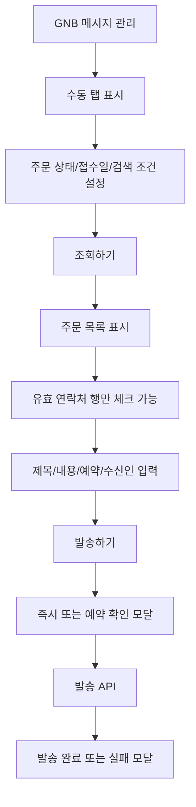

# 메세지관리-수동발송

## 개요

- **경로**: `/manage/message/manual`
- **역할**: 수동 메시지 발송(수신자·내용 입력 후 발송). 메시지 관리 기본 진입 탭.
- **권한**: 메시지 관리 추가 서비스(1) 미가입 또는 결제 제한 시 GNB 메시지 관리 비활성 또는 유료 안내.

## ScreenShot

## 구성

### 주문조회

- 검색:
  - 필드:
    - 주문접수일기간
    - 키워드유형: 주문ID, 담당기사, 아이템명
    - 키워드
    - 주문상태: 전체, 미배차, 배차완료, 처리중, 처리완료, 보류, 취소
  - 버튼: [조회하기], [초기화]

- 목록
  - 컬럼: 주문상태, 고객명, 고객연락처, 담당기사, 업체주문번호, 주문접수일, 주소, 상세주소, 아이템명, 아이템수, 작업희망일, 주문유형, 배차우선순위, 담당차량지정, 회망시간(이전), 희망시간(이후), 실제용적량, 합산용적량1-3, 특수조건, 예상작업소요시간(분), 실제작업소유시간(분), 작업완료일시, 보류사유, 보류일시, 화주사명, 화주사연락처, 중계사명, 중계사연락처, 고객전달사항, 비고1-5,
  - 행선택: 동일한 연락처가 n개 이상 존재하면 1개의 연락처로 통일.

### 메세지입력

- 필드: 메세지제목, 메세지내용, 예약날짜, 예약시간, 즉시발송하기, 수신인
- 버튼: [취소하기], [발송하기]

## Actions

### 주문선택

- 주문상태, 주문접수일, 키워드 선택 → 조회하기
- 조회된 주문을 선택
  - 고객연락처가 없거나, 전화번호 형식에 맞지 않으면 선택불가

### 메세지발송

- 수신자 선택 → 제목·내용·즉시/예약 입력 → [발송하기]

## User Flow

## ETC

- 메시지 제목: 40자 이하. 메시지 단문일 때는 제목 미발송되며, 제목 입력란은 비활성.
- 메시지 내용: 90자 초과 시 장문(LMS)으로 자동 전환·제목 입력 가능.
- 예약 날짜/시간: 즉시 발송 체크 시 날짜/시간 입력 비활성. 해제 시 날짜 선택·시(00~23)·분(00~59) 입력. 예약 시 과거 시간 불가, **현재 시각 + 최소 10분 이후**만 허용.
- 수신인: 좌측 테이블에서 체크한 고객이 고객명/연락처 형태로 태그처럼 표시됨.

---

## API

| 순서 | Method | Path                                                                            | 트리거                                                                 |
| ---- | ------ | ------------------------------------------------------------------------------- | ---------------------------------------------------------------------- |
| 1    | GET    | [`/order/messages`](../../../interface/00.roouty/order.md#get-ordermessages)    | 페이지 진입 시 + 필터 변경 시 — 주문 목록 조회 (`getMessageOrderList`) |
| 2    | POST   | [`/message/manual`](../../../interface/00.roouty/message.md#post-messagemanual) | [발송하기] 버튼 — 즉시/예약 발송 (`postManualSend`)                    |
