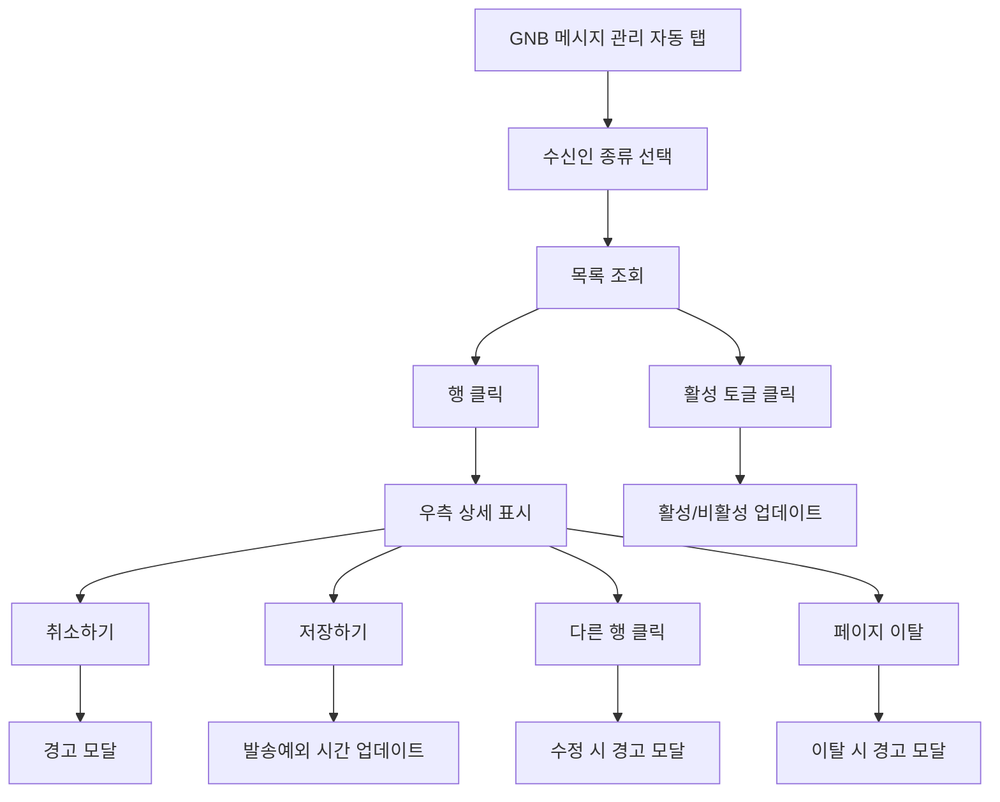

# 메세지관리-알림메세지자동설정

## 개요

- **경로**: `/manage/message/auto`
- **역할**: 알림 메시지 자동 발송 규칙·조건 설정·관리.
- **권한**: 메시지 관리 추가 서비스(1) 미가입 또는 결제 제한 시 GNB 메시지 관리 비활성 또는 유료 안내.

## ScreenShot

## 구성

### 메세지조회

- 검색
  - 필드:
    - 수신인종류: 전체, 고객, 기사, 중개사, 화주사
- 목록
  - 컬럼: 활성상태, 수신인, 진행구분, 메세지제목, 발송시간

### 메세지입력

- 필드: 메세지내용, 발송예외시간설정, 발송시간(시작,종료 시/분)
- 버튼: [취소하기], [저장하기]

## Actions

### 메세지조회

- 활성상태: 행에서 바로 활성/비활성 처리
- 행선택: **메세지입력** 에 행의 내용 적용.

### 메세지입력

- 메세지내용:
  - 수정불가
  - 카카오 알림톡으로 발송
- 발송예외시간설정:
  - 설정한 시간대에는 발송되지 않음.
  - 이력 조회에서만 확인가능.
  - 시작~종료에 자정 포함 시 익일까지로 처리
- [취소하기]: 행선택 초기화
- [저장하기]: 발송예외 시간 설정 데이터 저장.

## User Flow

---

## API

| 순서 | Method | Path                                                                               | 트리거                                                                                 |
| ---- | ------ | ---------------------------------------------------------------------------------- | -------------------------------------------------------------------------------------- |
| 1    | GET    | [`/message/auto`](../../../interface/00.roouty/message.md#get-messageauto)         | 페이지 진입 시 + 수신자 유형 변경 시 (`getMessageAuto`)                                |
| 2    | PATCH  | [`/message/auto/:id`](../../../interface/00.roouty/message.md#patch-messageautoid) | 토글 ON/OFF + [저장하기] 버튼 — isUse, isException, exceptionTime (`patchMessageAuto`) |
