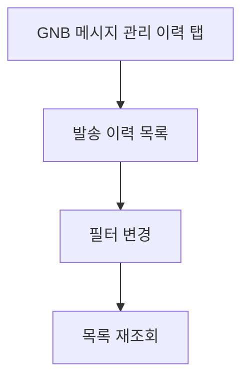

# 메세지관리-발송이력조회

## 개요

- **경로**: `/manage/message/history`
- **역할**: 메시지 발송 이력 목록·필터·조회.
- **권한**: 메시지 관리 추가 서비스(1) 미가입 또는 결제 제한 시 GNB 메시지 관리 비활성 또는 유료 안내.

## ScreenShot

## 구성

### 발송이력조회

- 검색:
  - 탭: 자동발송, 수동(예약)발송, 발송제외
  - 필드:
    - 수신인종류: 전체, 고객, 기사, 중개사, 화주사
    - 발송일
    - 키워드유형: 고객명, 제목
    - 키워드
  - 버튼: [조회하기], [초기화]
- 목록:
  - 컬럼:
    - 발송(예정)일/시간
    - 수신인종류 → (자동발송/발송제외)
    - 제목
    - 수신인명
    - 수신인전화번호 → (자동발송/발송제외)
    - 수신인수 → (수동(예약발송))
    - 제외시간 → (자동발송/발송제외)

## User Flow

---

## API

| 순서 | Method | Path                                                                                          | 트리거                                                                          |
| ---- | ------ | --------------------------------------------------------------------------------------------- | ------------------------------------------------------------------------------- |
| 1    | GET    | [`/message/auto/history`](../../../interface/00.roouty/message.md#get-messageautohistory)     | [자동 발송] 탭 — tabType=AUTO_MESSAGE, 검색/기간 변경 (`getMessageAutoHistory`) |
| 2    | GET    | [`/message/auto/history`](../../../interface/00.roouty/message.md#get-messageautohistory)     | [발송 예외] 탭 — isException=true (`getMessageAutoHistory`)                     |
| 3    | GET    | [`/message/manual/history`](../../../interface/00.roouty/message.md#get-messagemanualhistory) | [수동 발송] 탭, 검색/기간 변경 (`getMessageManualHistory`)                      |
| 4    | DELETE | [`/message/manual/:id`](../../../interface/00.roouty/message.md#delete-messagemanualid)       | [예약 취소] 버튼 (`deleteMessageManual`)                                        |
| 5    | PATCH  | [`/message/manual/:id`](../../../interface/00.roouty/message.md#patch-messagemanualid)        | [수정 완료] 버튼 (`patchMessageManual`)                                         |
