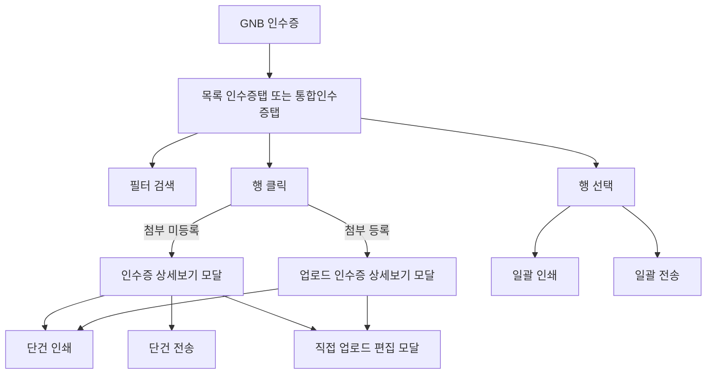

# 인수증 조회

## 개요

- **경로**: `/manage/receipt`
- **역할**: 발행된 배송 인수증·통합 인수증 현황 조회·일괄 인쇄·재전송·직접 업로드 및 상세 보기.
- **진입 경로**: GNB 상단 "인수증" 메뉴 클릭. URL 쿼리 `?tab=receipt | combined` 로 탭 직접 진입 가능.
- **권한**:
  - `관리자(1), 매니저(2), 영업매니저` 활성. 영업매니저는 GNB "인수증" 메뉴가 기본 노출, 일반 사용자는 부가서비스 4(인수증) 또는 6(통합 인수증) 가입 시에만 메뉴 노출.
  - 미가입 회사 영업매니저가 메뉴 접근 시 데이터 없음 노출 가능. 운영자 안내 필요.

## ScreenShot

## 구성

- 탭: `인수증` / `통합 인수증`. 탭 전환 시 검색 항목·일자 기준·필터 행·테이블 컬럼 동시 전환.

- 검색 (탭 공통 영역 + 탭별 분기 항목)
  - 필드 (공통):
    - 검색 항목 (드롭다운): 탭에 따라 옵션 세트 전환
    - 키워드 (최대 50자, 선택 항목별 안내 문구 노출)
    - 조회 기간 (기간 프리셋 + 달력 + 시작일/종료일 범위 선택)
    - 인수증 상태 배지 다중 선택: 전체 / 생성 / 서명대기 / 서명완료
  - 필드 (인수증 탭 전용):
    - 일자 기준 (드롭다운): 작업 희망일 / 주행 일자 (조회 기간과 결합)
    - 주문 상태 배지 다중 선택: 전체 / 배차완료 / 처리완료
  - 필드 (통합 인수증 탭 전용):
    - 일자 기준 라벨: "생성 일자" 고정 (드롭다운 미노출)
  - 검색 항목 옵션:
    - 인수증 탭: 인수증 ID, 업체 주문 번호, 고객명, 주소, 담당 차량, 선적 문서 번호
    - 통합 인수증 탭: 통합 인수증 ID, 중개사명
  - 버튼: [조회하기], [초기화]

- 목록 (탭별 컬럼 분기)
  - 인수증 탭 컬럼: 선택(체크박스), 인수증 상태(배지), 인수증 ID, 고객명, 작업 희망일, 담당 차량, 주행 일자, 업체 주문 번호(다건은 +N 배지), 선적 문서 번호, 작업 완료 일시, 주소, 상세 주소, 주문 상태(배지)
  - 통합 인수증 탭 컬럼: 선택(체크박스), 인수증 상태(배지), 통합 인수증 ID, 중개사명, 중개사 담당자명, 중개사 이메일, 생성 일자, 포함 건 수
  - 헤더 영역 버튼 (탭 공통): [인수증 인쇄], [인수증 전송]. 선택 0건 시 비활성.
  - 컬럼 가시성: 컬럼 선택기로 컬럼 표시/숨김 저장
  - 페이지네이션: 페이지 크기 선택, 페이지 이동
  - 행 클릭: 인수증 상세보기 모달 진입. 인수증 탭에서 첨부가 등록된 행은 업로드 인수증 상세보기 모달로 진입.

## Actions

### 인수증 인쇄 (일괄)

- 구성
  - 트리거: 목록 헤더 [인수증 인쇄] (탭 공통)
  - 안내: "선택한 인수증 N 건을 인쇄하시겠습니까?", "인수증은 PDF로 인쇄됩니다."
  - 버튼: [닫기], [확인]
- 플로우:
  - 행 다중 선택 → [인수증 인쇄] → 인쇄 확인 모달
  - [확인] → 인쇄 진행 모달 → 병합 PDF 생성 → 브라우저 인쇄 다이얼로그 오픈
  - 성공 시 선택 해제·모달 닫힘
  - 실패 시 "인수증을 인쇄하지 못했습니다." 에러 모달 노출

### 인수증 전송 (일괄 재전송)

- 구성
  - 트리거: 목록 헤더 [인수증 전송] (탭 공통)
  - 안내: "선택한 N 건의 인수증을 전송하시겠습니까?", "배송받는 담당자(통합 인수증은 중개사 담당자)의 이메일은 필수 발송되며, 카카오톡을 추가로 발송할 수 있습니다."
  - [전송 전 확인사항] 박스: "'생성' 상태의 인수증은 PDF·카카오톡 미발송", "'서명 완료' 상태의 인수증은 카카오톡 미발송"
  - 필드: "카카오톡으로도 발송하기" 체크박스
  - 버튼: [취소], [확인]
- 플로우:
  - 행 다중 선택 → [인수증 전송]
  - 선택 행이 모두 '생성' 상태이면 전송 차단 모달("인수증 상태가 '생성'일 경우 전송이 불가능합니다.") 노출 후 종료
  - 그 외 → 전송 확인 모달 노출 → 카카오톡 발송 옵션 선택 → [확인]
  - 성공 시 "인수증이 전송되었습니다." 토스트 노출 후 모달 닫힘·선택 해제
  - 실패 시 "인수증을 전송하지 못했습니다." 에러 모달 노출

## 모달 상세

### 인수증 상세보기 모달

| 인수증                                                  | 통합인수증                                                  |
| ------------------------------------------------------- | ----------------------------------------------------------- |
|  |  |

- **표시 형태**: 중앙 팝업.
- **진입**: 인수증 탭 행 클릭(첨부 없는 건) 또는 통합 인수증 탭 행 클릭.
- **내부 구성**:
  - **상단 정보**: 인수증 ID, 인수증 상태 배지(생성·서명대기·서명완료).
  - **본문**: 인수증 PDF 미리보기. PDF URL이 없으면 상세 데이터로부터 즉시 렌더, 둘 다 없으면 "인수증 미리보기를 불러올 수 없습니다." 노출.
  - **버튼**: [직접 업로드](주문 상태 "처리완료" 한정 노출), [인쇄하기], [전송하기]('생성' 상태 인수증은 [전송하기] 비노출).
- **닫기**: [X] 또는 배경 클릭 시 모달 닫힘.

### 업로드 인수증 상세보기 모달

| 업로드 상세                                             | 업로드 편집                                               |
| ------------------------------------------------------- | --------------------------------------------------------- |
|  |  |

- **표시 형태**: 좌측 미리보기 + 우측 파일 리스트의 분할 팝업
- **진입**
  - 상세: 인수증 탭에서 첨부가 등록된 행 클릭.
  - 편집: 인수증 상세보기 모달의 [직접 업로드] 또는 업로드 인수증 상세보기의 [수정하기].
- **내부 구성**:
  - **좌측**: 선택 파일 미리보기(이미지·PDF·TIFF), 페이지네이션. 업로드 없을 때 "업로드한 파일이 없어요. 파일을 업로드하거나 기본 인수증을 생성해 주세요." 빈 상태와 [기본 인수증 보기] 버튼.
  - **우측**: "업로드 리스트" 헤더 + 파일명 리스트. 편집시 [파일 추가] 버튼. 파일 리스트는 드래그로 순서 변경, 삭제 아이콘으로 항목 제거. 최대 10개·단건 5MB 이하.
  - **버튼**: [수정하기](직접 업로드 편집 진입), [인쇄하기](첨부 인쇄). 편집시 [닫기], [저장하기].
- **닫기**: 변경 사항 있을 때 "작업을 중단하고 나가시겠습니까?" 확인 모달 노출.

### 기타 모달

- **전송 불가 안내**: 선택 행이 모두 '생성' 상태일 때 "인수증을 전송하지 못했습니다.", "인수증 상태가 '생성'일 경우 전송이 불가능합니다." 안내 노출.
- **파일 저장 실패**: 직접 업로드 저장 실패 시 "인수증 파일을 저장하지 못했습니다.", "다시 시도해 주세요." 에러 모달 노출.

## User Flow

## ETC

### 통합 인수증 부가 안내

- **자동 발행**: 통합 인수증 가입 회사 대상으로 매일 새벽 전일 거래분에 대해 자동 발행 작업 수행.
- **수동 재시도**: 발행 실패 건은 통합 인수증 탭 목록에서 운영자가 재전송 시도 가능.
- **상태 흐름**: 생성 → 서명대기 → 서명완료. 외부 서명 링크(SMS·카카오톡) 발송 후 수령인이 서명 완료 시 상태 전환.

---

## API

| 순서 | Method | Path                                                                                                                          | 설명                                         | 트리거                                       |
| ---- | ------ | ----------------------------------------------------------------------------------------------------------------------------- | -------------------------------------------- | -------------------------------------------- |
| 1    | GET    | [`/v2/epod/receipt/list`](../../../interface/00.roouty/epod-receipt-v2.md#get-v2epodreceiptlist)                              | 인수증·통합 인수증 목록 조회 (필터 포함)     | 페이지 진입, 검색·필터·탭 변경, 페이지네이션 |
| 2    | POST   | [`/v2/epod/receipt/print`](../../../interface/00.roouty/epod-receipt-v2.md#post-v2epodreceiptprint)                           | 인수증 PDF 데이터 일괄 조회 (인쇄·상세 공용) | [인수증 인쇄], 행 클릭(상세보기 진입)        |
| 3    | POST   | [`/v2/epod/receipt/:tskey/upload`](../../../interface/00.roouty/epod-receipt-v2.md#post-v2epodreceipttskeyupload)             | 인수증 직접 업로드 (파일 첨부·재정렬·삭제)   | 직접 업로드 편집 모달 → [저장하기]           |
| 4    | POST   | [`/v2/epod/resend-signature-link`](../../../interface/00.roouty/epod-remote-signature-v2.md#post-v2epodresend-signature-link) | 인수증 재전송 (이메일·카카오톡)              | [인수증 전송] 헤더 버튼, 상세보기 [전송하기] |
