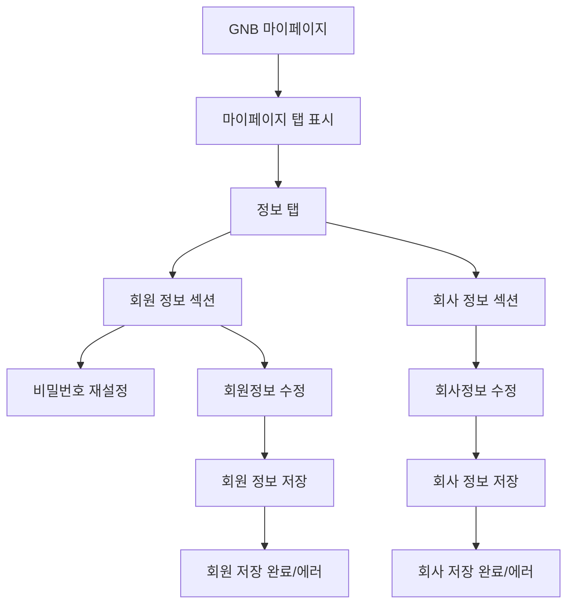

# 마이페이지-계정정보관리

## 개요

- **경로**: `/mypage` (탭: 정보)
- **역할**: 로그인 사용자 개인정보·회사정보 조회·수정.

## ScreenShot

## 구성

### 회원 정보

- 필드: 아이디(이메일), 비밀번호, 소속팀, 이름, 휴대폰번호, 마케팅 정보 수신
- 버튼: [정보수정], [변경사항저장], [취소]

### 회사 정보

- 필드: 회사이름, 사업자등록번호, 산업분야
- 버튼: [정보수정], [변경사항저장], [취소]

## Actions

### 회원 정보 수정

- **트리거**: 회원정보 섹션에서 [정보수정] 클릭
- **플로우**: 이름/휴대폰번호/마케팅수신동의 수정 -> [변경사항 저장] 클릭.

### 비밀번호 재설정

- **트리거**: 회원 정보 섹션 [인증이메일 발송] 클릭.
- **플로우**: 모달 오픈 (기존 로그인 이메일 전달). 이메일 인증 후 비밀번호 재설정 플로우 진행.

### 회사 정보 수정 (ADMIN 권한만 가능)

- **트리거**: 회사정보 섹션에서 [정보수정] 클릭
- **플로우**: 회사명/사업자번호/산업분야 수정 후 [변경사항 저장] 클릭.

## User Flow

## ETC

- 이름: 2~20자
- 숫자만 사용 시 10자 또는 11자 허용 `-` 제거 후 길이 9 초과 12 미만.
- 회사 이름: 30자 이내.
- 사업자 등록 번호: 3자-2자-5자 (총 10자리 숫자)
- 상태·조건: 결제 정지/만료 시 결제 탭 포커스·안내 가능. 회사 정보 수정 버튼은 `roleId(1)`일 때만 활성화.

---

## API

| 순서 | Method | Path                                                                                                | 트리거                                                                                |
| ---- | ------ | --------------------------------------------------------------------------------------------------- | ------------------------------------------------------------------------------------- |
| 1    | GET    | [`/member/profile/my`](../../../interface/00.roouty/member.md#get-memberprofilemy)                  | 페이지 진입 시 (`getMyAccountUserData`)                                               |
| 2    | GET    | [`/company`](../../../interface/00.roouty/company.md#get-company)                                   | 페이지 진입 시 (`getMyAccountCompanyData`)                                            |
| 3    | GET    | [`/company/industryType/list`](../../../interface/00.roouty/company.md#get-companyindustrytypelist) | 페이지 진입 시 — 업종 드롭다운 옵션 (`getRequestIndustryType`)                        |
| 4    | PUT    | [`/member/profile/my`](../../../interface/00.roouty/member.md#put-memberprofilemy)                  | [저장하기] 버튼 — 사용자 정보 수정 (`putUpdateMyAccountUserData`)                     |
| 5    | PUT    | [`/company`](../../../interface/00.roouty/company.md#put-company)                                   | [저장하기] 버튼 — 회사 정보 수정 (`setCompanyInfo` / `putUpdateMyAccountCompanyData`) |
| 6    | GET    | [`/member/profile/my`](../../../interface/00.roouty/member.md#get-memberprofilemy)                  | 내부호출 — 사용자 정보 수정 성공 후 localStorage 갱신 (`getMyInfo`)                   |
