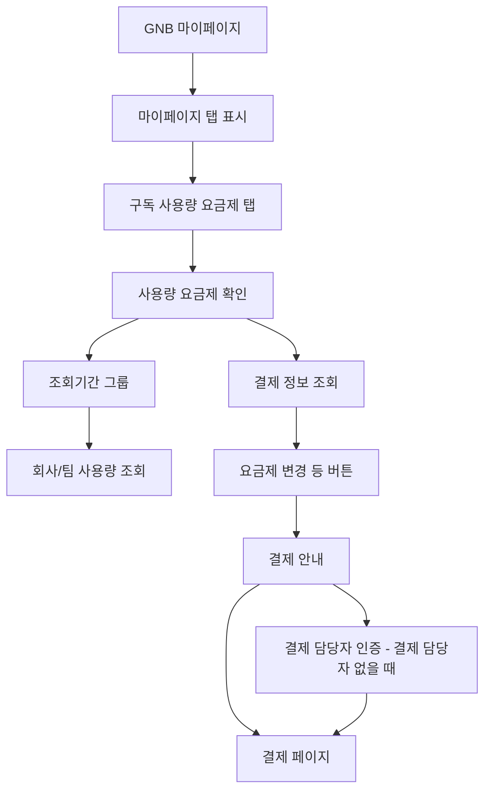

# 마이페이지-사용량 및 요금제

## 개요

- **경로**: `/mypage` (탭: 구독/요금제)
- **역할**: 이용기간별 사용량 조회, 요금제(구독) 확인 및 변경(업그레이드/다운그레이드/구독/해지 신청).
- **진입 경로**: GNB 사용자 드롭다운에서 "마이페이지" 이동 → 구독(또는 사용량·요금제) 탭.
- **권한**: 요금제 변경 버튼은 `관리자(1)`일 때만 활성화.

## ScreenShot

## 구성

### 사용량

- 필드: 조회기간
- 정보: 총 누적 사용량(총 도착지 수, 총 라우트 수), 팀별사용량

### 요금제 관리

- 정보: 요금제 정보
- 버튼: [요금제 변경],[별도문의]

## Actions (요약)

### 사용량

- 입력 필드 없음. 기간 선택은 조회 결과로 생성된 옵션만 선택 가능.
- 결과로 총 누적 경유지 수, 진행률, 팀별 경유지 수 갱신.

### 요금제 관리

- 버튼 활성/비활성만 조건에 따름.
- `ADMIN 권한` 이 아니고 또는 `결제중지` 상태 이면 버튼 비활성.

## User Flow

## 모달

### 요금제 변경

- 구성:
  - 정보: 요금제, 다음결제예정일, 다음결제금액
  - 버튼: [요금제변경], [닫기]
- 플로우
  - 추정 결제 금액(업그레이드 시)
    - 이번에 결제할 금액이 없으면 **요금제 변경/구매하기 버튼 비활성**.
    - 추정 금액이 음수인 경우 (예: 이미 선납분이 많아서 이번엔 낼 돈이 없거나, 잘못된 상태로 보는 경우)
  - 팀 개수 제한(다운그레이드/변경 시)
    - 대상 요금제가 `Free, Starter, Lite, Standard` 중 하나이고, 현재 팀이 2개 이상이면 변경 진행 전 **팀 삭제 안내 모달** 노출(진행 불가 팀 관리에서 삭제).
  - 요금제 변경(업그레이드)
    - 팀 제한 체크(`Free/Starter/Lite/Standard`면 팀 2개 이상 시 “팀 삭제 후 진행” 모달).
  - 요금제 변경(다운그레이드)
    - 팀 제한 체크(동일).
  - 요금제 구매하기(Free → 유료)
    - 결제 담당자 있음: 결제 페이지 이동.
    - 결제 담당자 없음: **결제 담당자 인증 모달** 오픈 → 이름/이메일/휴대폰 validate 후 인증 플로우 → 결제 페이지 이동.

      

      

### 결제 담당자 인증 모달 (Free → 유료 최초 구독 시)

- 구성:
  - 필드: 결제담당자 이름, 결제담당자 이메일, 결제 담당자 휴대폰번호
  - 버튼: [결제담당자 인증하기], [취소]
- 노출 조건:
  - Free 요금제에서 유료 요금제 구독 시, 결제 담당자 정보가 없으면 모달 열림
  - 위 폼 입력 → [결제 담당자 인증하기]로 진행.

    

    

## ETC

- 결제 담당자 이름: 2~20자
- 결제 담당자 휴대폰: 10~11자리 숫자

---

## API

**Usage 영역**

| 순서 | Method | Path                                                                                               | 트리거                                                          |
| ---- | ------ | -------------------------------------------------------------------------------------------------- | --------------------------------------------------------------- |
| 1    | GET    | [`/payment/my`](../../../interface/00.roouty/payment.md#get-paymentmy)                             | 페이지 진입 시 — 요금제 상태 확인 (`useGetPaymentMy`)           |
| 2    | GET    | [`/payment/history-boundary`](../../../interface/00.roouty/payment.md#get-paymenthistory-boundary) | 페이지 진입 시 — 사용량 기간 범위 (`getPaymentBoundaries`)      |
| 3    | GET    | [`/member/profile/my`](../../../interface/00.roouty/member.md#get-memberprofilemy)                 | 페이지 진입 시 — 권한 확인: roleId (`getMyInfo`)                |
| 4    | GET    | [`/v2/usage/total`](../../../interface/00.roouty/usage-v2.md#get-v2usagetotal)                     | 기간 변경 시 (`useUsageQuery` direct request)                   |
| 5    | GET    | [`/v2/usage/team`](../../../interface/00.roouty/usage-v2.md#get-v2usageteam)                       | boundary 설정 후, 기간 변경 시 (`useUsageQuery` direct request) |
| 6    | GET    | [`/company/:key-usage`](../../../interface/00.roouty/company.md#get-companyusage)                  | 페이지 진입 시 — 사용량 조회 (`getUsageByBoundary`)             |

**Plan 영역**

| 순서 | Method | Path                                                                                                     | 트리거                                                           |
| ---- | ------ | -------------------------------------------------------------------------------------------------------- | ---------------------------------------------------------------- |
| 7    | GET    | [`/payment/my`](../../../interface/00.roouty/payment.md#get-paymentmy)                                   | 페이지 진입 시 — 현재 요금제 (`useGetPaymentMy`)                 |
| 8    | PUT    | [`/payment/downgrade/cancel`](../../../interface/00.roouty/payment.md#put-paymentdowngradecancel)        | [변경 신청 취소] 버튼 (`cancelDowngrade`)                        |
| 9    | POST   | [`/payment/confirm`](../../../interface/00.roouty/payment.md#post-paymentconfirm)                        | 결제 확인 (`usePaymentConfirm`)                                  |
| 10   | PUT    | [`/payment/unsubscribe/cancel`](../../../interface/00.roouty/payment.md#put-paymentunsubscribecancel)    | [해지 신청 취소] 버튼 (`useUnsubscribeCancel`)                   |
| 11   | GET    | [`/payment/estimate-pay-amount`](../../../interface/00.roouty/payment.md#get-paymentestimate-pay-amount) | 요금제 변경 시 추정 결제 금액 자동 조회 (`getEstimatePayAmount`) |
| 12   | POST   | [`/payment/start-plan`](../../../interface/00.roouty/payment.md#post-paymentstart-plan)                  | [결제하기] 버튼 — Free→유료 최초 구독 (`paymentStart`)           |
| 13   | PUT    | [`/payment/plan`](../../../interface/00.roouty/payment.md#put-paymentplan)                               | [요금제 변경] 버튼 — 유료→유료 변경 (`paymentChange`)            |
| 14   | POST   | [`/payment/unsubscribe`](../../../interface/00.roouty/payment.md#post-paymentunsubscribe)                | [구독 취소] 버튼 (`unsubscribe`)                                 |

**결제 담당자 인증 모달**

| 순서 | Method | Path                                                                                                                  | 트리거                                                   |
| ---- | ------ | --------------------------------------------------------------------------------------------------------------------- | -------------------------------------------------------- |
| 15   | POST   | [`/payment/check-exists-manager-info`](../../../interface/00.roouty/payment.md#post-paymentcheck-exists-manager-info) | 결제 담당자 존재 여부 확인 (`useCheckExistsManagerInfo`) |
| 16   | POST   | [`/payment/verify-manager-info`](../../../interface/00.roouty/payment.md#post-paymentverify-manager-info)             | 결제 담당자 정보 검증 (`useSetPaymentVerifyManagerInfo`) |
| 17   | POST   | [`/payment/send-manager-auth-code`](../../../interface/00.roouty/payment.md#post-paymentsend-manager-auth-code)       | 인증번호 발송 (`useSendManagerAuthCode`)                 |
| 18   | POST   | [`/payment/verify-manager-auth-code`](../../../interface/00.roouty/payment.md#post-paymentverify-manager-auth-code)   | 인증번호 검증 (`useVerifyManagerAuthCode`)               |
