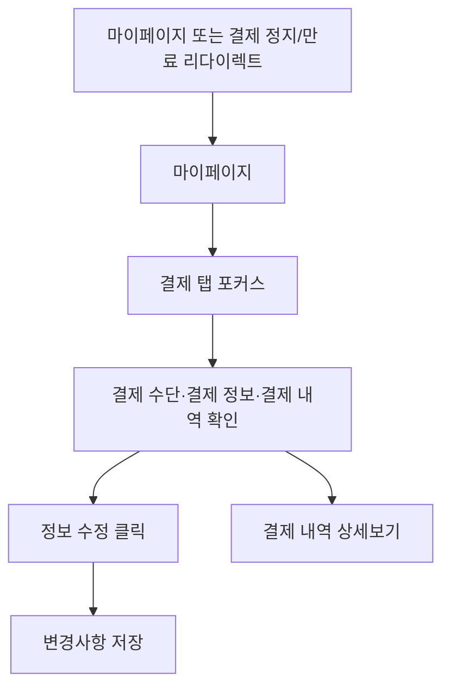

# 마이페이지-결제관리

## 개요

- **경로**: `/mypage` (사이드바: 결제 정보 관리 > 결제 관리).
- **역할**: 결제 수단·결제 담당자 정보 관리, 결제 내역 조회 및 요금명세서 상세.
- **권한**: `관리자(1)`이 아닌 경우 사이드바에서 [결제 관리] 메뉴 비노출.

## ScreenShot

![결제 담당자 미등록 시에는 "결제 수단 관리"만 표시되고, 결제 수단 영역 클릭 시 "[사용량 및 요금제 관리]에서 요금제를 결제하시면 결제 정보가 등록됩니다." 알림.](../assets/screens/마이페이지-결제관리-1.png)

## 구성

### 결제 수단 관리

- 정보: 결제수단, 결제예정일
- 버튼: [결제수단 등록]

### 결제 정보 관리

- 필드: 결제담당자 이름, 결제담당자 휴대폰번호, 결제담당자 이메일
- 버튼: [정보수정], [변경사항저장], [취소], [인증번호 발송하기], [재발송]

### 결제 내역

- 컬럼: 이용기간, 요금제, 결제금액(부가세포함), 결제수단, 결제일, 요금명세서
- 버튼: [상세보기], [명세서 PDF 다운로드]

## Actions

### 명세서 PDF 다운받기

- 현재 상세 영역을 PDF로 다운로드.
- 클라이언트 PDF 생성 후 다운로드(파일명 예: `루티_요금명세서_YYYYMMDD`).

## User Flow

## ETC

- 결제 담당자 이름: 2~20자
- 결제 담당자 휴대폰 번호: 10~11자리 숫자
- [인증번호 발송하기]: 응답 후 180초 타이머 시작, 인증번호 입력란 노출 → 사용자가 인증번호 입력 후 검증 완료 시 휴대폰 값 반영.

---

## API

| 순서 | Method | Path                                                                                                                  | 트리거                                                        |
| ---- | ------ | --------------------------------------------------------------------------------------------------------------------- | ------------------------------------------------------------- |
| 1    | GET    | [`/payment/method`](../../../interface/00.roouty/payment.md#get-paymentmethod)                                        | 페이지 진입 시 — 카드 정보 조회 (`useGetPaymentMethod`)       |
| 1-1  | PUT    | [`/payment/method`](../../../interface/00.roouty/payment.md#put-paymentmethod)                                        | 결제 수단 변경 (`useSetChangePayMethod`)                      |
| 2    | GET    | [`/payment/info`](../../../interface/00.roouty/payment.md#get-paymentinfo)                                            | 페이지 진입 시 — 결제 담당자 정보 (`useGetPaymentInfo`)       |
| 3    | PATCH  | [`/payment/manager`](../../../interface/00.roouty/payment.md#patch-paymentmanager)                                    | [저장하기] 버튼 — 결제 담당자 수정 (`usePatchPaymentManager`) |
| 4    | GET    | [`/payment/history`](../../../interface/00.roouty/payment.md#get-paymenthistory)                                      | 페이지 진입 시 — 결제 이력 목록 (`useGetPaymentHistory`)      |
| 5    | GET    | [`/payment/history/:id/bill`](../../../interface/00.roouty/payment.md#get-paymenthistoryidbill)                       | 결제 내역 행 클릭 — 요금명세서 상세 (`useGetReceipt`)         |
| 6    | POST   | [`/payment/check-exists-manager-info`](../../../interface/00.roouty/payment.md#post-paymentcheck-exists-manager-info) | 결제 담당자 존재 여부 확인 (`useCheckExistsManagerInfo`)      |
| 7    | POST   | [`/payment/send-manager-auth-code`](../../../interface/00.roouty/payment.md#post-paymentsend-manager-auth-code)       | 인증번호 발송 (`useSendManagerAuthCode`)                      |
| 8    | POST   | [`/payment/verify-manager-auth-code`](../../../interface/00.roouty/payment.md#post-paymentverify-manager-auth-code)   | 인증번호 검증 (`useVerifyManagerAuthCode`)                    |
| 9    | POST   | [`/payment/verify-manager-info`](../../../interface/00.roouty/payment.md#post-paymentverify-manager-info)             | 결제 담당자 정보 검증 (`useSetPaymentVerifyManagerInfo`)      |
