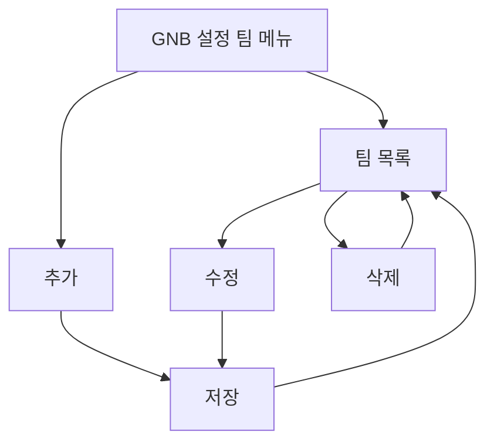

# 설정-팀관리

## 개요

- **경로**: `/setting` (좌측 메뉴: 팀)
- **역할**: 팀 목록·등록·수정·삭제. 팀별 매니저·차량 연결 확인.
- **권한**: `관리자(1)`만 활성.

## ScreenShot

## 구성

- 검색:
  - 필드:
    - 키워드유형: 팀이름, 매니저명, 차량명
    - 키워드
  - 버튼: [팀추가], [조회하기], [초기화]

- 목록
  - 컬럼: 팀이름, 소속매니저, 소속차량, 추가일자, 팀연락처, 팀주소, 팀상세주소, 팀메모, 하위구분

## Actions

### 팀 추가

- 구성
  - 필드: 팀이름, 팀연락처, 팀주소, 팀상세주소, 하위구분
  - 버튼: [닫기], [추가하기]
- 플로우:
  - 필수내용 입력 → 저장 API 호출
  - 성공시 리스트 갱신

### 팀 수정(목록 행 클릭)

- 구성
  - 상세
    - 정보:
      - 팀기본정보: 팀이름, 등록일, 소속매니저, 소속차랑, 팀메모, 팀주소, 팀상세주소, 팀연락처
      - 소속매니저정보: 팀소속일자, 이름, 소속팀수, 아이디(이메일)
      - 소속차량정보: 팀소속일자, 차량, 상태, 운행유형, 아이디(휴대폰번호)
      - 하위구분정보
    - 버튼: [삭제하기], [닫기], [수정하기]
  - 수정
    - 필드: 팀이름, 팀연락처, 팀주소, 팀상세주소, 하위구분
    - 버튼: [닫기], [저장하기]

- 플로우:
  - 목록 행 클릭
  - 상세내용 확인 → [닫기]
  - [삭제하기] → 목록 갱신
  - [수정하기] → 필드내용변경 - [저장하기] → 목록 갱신

### 팀 삭제

- 구성
  - 정보: 팀이름, 추가일자, 소속매니저, 소속차량, 팀메모
  - 필드: 팀이름
  - 버튼: [닫기], [영구삭제]
- 플로우
  - 삭제 경고문 동의 체크 후 [다음] 클릭
  - 삭제할 팀 이름 명확히 입력 후 [영구삭제] 클릭

## User Flow

---

## API

| 순서 | Method | Path                                                                                | 설명                                                | 트리거                                      |
| ---- | ------ | ----------------------------------------------------------------------------------- | --------------------------------------------------- | ------------------------------------------- |
| 1    | GET    | [`/team/list`](../../../interface/00.roouty/team.md#get-teamlist)                   | 팀 목록 조회 (searchItem, keyword)                  | 페이지 진입, [조회하기] 버튼, [초기화] 버튼 |
| 2    | GET    | [`/team/detail/:teamId`](../../../interface/00.roouty/team.md#get-teamdetailteamid) | 팀 상세 조회                                        | 테이블 행 클릭 (상세 모달)                  |
| 3    | POST   | [`/team`](../../../interface/00.roouty/team.md#post-team)                           | 팀 생성                                             | [팀 추가] 모달 → [추가하기]                 |
| 4    | PUT    | [`/team/:teamId`](../../../interface/00.roouty/team.md#put-teamteamid)              | 팀 수정                                             | 팀 수정 모달 → [저장하기]                   |
| 5    | DELETE | [`/team/:teamId`](../../../interface/00.roouty/team.md#delete-teamteamid)           | 팀 삭제                                             | [삭제하기] → [영구삭제]                     |
| 6    | GET    | [`/team/check/name`](../../../interface/00.roouty/team.md#get-teamcheckname)        | 팀명 중복 확인                                      | 팀 추가/수정 모달에서 팀명 입력             |
| 7    | GET    | [`/payment/my`](../../../interface/00.roouty/payment.md#get-paymentmy)              | 내 결제 정보 (Pro/Custom이 아니면 요금제 안내 모달) | 페이지 진입                                 |

> 외부 연동

| 유형  | 대상          | 설명         | 트리거            |
| ----- | ------------- | ------------ | ----------------- |
| Kakao | Daum Postcode | 팀 주소 검색 | 팀 추가/수정 모달 |
