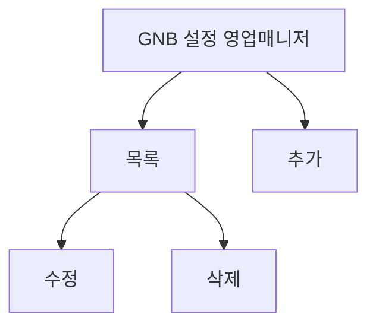

# 설정-영업매니저관리

## 개요

- **경로**: `/setting` (좌측 메뉴: 영업매니저)
- **역할**: 영업 매니저 목록·등록·수정·삭제.
- **권한**: `관리자(1), 매니저(2)`만 활성.

## ScreenShot

## 구성

- 검색
  - 탭: 소속영업매니저, 초대한영업매니저
  - 필드:
    - 키워드유형:
      - 소속팀
      - 이름 → (소속영업매니저)
      - 아이디(이메일)
    - 키워드
  - 버튼: [영업매니저초대], [조회하기], [초기화]

- 목록
  - 컬럼:
    - 소속팀
    - 이름 → (소속영업매니저)
    - 아이디(이메일)
    - 소속일자 → (소속영업매니저)
    - 초대일자 → (초대된영업매니저)
    - 만료일자 → (초대된영업매니저)
  - 버튼:
    - [소속팀변경]
    - [매니저삭제] → (소속영업매니저)
    - [초대장재전송] → (초대된영업매니저)
    - [초대취소] → (초대된영업매니저)

## Actions

### 영업 매니저 초대

- 구성
  - 필드: 이메일주소 (복수입력가능), 소속팀
  - 버튼: [닫기], [초대하기]
- 플로우
  - 이메일 입력 → 유효성 검사 → [초대하기]
  - 완료후 → 목록 갱신
  - 등록된 메일로 전달된 초대 링크 → `04.회원가입-초대` 에서 회원 가입 진행.

### 영업 매니저 수정

- 구성
  - 필드: 이름, 이메일, 소속팀
  - 버튼: [닫기], [저장하기]
- 플로우:
  - 목록 행 클릭 (`ADMIN 권한` 제외) → 소속팀 변경 → [저장하기]
  - 완료후 → 목록 갱신

### 소속팀 변경

- 구성
  - 정보: 소속팀, 이름, 아이디(이메일)
  - 필드: 팀선택
- 버튼: [닫기], [소속팀변경]
- 플로우:
  - 목록 행 선택 → [소속팀 변경] → 팀선택 [저장하기]
  - 완료후 → 목록 갱신

### 매니저 삭제, 초대장 재전송, 초대취소

- 플로우:
  - 목록 행 선택 → [매니저삭제], [초대장재전송], [초대취소]
  - 완료후 → 목록 갱신

## User Flow

---

## API

| 순서 | Method | Path                                                                                                                            | 설명                       | 트리거                   |
| ---- | ------ | ------------------------------------------------------------------------------------------------------------------------------- | -------------------------- | ------------------------ |
| 1    | GET    | [`/member/list/sales-manager`](../../../interface/00.roouty/member.md#get-memberlistsales-manager)                              | 영업매니저 목록 조회       | 페이지 진입, [조회하기]  |
| 2    | GET    | [`/member/list/sales-manager/invited`](../../../interface/00.roouty/member.md#get-memberlistsales-managerinvited)               | 초대된 영업매니저 목록     | [초대 현황] 탭           |
| 3    | POST   | [`/member/validate/sales-manager`](../../../interface/00.roouty/member.md#post-membervalidatesales-manager)                     | 초대 이메일 검증           | 초대 모달 → 이메일 입력  |
| 4    | POST   | [`/member/invite/sales-manager`](../../../interface/00.roouty/member.md#post-memberinvitesales-manager)                         | 영업매니저 초대            | 초대 모달 → [초대하기]   |
| 5    | PUT    | [`/member/resend/sales-manager`](../../../interface/00.roouty/member.md#put-memberresendsales-manager)                          | 초대 재발송                | [재발송] 버튼            |
| 6    | PUT    | [`/member/cancel/sales-manager`](../../../interface/00.roouty/member.md#put-membercancelsales-manager)                          | 초대 취소                  | [초대 취소] 버튼         |
| 7    | PUT    | [`/member/delete/sales-manager`](../../../interface/00.roouty/member.md#put-memberdeletesales-manager)                          | 영업매니저 삭제            | [삭제] 버튼              |
| 8    | PUT    | [`/member/move/sales-manager/:teamId`](../../../interface/00.roouty/member.md#put-membermovesales-managerteamid)                | 영업매니저 팀 이동         | [팀 변경] 모달 → [변경]  |
| 9    | PUT    | [`/member/move/sales-manager/invited/:teamId`](../../../interface/00.roouty/member.md#put-membermovesales-managerinvitedteamid) | 초대 영업매니저 팀 이동    | [팀 변경] 모달 (초대 탭) |
| 10   | GET    | [`/team/list`](../../../interface/00.roouty/team.md#get-teamlist)                                                               | 팀 목록 (팀 변경 드롭다운) | 팀 변경 모달 진입        |
