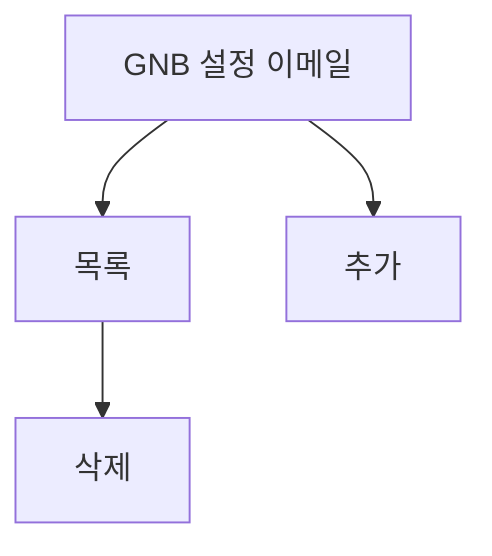

# 설정-이메일관리

## 개요

- **경로**: `/setting` (좌측 메뉴: 이메일)
- **역할**: 이메일 설정(발송·수신 등) 조회·삭제. (고객사 요청으로 만들었지만, 요건정리가 불분명함)
- **권한**: `관리자(1), 매니저(2)`만 활성.

## ScreenShot

## 구성

- 검색
  - 필드:
    - 키워드유형:
      - 소속팀
      - 이름
      - 이메일
    - 키워드
  - 버튼: [이메일추가], [조회하기], [초기화]

- 목록
  - 컬럼:
    - 소속팀
    - 이름
    - 이메일
    - 등록일자
  - 버튼:
    - [이메일삭제]

## Actions

### 이메일 추가

- 구성:
  - 필드: 이름, 소속팀, 이메일
  - 버튼: [닫기], [추가하기]
  - 플로우:
    - [이메일추가] 클릭
    - 필드 입력 → [추가하기]
    - 완료 후 목록 갱신

### 이메일 삭제

- 플로우:
  - 목록 행 선택 → [이메일삭제]
  - 완료후 → 목록 갱신

## User Flow

---

## API

| 순서 | Method | Path                                                                                                                       | 설명                                       | 트리거                              |
| ---- | ------ | -------------------------------------------------------------------------------------------------------------------------- | ------------------------------------------ | ----------------------------------- |
| 1    | GET    | [`/v2/sales-note/email`](../../../interface/00.roouty/sales-note-email-v2.md#get-v2sales-noteemail)                        | 이메일 목록 조회 (페이지네이션, 검색 포함) | 페이지 진입, [조회하기]             |
| 2    | POST   | [`/v2/sales-note/email`](../../../interface/00.roouty/sales-note-email-v2.md#post-v2sales-noteemail)                       | 이메일 추가                                | [이메일 추가] 모달 → [저장]         |
| 3    | DELETE | [`/v2/sales-note/email`](../../../interface/00.roouty/sales-note-email-v2.md#delete-v2sales-noteemail)                     | 이메일 삭제 (emailIds 배열)                | [삭제] 버튼                         |
| 4    | GET    | [`/v2/sales-note/email/check/:email`](../../../interface/00.roouty/sales-note-email-v2.md#get-v2sales-noteemailcheckemail) | 이메일 중복 확인 (teamId 쿼리 포함)        | 이메일 추가 모달에서 이메일 입력 시 |
| 5    | GET    | [`/payment/my`](../../../interface/00.roouty/payment.md#get-paymentmy)                                                     | 내 결제 정보                               | 페이지 진입 (요금제 확인)           |
