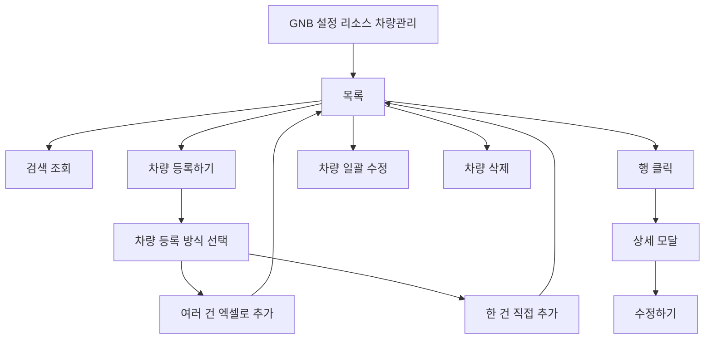

# 설정-차량관리

## 개요

- **경로**: `/setting` (좌측 메뉴: 리소스 관리 > 차량 관리)
- **역할**: 배차·모니터링에서 사용하는 차량(기사) 목록 조회·등록·수정·삭제, 일괄 수정, 엑셀 업로드.
- **진입 경로**: GNB "설정" → 좌측 "리소스 관리" 내 "차량 관리" 선택.
- **권한**:
  - `관리자(1), 매니저(2)` 만 활성.
  - `수동배차전용플랜(2)`일 때는 권역 관리 없이 차량·앱만 노출.

## ScreenShot

## 검색

| 라벨(표시명)      | 옵션/기본값·초기화                                                              |
| ----------------- | ------------------------------------------------------------------------------- |
| 탭                | 일반 차량, 기타 차량                                                            |
| 검색 항목(셀렉트) | 소속 팀, 이름, 아이디(휴대폰 번호), 권역, 특수 조건 중 선택.                    |
| 키워드            | 선택 항목에 따라 검색. [조회하기]로 목록 조회. [초기화]로 필터·검색 초기화.     |
| 운영 유형         | 일반차량(전체, 고정차, 지입차, 고정용차), 기타 차량 (전체, 자가배송, 용차)용차. |

## 목록

- **컬럼명**: 선택(체크박스), 소속 팀, 차량, 차량 연락처, 운영 유형, 등록 일자, 차종, 출발지 주소, 출발지 상세 주소, 도착지 주소, 도착지 상세 주소, 메모, 활성 상태, 앱 설치, 스마트 주행, 연료, 연비, 용적량1-3, 회전, 회전 작업 시간, 담당 권역, 특수 조건, 근무 시작 시간, 근무 종료 시간, 휴게 시간, 휴게 시작 시간 구간, 휴무일 등.
- **행 선택**: 다중 선택(체크박스). 선택 후 테이블 상단 버튼 사용.
- **행 클릭**: 해당 차량 상세 모달 오픈. 상세에서 [수정하기]로 수정 모드 전환 후 저장.
- **[차량 일괄 수정]**(일반차량 탭만 노출): 클릭 시 일괄 수정 모달 오픈. 선택한 차량이 **서로 다른 팀**이면 "소속 팀이 다른 차량이 선택되었습니다. 소속 팀이 동일한 차량을 선택한 뒤 다시 시도해 주세요." 경고 모달만 노출되고 일괄 수정 모달은 열리지 않음.
- **[설치 문자 발송]**(일반차량 탭만 노출): 선택한 차량에게 설치 문자 발송 확인 모달 → [발송] 시 발송 처리.
- **[차량 삭제]**: 클릭 시 삭제 확인 모달 오픈 → [확인] 시 선택한 차량 일괄 삭제 후 목록 갱신. 배차 사용 중이면 삭제 제한·프로세싱 알림 모달 안내.
- **[다운로드]**: 클릭 시 다중 선택된 차량 정보 엑셀 다운로드.

## Actions

- **차량 추가**
  - **트리거**: 화면 상단 [차량 등록하기] 버튼 클릭.
  - **플로우**: 클릭 → 차량 등록 방식 선택 모달 오픈("차량 등록 방식을 선택해주세요.") → (여러 건 엑셀로 추가 / 한 건 직접 추가) 중 선택 → 해당 방식 모달에서 입력·저장.
  - **최종 동작**: 방식 선택 모달 닫힘.

## User Flow

## 모달·드로어 상세

### 차량 등록 방식 선택 모달

- **진입**: 상단 [차량 추가] 클릭.
- **내부 구성**
  - (1) **여러 건 엑셀로 추가** → 엑셀 업로드 플로우로 이동.
  - (2) **한 건 직접 추가** → 차량 등록 모달(한 건) 오픈.
- **동작**: 선택 시 해당 모달/플로우로 전환. [취소]/배경 클릭 시 닫힘.

### (1) 여러 건 엑셀로 추가

- **진입**: 방식 선택 모달에서 "여러 건 엑셀로 추가" 선택.
- **내부 구성**: 파일 선택 후 업로드 진행 → 파일 로딩 모달 → 검증·데이터 로딩 모달 → 검증 결과(성공/실패 행 안내, 수정 가능 시 에러 테이블) → 등록 처리. [닫기].
- **에러 시**: "잘못된 파일 형식이거나 오류가 있습니다." 등 안내. 파일·확장자, 칼럼 설정, 빈 파일 여부 확인 유도.
- **동작**: 엑셀 양식에 맞춰 차량(기사)·팀·연락처 등 다건 입력 후 업로드. 검증 통과 시 일괄 등록 후 목록 갱신.

### (2) 한 건 직접 추가 — 차량 등록 모달

- **진입**: 방식 선택 모달에서 "한 건 직접 추가" 선택.
- **버튼**: [닫기], [추가하기]. [닫기]/배경 클릭 시 모달 닫힘.
- **차량 기본 정보**
  - **소속 팀**(필수): 검색·셀렉트. 팀 관리에 등록된 팀만 선택 가능.
  - **차량**(필수): 기사명.
  - **차량 연락처**(필수): 10~13자, 숫자만. 유효한 연락처 형식 검사.
  - **운영 유형**(필수): 고정차, 지입차, 고정용차, 자가배송, 용차.
  - **차종**(필수): 셀렉트(차종 목록 연동).
  - **근무 시작 시간**(필수): 시간 선택. 기본 09:00. 주행 종료 시간보다 늦을 수 없음.
  - **근무 종료 시간**: 시간 선택 또는 "없음". 주행 시작 시간보다 앞설 수 없음.
  - **휴게 시간**(필수): 없음(0) / 30분 / 60분 / 90분 / 120분 셀렉트.
  - **휴게 시간 가능 구간**: 휴게 시간이 0이 아니면 활성. 구간 선택(시작~종료). 휴게 시작 시간이 근무 시작 시간보다 앞설 수 없음. 휴게 종료 시간을 주행 시작 시간보다 앞서서 설정할 수 없음. 휴게 시간 구간은 휴게 시간(분)보다 길어야 함.
  - **출발지 주소**(필수): 주소 검색(우편번호 찾기) 연동. 상세주소 입력(출발지 입력 후 활성).
  - **도착지 주소**: 주소 검색 연동. "출발지와 동일" 체크 시 출발지와 동일하게 설정 가능. 상세주소(도착지 입력 후 활성).
  - **회전**: 다회전 가능 여부(없음, 2, 3, 4, 5)
  - **회전작업시간**: 다회전 회차시 상차등에 필요한 작업시간.
  - **메모**: 텍스트 영역.
- **배송정보**
  - **스마트 주행**: 사용/미사용. 앱에서 자동 출도착 처리를 할 수 있는 설정
  - **최대 용적량**, **최대 용적량 1**, **최대 용적량 2**: 0 이상(소수점 3자리까지 입력 가능). **최대 용적량의 합은 1 이상**이어야 함. 미충족 시 "최대 용적량의 합은 1 이상이어야 합니다." 에러. 사용자 가이드·매뉴얼에서는 정수만 입력하도록 안내할 수 있으나, 시스템은 소수점 3자리까지 저장·반영한다.
  - **특수 조건**: 특수 조건 관리에 등록된 항목 다중 선택(팀 기준).
  - **연료**: 셀렉트(없음, 경유, 휘발유, LPG, 전기)
  - **연비**: 텍스트 (예, 13.1)
- **휴무일정보**
  - **휴무일 추가**: 휴무일 선택과 휴무일 내용을 작성할 수 있는 모달 오픈
- **저장**: [추가하기] → 필수·형식·용적량 합 + **근무/휴게 시간 검증** 통과 시 등록 → 성공 시 "차량 등록을 완료하였습니다." 후 모달 닫힘·목록 갱신.
  - **근무 시간 검증**: 근무 종료 시간이 근무 시작 시간보다 앞이면 "근무 종료 시간은 시작 시간보다 늦어야 합니다." 노출, 등록 차단.
  - **휴게 시간 구간 검증**: 휴게 시간이 0이 아닌 경우, 휴게 구간이 근무 시작·종료 시간 안에 포함되어야 함. 어긋나면 "근무 시간과 휴게 시간 구간이 올바르지 않습니다." 노출, 등록 차단.

### 차량 수정 모달

- **진입**: 상세 모달 내 [수정하기] 버튼 클릭.
- **버튼**: [닫기], [저장하기]. [닫기]/배경 클릭 시 모달 닫힘.
- **내부구성**: 차량 단건 등록과 동일. 단 소속팀, 차량 연락처 수정 불가.

### 차량 상세 모달

- **진입 경로**: 목록 행 클릭 → 해당 주문 상세 조회 후 모달 오픈. [닫기] 또는 배경 클릭 시 모달 닫힘.
- **푸터(주문 상태별)**: [닫기], [수정하기], [삭제]
- **모달 내부 탭별 구성**
  | 탭 | 구성 | 화면 |
  | --------- | ----------------------------------------------------------------------------------------------------------------------------------------------------------------------------------------------------------------- | -------------------------------------------------------------------------- |
  | 기본 정보 | **차량 기본 정보**: (소속팀, 활성상태, 차량, 차량 연락처, 운영유형, 차종, 근무시작시간, 근무종료시간, 휴게시간, 휴세기작 가능구간, 출발지주소, 출발지상세주소, 도착지주소, 도착지 상세주소, 메모), **휴무일정보** |  |
  | 배송 정보 | **차량 배송 정보**: (스마트주행, 회전, 회전작업시간, 용적량1-3, 연료, 연비), **특수 조건 정보**, **담당 권역 정보** | |

### 차량 일괄 수정 모달

- **진입**: 차량 다중 선택(동일 팀만) 후 테이블 [차량 일괄 수정] 클릭.
- **버튼**: [닫기], [저장하기]. [취소]/배경 클릭 시 모달 닫힘.
- **차량 기본 정보**
  - **메모**: 텍스트 영역. "예시) 매주 월요일 휴무". 최대 200자. "설정값 삭제"로 공통 적용 값 제거 가능.
- **차량 기본 정보**
  - **운영 유형**: 고정차, 지입차, 고정용차, 자가배송, 용차.
  - **차종**: 셀렉트(차종 목록 연동).
  - **근무 시작 시간**: 시간 선택. 기본 09:00. 주행 종료 시간보다 늦을 수 없음.
  - **근무 종료 시간**: 시간 선택 또는 "없음". 주행 시작 시간보다 앞설 수 없음.
  - **휴게 시간**: 없음(0) / 30분 / 60분 / 90분 / 120분 셀렉트.
  - **휴게 시간 가능 구간**: 휴게 시간이 0이 아니면 활성. 구간 선택(시작~종료). 휴게 시작 시간이 근무 시작 시간보다 앞설 수 없음. 휴게 종료 시간을 주행 시작 시간보다 앞서서 설정할 수 없음. 휴게 시간 구간은 휴게 시간(분)보다 길어야 함.
  - **출발지 주소**: 주소 검색(우편번호 찾기) 연동. 상세주소 입력(출발지 입력 후 활성).
  - **도착지 주소**: 주소 검색 연동. "출발지와 동일" 체크 시 출발지와 동일하게 설정 가능. 상세주소(도착지 입력 후 활성), 설정값 삭제 가능.
  - **회전**: 다회전 가능 여부(없음, 2, 3, 4, 5)
  - **회전작업시간**: 다회전 회차시 상차등에 필요한 작업시간.
  - **메모**: 텍스트 영역, 설정값 삭제 가능.
- **배송정보**
  - **최대 용적량**, **최대 용적량 1**, **최대 용적량 2**: 0 이상(소수점 3자리까지 입력 가능). **최대 용적량의 합은 1 이상**이어야 함. 미충족 시 "최대 용적량의 합은 1 이상이어야 합니다." 에러. 사용자 가이드·매뉴얼에서는 정수만 입력하도록 안내할 수 있으나, 시스템은 소수점 3자리까지 저장·반영한다.
  - **특수 조건**: 특수 조건 관리에 등록된 항목 다중 선택(팀 기준).
  - **연료**: 셀렉트(없음, 경유, 휘발유, LPG, 전기)
  - **연비**: 텍스트 (예, 13.1)
- **저장**: [저장하기] → 단건 등록과 동일한 **근무/휴게 시간 검증** 수행. 검증 실패 시 등록 차단 + 안내 메시지 노출, 통과 시 선택한 차량에 공통 값 일괄 적용. 성공 시 "선택한 차량의 정보를 일괄 변경하였습니다. 변경된 정보는 다음 배차 계획부터 적용됩니다." 후 모달 닫힘·목록 갱신.

  

### 기타 모달

- **삭제 확인**: "선택한 차량 N 명을 삭제하시겠습니까?" [취소], [삭제]. 확인 시 선택한 차량 일괄 삭제 후 목록 갱신.
- **설치 문자 발송 확인**: "선택한 차량 N 명에게 설치 문자를 발송하시겠습니까?" [취소], [발송]. 확인 시 발송 처리.
- **소속 팀 상이 경고**: "소속 팀이 다른 차량이 선택되었습니다. 소속 팀이 동일한 차량을 선택한 뒤 다시 시도해 주세요." [확인].
- **프로세싱 알림**: "선택한 차량에게 배차된 주행이 있습니다. 먼저 배차취소를 하시거나 작업을 완료한 뒤 다시 시도해 주세요. 배차된 주행은 [모니터링] 에서 확인할 수 있습니다." [닫기], [모니터링으로 이동].

---

## 차량 설정관리로 수행하는 작업

- **배차 풀**: 여기서 등록·관리한 차량(기사) 목록은 **배차 계획**(자동/수동)·**모니터링**·**주문 배차**에서 선택 가능한 차량 풀으로 사용된다. 차량별 팀·권역·특수 조건·용적량·근무 시간 등이 배차·경로 최적화에 반영된다.
- **권역·특수 조건·용적량 연동**: 차량에 지정한 **권역**, **특수 조건**, **최대 용적량**(1/2)은 주문지·납품처 설정, 팔레트 용적량 등과 함께 배차 가능 여부·경로 산정에 쓰인다. 이 화면에서 등록·수정한 값이 배차 및 모니터링 화면에서 일관되게 적용된다.
- **배차 사용 중 삭제·수정 제한**: 이미 **배차(활성/주행 중)** 에 포함된 차량은 삭제·일부 수정(예: 비활성 전환)이 제한된다. 삭제·비활성 시도 시 프로세싱 알림 모달로 안내하며, 배차 취소 또는 작업 완료 후 다시 시도하도록 유도해 데이터 일관성을 유지한다.

---

## API

| 순서 | Method | Path                                                                                                                                                                                    | 설명                                                                                            | 트리거                                |
| ---- | ------ | --------------------------------------------------------------------------------------------------------------------------------------------------------------------------------------- | ----------------------------------------------------------------------------------------------- | ------------------------------------- |
| 1    | GET    | [`/member/list/driver`](../../../interface/00.roouty/member.md#get-memberlistdriver)                                                                                                    | 차량(기사) 목록 조회 (operationType 탭별 분기: 일반=regular,backup,contract / 기타=self,single) | 페이지 진입, [조회하기], 필터 변경    |
| 2    | POST   | [`/member/regist/driver`](../../../interface/00.roouty/member.md#post-memberregistdriver)                                                                                               | 차량 직접 등록 (단건)                                                                           | [차량 추가] → 직접 등록 모달 → [저장] |
| 3    | PUT    | [`/member/update/driver/:driverId`](../../../interface/00.roouty/member.md#put-memberupdatedriverdriverid)                                                                              | 차량 정보 수정                                                                                  | 수정 모달 → [저장]                    |
| 4    | PUT    | [`/member/delete/driver`](../../../interface/00.roouty/member.md#put-memberdeletedriver)                                                                                                | 차량 삭제 (driverList 배열)                                                                     | [삭제] 버튼                           |
| 5    | POST   | [`/member/driver/modifiable`](../../../interface/00.roouty/member.md#post-memberdrivermodifiable)                                                                                       | 수정 가능 여부 확인 (배차 진행 중 검증)                                                         | 수정/삭제 전 자동 호출                |
| 5-1  | PUT    | [`/member/batch/driver`](../../../interface/00.roouty/member.md#put-memberbatchdriver)                                                                                                  | 차량 일괄 수정 (batchModifyingDriverById)                                                       | [차량 일괄 수정] 모달 → [저장하기]    |
| 6    | GET    | [`/vehicle/model/list`](../../../interface/00.roouty/vehicle.md#get-vehiclemodellist)                                                                                                   | 차량 모델 목록                                                                                  | 차량 추가/수정 모달 진입              |
| 7    | GET    | [`/team/list`](../../../interface/00.roouty/team.md#get-teamlist)                                                                                                                       | 팀 목록 (드롭다운)                                                                              | 차량 추가/수정 모달                   |
| 8    | GET    | [`/v2/external/fuel-prices`](../../../interface/00.roouty/fuel-price-v2.md#get-v2externalfuel-prices)                                                                                   | 유류비 조회                                                                                     | 차량 수정 모달                        |
| 9    | POST   | [`/v2/driver/excel/download`](../../../interface/00.roouty/driver-excel-v2.md#post-v2driverexceldownload)                                                                               | 차량 Excel 다운로드 (driverIds 배열)                                                            | [엑셀 다운로드] 버튼                  |
| 10   | POST   | [`/v2/driver/temporary/excel`](../../../interface/00.roouty/temporary-driver-v2.md#post-v2drivertemporaryexcel)                                                                         | 차량 Excel 업로드                                                                               | [엑셀 업로드] → 파일 선택             |
| 11   | GET    | [`/v2/driver/temporary/:id`](../../../interface/00.roouty/temporary-driver-v2.md#get-v2drivertemporarytemporaryinvitationdriverid)                                                      | 임시 차량 데이터 조회                                                                           | Excel 검증 완료 후                    |
| 12   | GET    | [`/v2/driver/temporary/row-status/:id`](../../../interface/00.roouty/temporary-driver-v2.md#get-v2drivertemporaryrow-statustemporaryinvitationdriverid)                                 | 행 검증 상태 (폴링)                                                                             | Excel 업로드 후 검증 진행 중          |
| 13   | PUT    | [`/v2/driver/temporary/:id/row/:rowId/edit`](../../../interface/00.roouty/temporary-driver-v2.md#put-v2drivertemporarytemporaryinvitationdriveridrowtemporaryinvitationdriverrowidedit) | 검증 행 수정                                                                                    | 검증 모달에서 셀 수정                 |
| 14   | POST   | [`/v2/driver/temporary/register/:id`](../../../interface/00.roouty/temporary-driver-v2.md#post-v2drivertemporaryregistertemporarydriverid)                                              | 임시 차량 확정 등록                                                                             | [등록하기] 버튼                       |
| 15   | PUT    | [`/member/cancel/driver`](../../../interface/00.roouty/member.md#put-membercanceldriver)                                                                                                | 기사 초대 취소 (invitationList)                                                                 | [초대 취소] 버튼                      |
| 16   | POST   | [`/member/invite-resend/driver`](../../../interface/00.roouty/member.md#post-memberinvite-resenddriver)                                                                                 | 기사 초대 재발송                                                                                | [재발송] 버튼                         |
| 17   | POST   | [`/member/install-send/driver`](../../../interface/00.roouty/member.md#post-memberinstall-senddriver)                                                                                   | 앱 설치 링크 발송                                                                               | [설치 링크 발송] 버튼                 |

> 외부 연동

| 유형  | 대상          | 설명           | 트리거              |
| ----- | ------------- | -------------- | ------------------- |
| Kakao | Daum Postcode | 기사 주소 검색 | 기사 등록/수정 모달 |
