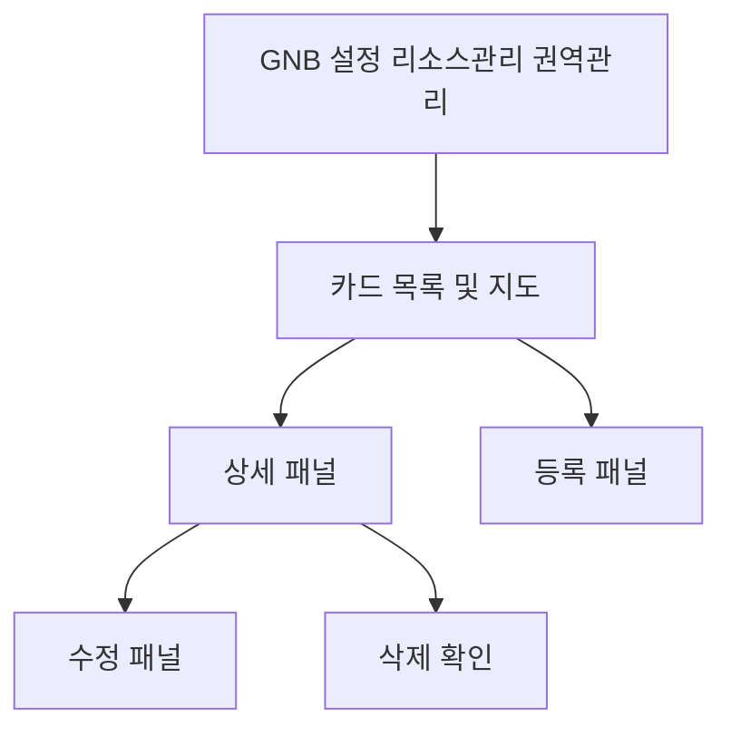

# 설정-권역관리

## 개요

- **경로**: `/setting` (좌측 메뉴: 리소스 관리 > 권역 관리)
- **역할**: 권역 목록·등록·수정·삭제.
- **진입 경로**: GNB "설정" → 좌측 "리소스 관리" 내 "권역 관리" 선택.
- **권한**:
  - `관리자(1), 매니저(2)`만 활성.
  - `수동배차전용플랜(2)`인 경우 권역 관리 메뉴 비노출(차량·앱만 노출).
  - 그 외 요금제에서만 노출.

## ScreenShot

## 검색

| 라벨(표시명) | 타입   | 옵션/기본값·초기화                  |
| ------------ | ------ | ----------------------------------- |
| 검색 항목    | 셀렉트 | 차량 / 행정구역 / 권역이름 중 선택. |
| 키워드       | 텍스트 | 키워드 검색                         |

## 목록

- **표시 형태**: 카드 리스트 + 지도. 좌측 카드 목록, 우측 지도 레이아웃. 카드 항목: 권역명, 담당 차량(요약), 행정구역(요약).
- **카드당 표시**: 권역명, 담당 차량(최대 2명 노출 후 "외 N명"), 행정구역(첫 구역 태그 + "외 N 구역").
- **카드 클릭**: 상세 패널(드로어) 오픈. 상세에서 [수정], [삭제] 제공.
- **목록 영역 버튼**: **하단** [권역 추가] → 등록 패널 오픈.
- **추가 기능**: 빈 상태 문구 및 [권역 추가] CTA. (페이지네이션 해당 시.)

## Actions

- **권역 등록**
  - **트리거**: 목록 **하단** [권역 추가] 버튼 클릭.
  - **플로우**: 등록용 슬라이드 패널 오픈 → 권역명·행정구역(지도 선택)·담당 차량(선택) 입력 → [저장] → 유효성 검사 → 등록 API 호출.
  - **유효성**: 권역명 필수, 20자 이내. 행정구역 1개 이상 필수(미선택 시 "선택한 구역이 없습니다. 권역에 포함시킬 행정구역을 선택해주세요." 모달). 권역명 중복 시 서버 에러 "이미 사용 중인 권역 이름입니다." 필드 에러로 표시.
  - **최종 동작**: 성공 시 패널 닫힘·목록 갱신.

- **권역 수정**
  - **트리거**: 카드 클릭 → 상세 패널 → [수정] 클릭.
  - **플로우**: 수정 패널 오픈(기존 권역명·행정구역·담당 차량 로드) → 수정 후 [저장] → 유효성 검사(등록과 동일) → 수정 API 호출.
  - **최종 동작**: 성공 시 패널 닫힘·목록 갱신.

- **권역 삭제**
  - **트리거**: 상세 패널 내 [삭제] 클릭.
  - **플로우**: 삭제 확인 모달("권역을 삭제하시겠습니까?" / "삭제한 권역 정보는 되돌릴 수 없습니다.", [권역 삭제], [취소]) → [권역 삭제] 시 삭제 API 호출.
  - **최종 동작**: 성공 시 패널 닫힘·목록 갱신.

## User Flow

목록 → 상세 → 수정/삭제. 목록 하단 → 등록.

## 슬라이드 패널 상세

### 권역 등록 패널

- **진입**: 목록 하단 [권역 추가] 클릭.
- **내부 구성**:
  - **필드**: 권역명(필수, 20자 이내), 행정구역(지도에서 선택, 1개 이상 필수), 담당 차량(선택, 차량 검색 후 선택).
  - **버튼**: [저장], [취소]. [취소]/패널 닫기 시 패널 닫힘.
- **동작**: [저장] → 등록 API(POST /area) → 성공 시 패널 닫힘·목록 갱신.

### 상세 패널

- **진입**: 목록 카드 클릭.
- **구성**: "이전 목록으로"로 패널 닫기, 권역명 표시, 지도에 해당 권역 행정구역 표시, 담당 차량 목록, [수정], [삭제] 버튼.

### 권역 수정 패널

- **진입**: 카드 클릭 → 상세 패널 → [수정] 클릭.
- **내부 구성**:
  - **필드**: 권역명(필수·20자 이내), 행정구역(1개이상), 담당 차량. 기존 값 로드 후 수정.
  - **버튼**: [저장], [취소]. [취소]/패널 닫기 시 패널 닫힘.
- **동작**: [저장] → 수정 API(PUT /area/edit/:areaId) → 성공 시 패널 닫힘·목록 갱신.

### 기타 모달

- **삭제 확인**: "권역을 삭제하시겠습니까?" / "삭제한 권역 정보는 되돌릴 수 없습니다.", [권역 삭제], [취소].
- **행정구역 미선택**: "선택한 구역이 없습니다. 권역에 포함시킬 행정구역을 선택해주세요.", footer "돌아가기."
- **지역 정보 로딩**: 지도/Geo 데이터 로드 중 "지역 정보를 불러오고 있습니다. 잠시만 기다려주세요." 등 안내 모달.

## 권역 정보 조회 및 지도 사용

### 행정구역 지도 데이터

- **URL 조회**: 시·도(sido), 시군구(sgg), 읍면동(emd) TopoJSON 파일을 조회할 수 있는 **URL**과 version 을 조회
- **다운로드·변환**: 각 URL로 TopoJSON fetch → topojson-client로 GeoJSON(FeatureCollection) 변환. 시/도·시군구·읍면동 3단계로 분리 보관.
- **캐시**: IndexedDB(DB명 topoJsonDB1, 스토어명 버전 기준)에 저장. 동일 version이면 DB에서만 로드, version 변경 시 재다운로드 후 저장. 로딩 중 진행률 표시, 완료 후 지도용 geo(Feature 배열) 상태로 사용.

### 지도 사용

- **역할**: 권역 목록·상세·등록·수정 화면에서 **우측 영역**에 지도 표시. 행정구역 선택·선택 해제·시각화·영역 맞춤에 사용.
- **영역 표시 방법**: 행정구역 경계는 GeoJSON 폴리곤으로 지도 레이어에 그림. 기본 구역은 경계·연한 표시, **선택된 구역**은 채우기·테두리로 강조, **호버** 시 해당 구역만 하이라이트·툴팁(구역명)으로 표시.
- **행정구역 단위**: 각 구역은 mainCode로 식별. 2자리=시/도, 5자리=시군구, 그 외=읍면동. 지도 **줌 레벨**에 따라 클릭 시 선택 단위가 달라짐(줌 낮음→시도, 높음→시군구·읍면동).
- **선택 상태**:
  - **선택된 구역**(등록/수정 시 권역에 포함할 구역): 지도에서 클릭으로 추가·재클릭으로 제거. 선택 목록은 폼의 행정구역(district) 필드와 동기화.
  - **호버**: 마우스 오버 시 해당 구역 하이라이트·툴팁(구역명) 표시.
  - **시각화**: 선택된 구역은 별도 레이어로 채우기·테두리 표시.
- **영역 맞춤**: 카드 클릭(상세)·등록/수정 패널에서 선택 구역이 바뀔 때, 해당 구역들이 화면에 들어오도록 지도 영역(fitBounds) 자동 조정.
- **검색 연동**: 검색으로 행정구역을 선택하면 해당 구역 정보(시/도·시군구·읍면동 계층)가 폼에 세팅되고, 지도에서 해당 구역 표시·연동 가능.

---

## API

| 순서 | Method | Path                                                                                      | 설명                                           | 트리거                                                  |
| ---- | ------ | ----------------------------------------------------------------------------------------- | ---------------------------------------------- | ------------------------------------------------------- |
| 1    | GET    | [`/area/list`](../../../interface/00.roouty/area.md#get-arealist)                         | 권역 목록 조회 (기사 포함, 검색 파라미터 지원) | 페이지 진입, [조회하기], 권역 추가/수정/삭제 후 refetch |
| 2    | POST   | [`/area`](../../../interface/00.roouty/area.md#post-area)                                 | 권역 생성 (폴리곤 좌표 + 기사 배정)            | [권역 추가] 폼 → [저장]                                 |
| 3    | PUT    | [`/area/edit/:areaId`](../../../interface/00.roouty/area.md#put-areaeditareaid)           | 권역 수정                                      | 수정 폼 → [저장]                                        |
| 4    | DELETE | [`/area/:areaId`](../../../interface/00.roouty/area.md#delete-areaareaid)                 | 권역 삭제                                      | [삭제] 버튼                                             |
| 5    | GET    | [`/area/district/url`](../../../interface/00.roouty/area.md#get-areadistricturl)          | 행정구역 TopoJSON CDN URL 조회 (sido/sgg/emd)  | 페이지 진입 시                                          |
| 6    | GET    | [`/member/list/driver/team`](../../../interface/00.roouty/member.md#get-memberlistdriver) | 같은 팀 기사 목록                              | 권역 추가/수정 시 기사 배정 드롭다운                    |

> 외부 연동

| 유형      | 대상                    | 설명                                                                        | 트리거         |
| --------- | ----------------------- | --------------------------------------------------------------------------- | -------------- |
| CDN fetch | TopoJSON (sido/sgg/emd) | `/area/district/url` 응답의 URL로 IndexedDB 캐싱. 버전 불일치 시 재다운로드 | 페이지 진입 시 |
