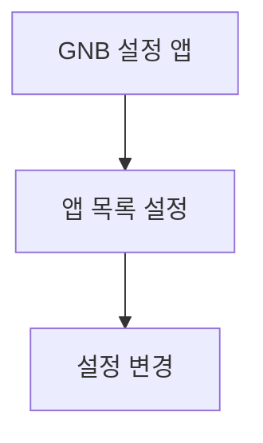

# 설정-앱관리

---

## 개요

- **경로**: `/setting` (좌측 메뉴: 앱)
- **역할**: 앱(기사 앱 등) 설정·관리.
- **진입 경로**: GNB "설정" → 좌측 "앱" 선택.
- **권한**:
  - `관리자(1), 매니저(2)`만 활성.
  - `Free(1)` 시 클릭 시 업그레이드 안내 모달 노출.

---

## ScreenShot

---

## 목록·액션

- **목록**
  - 팀별 설정 내용 노출
  - 컬럼: 팀 이름, 소속 매니저, 소속 차량, 자동 출발 처리, 자동 도착 처리, 자동 주행 시작, 자동 주행 종료, 주문 임의 순서 변경, 차량 주문 검수.

---

## 모달·화면 상세

### 업그레이드 안내 모달(Free 요금제)

- **진입 경로**: Free 요금제 사용자가 설정 > 앱 메뉴 클릭 또는 [설정]/[연동] 클릭 시.
- **내부 구성**: 유료 전환·업그레이드 안내 문구, [확인] 또는 [업그레이드] 버튼. [닫기] 시 모달 닫힘.
- **동작**: 앱 설정 기능 사용 제한 안내.

  

### 앱 설정 모달/화면

- **진입 경로**: 앱 항목 [설정] 클릭(유료 요금제).
- **내부 구성**: 앱별 설정 항목(알림·위치·작업 사진 등). [저장], [취소]. 유효성 적용 시 필드 에러 표시.
- **동작**: [저장] → 설정 저장 API → 성공 시 반영.

  

---

## User Flow

---

## ETC

- **기능 분석**: 앱 설정·차량 연동 등.
- **상태·조건**: Free 요금제 시 메뉴 클릭 시 업그레이드 모달.
- **엣지케이스·예외**: 팀 차량 주행중 등 상태에 따라 일부 설정 제한(해당 시).
- **동서·KT 등**: 설정 메뉴 노출 분기 적용.

---

## API

| 순서 | Method | Path                                                                                  | 설명                                                                                                               | 트리거                            |
| ---- | ------ | ------------------------------------------------------------------------------------- | ------------------------------------------------------------------------------------------------------------------ | --------------------------------- |
| 1    | GET    | [`/team/list/setting`](../../../interface/00.roouty/team.md#get-teamlistsetting)      | 기사앱 설정 목록 (팀별, 검색 포함)                                                                                 | 페이지 진입, [조회하기], [초기화] |
| 2    | PUT    | [`/team/setting/:teamId`](../../../interface/00.roouty/team.md#put-teamsettingteamid) | 기사앱 설정 수정 (geocoding, podRequired, stepFixed, autoStartOrder, autoStartWorking, autoEndWorking, skipPod 등) | 설정 모달 → [저장]                |
