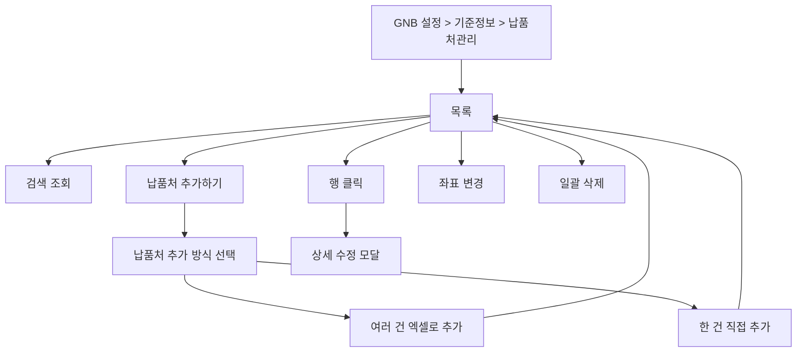

# 설정-납품처관리

## 개요

- **경로**: `/setting` (좌측 메뉴: 기준 정보 관리 > 납품처 관리)
- **역할**: 주문·배차에서 사용하는 납품처(주문지 마스터) 목록 조회·등록·수정·삭제, 좌표 변경, 엑셀 업로드·일괄 삭제.
- **진입 경로**: GNB "설정" → 좌측 "기준 정보 관리" 내 "납품처 관리" 선택.
- **권한**:
  - `관리자(1), 매니저(2)`만 활성.
  - `Free(1)`시 업그레이드 안내.

## ScreenShot

## 검색

| 라벨(표시명)          | 옵션/기본값·초기화                                                    |
| --------------------- | --------------------------------------------------------------------- |
| 검색 항목(셀렉트)     | 납품처명 등 선택. (업체 유형 필터 해당 시.)                           |
| 키워드                | 선택 항목에 따라 검색. [조회]로 목록 조회.                            |
| 업체유형 (멀티셀렉트) | 전체, 할인점, 할인점 물류센터, SSM, CVS, 대리점, 온라인, 직거래, 기타 |

## 목록

- **컬럼명**: 선택(체크박스), 좌표 변경, 소속 팀, 납품처명, 연락처, 주소, 상세주소, 좌표 변경 여부, 특수 조건, 담당 차량 지정, 제외 차량 지정, 예상 작업 시간, 희망 시간, 비고1~5 등.
- **행 선택**: 다중 선택(체크박스). 선택 후 [납품처 삭제] 버튼으로 일괄 삭제 가능.
- **행 클릭**: 행 클릭 시 해당 납품처 상세·수정 모달 오픈.
- **[납품처 삭제]**: 선택한 행이 1개 이상일 때만 활성. 클릭 시 삭제 확인 모달 오픈 → [확인] 시 선택한 납품처 일괄 삭제 후 목록 갱신. (팔레트 용적량에 등록된 납품처가 포함되면 삭제 불가 안내.)
- **[다운로드]**: 선택한 행이 1개 이상일 때만 활성. 클릭 시 납품처 엑셀 다운로드
- **행 내 [좌표 변경]**: 클릭 시 해당 행의 주소·좌표 수정 모달 오픈. 저장 시 좌표만 갱신·목록 반영.

## Actions

- **납품처 추가**
  - **트리거**: 화면 상단 [납품처 추가하기] 버튼 클릭.
  - **플로우**: 클릭 → 납품처 추가 방식 선택 모달 오픈 → (여러 건 엑셀 / 한 건 직접) 중 선택 → 해당 방식 모달에서 입력·저장.
  - **최종 동작**: 방식 선택 모달 닫힘. 각 방식 완료 시 목록 갱신 또는 해당 모달 내 성공 안내.
  - **실패/예외**: 필수 미입력 시 필드 에러. 동일 팀 내 납품처명·연락처 등 중복 시 중복 에러 안내. 엑셀 검증 실패·저장 실패 시 에러 안내.

## User Flow

## 모달·드로어 상세

### 납품처 추가 방식 선택 모달

- **진입 경로**: 상단 [납품처 추가하기] 클릭.
- **내부 구성**: 추가 방식 2가지 선택.
  - (1) **여러 건 엑셀로 추가** → 엑셀 업로드 모달 오픈 → 파일 선택 → 검증(헤더·필수 컬럼·형식) → 업로드 처리 → 성공 시 결과 안내(성공/실패 행) 및 목록 갱신.
  - (2) **한 건 직접 추가** → 납품처 등록 모달(한 건) 오픈 → 필드 입력 → [저장] → 등록 처리 → 성공 시 모달 닫힘·목록 갱신.

    

### (1) 여러 건 엑셀로 추가

- **진입 경로**: 방식 선택 모달에서 "여러 건 엑셀로 추가" 선택.
- **내부 구성**: 파일 선택(드래그 또는 선택) → 업로드 진행 → 검증 결과(성공/실패 행 안내, 수정 가능) → 납품처 등록 처리 → 성공 시 목록 갱신, 실패 행 있으면 필드/행 단위 에러 표시. [닫기].
- **동작**: 엑셀 양식에 맞춰 납품처명·주소·연락처·팀 등 다건 입력 후 업로드. 검증 통과 시 일괄 등록.

  

### (2) 한 건 직접 추가/수정

- **진입 경로**: 방식 선택 모달에서 "한 건 직접 추가" 선택.
- **내부 구성**:
  - **필드**: 납품처명(필수), 지점, 업체유형(필수), 소속팀(필수, 팀 검색·선택, 수정 불가), 주소(주소 검색 연동), 상세주소, 인수자명, 연락처, 인수자 이메일, 참조자 이메일, 화주사명, 화주사 연락처, 중개사명, 중개사연락처, 중개사 이메일, 예상 작업 소요 시간(분), 특수 조건, 담당 차량 지정, 제외 차량 지정, **순환 배차 사용**(담당 차량 2대 이상일 때 노출), 희망 시간(이후, 이전), 배송가능요일, 하위구분정보, 비고1~5 등.
  - **순환 배차 사용 영역** (담당 차량 2대 이상일 때만 노출):
    - 토글 OFF: 일반 배차 정책 적용
    - 토글 ON: 매 운행 사이클마다 등록된 담당 차량 순서대로 다음 차량 회전. 활성 시 안내 박스 노출 + [순서 조정] 버튼 활성
    - [순서 조정] 클릭 시 "순환 배차 순서 관리" 모달 노출 — 차량 카드 드래그&드롭으로 순서 변경 → [저장]
    - 경고 메시지: "순환 배차 상태 변경, 차량 추가 및 삭제 시 순서가 초기화되어 첫 번째 차량부터 배차됩니다."
    - 담당 차량을 모두 제거하면 순환 배차 사용도 자동 해제
  - **버튼**: [저장], [취소]. [취소]/배경 클릭 시 모달 닫힘.
  - **유효성**: 납품처명 필수. 동일 팀 내 납품처명·연락처 등 중복 불가. 순환 배차 사용 ON 일 때 담당 차량 1대 이상 필수.

    
    

### 납품처 상세 모달

- **진입 경로**: 목록 행 클릭 → 해당 주문 상세 조회 후 모달 오픈. [닫기] 또는 배경 클릭 시 모달 닫힘.
- **푸터(주문 상태별)**: [닫기], [수정하기], [삭제]
- **모달 내부 탭별 구성**
  | 탭 | 구성 | 화면 |
  | -------------- | --------------------------------------------------------------------------------------------------------------------------------------------------------------------------------------------------------------------------------------------------------------------------------------------------------- | ------------------------------------------------------------------------------ |
  | 기본 정보 | **납품처 배송 정보**: (소속팀, 납품처명, 지점, 업체유형, 예상 작업 시간, 주소, 상세주소, 인수자명, 연락처, 인수자 이메일, 참조자 이메일, 화주사 명, 화주사 연락처, 중개사 명, 중개사 연락처, 중개사 이메일) |  |
  | 배송 정보 | **납품처 배송 정보**: (담당 차량 지정, 제외 차량 지정, 독차 여부, 배송 가능 요일, 희망 시간(이후), 희망 시간(이전), 비고1-5), **특수 조건 정보** |  |
  | 하위 구분 정보 | **하위 구분 정보** |  |

### 좌표 변경 모달

- **진입 경로**: 목록 행 내 [좌표 변경] 클릭.
- **내부 구성**: 현재 주소·상세주소·좌표 표시. 주소 재검색 또는 좌표 직접 수정.

  

### 업그레이드 안내 모달(Free 요금제)

- **진입 경로**: Free 요금제 사용자가 설정 > 앱 메뉴 클릭 또는 [설정]/[연동] 클릭 시.
- **내부 구성**: 유료 전환·업그레이드 안내 문구, [확인] 또는 [업그레이드] 버튼. [닫기] 시 모달 닫힘.
- **동작**: 앱 설정 기능 사용 제한 안내.

  

### 기타 모달

- **삭제 확인**: 선택한 납품처 N 건 삭제 여부 확인. [취소], [확인]. 확인 시 일괄 삭제 후 목록 갱신.

---

## API

| 순서 | Method | Path                                                                                                                                                                                          | 설명                                               | 트리거                            |
| ---- | ------ | --------------------------------------------------------------------------------------------------------------------------------------------------------------------------------------------- | -------------------------------------------------- | --------------------------------- |
| 1    | GET    | [`/masterOrder/list`](../../../interface/00.roouty/master-order.md#get-masterorderlist)                                                                                                       | 납품처 목록 조회 (searchItem, keyword, vendorType) | 페이지 진입, [조회하기]           |
| 2    | GET    | [`/masterOrder/vendor-list`](../../../interface/00.roouty/master-order.md#get-masterordervendor-list)                                                                                         | 업체 유형 목록 (필터 칩)                           | 페이지 진입                       |
| 3    | GET    | `/masterOrder/duplicate`                                                                                                                                                                      | 납품처 중복 확인                                   | 납품처 추가 시                    |
| 4    | PUT    | [`/masterOrder/:id`](../../../interface/00.roouty/master-order.md#put-masterordermasterorderid)                                                                                               | 납품처 좌표 수정                                   | 수정 모달 → [저장]                |
| 5    | PUT    | [`/masterOrder/delete`](../../../interface/00.roouty/master-order.md#put-masterorderdelete)                                                                                                   | 납품처 일괄 삭제 (masterOrderIds 배열)             | [삭제] 버튼 → 확인                |
| 6    | POST   | [`/masterOrder/download`](../../../interface/00.roouty/master-order.md#post-masterorderdownload)                                                                                              | 납품처 Excel 다운로드 (masterOrderIds 배열)        | [엑셀 다운로드] 버튼              |
| 7    | POST   | [`/v2/masterOrder/temporary/excel`](../../../interface/00.roouty/temporary-master-order-v2.md#post-v2masterordertemporaryexcel)                                                               | 납품처 Excel 업로드                                | [엑셀 업로드] → 파일 선택         |
| 8    | GET    | [`/v2/masterOrder/temporary/:id`](../../../interface/00.roouty/temporary-master-order-v2.md#get-v2masterordertemporarytemporarymasterorderid)                                                 | 임시 납품처 데이터 조회                            | Excel 검증 완료 후                |
| 9    | GET    | [`/v2/masterOrder/temporary/row-status/:id`](../../../interface/00.roouty/temporary-master-order-v2.md#get-v2masterordertemporaryrow-statustemporarymasterorderid)                            | 행 검증 상태 (폴링)                                | Excel 업로드 후 검증 진행 중      |
| 10   | PUT    | [`/v2/masterOrder/temporary/:id/row/:rowId/edit`](../../../interface/00.roouty/temporary-master-order-v2.md#put-v2masterordertemporarytemporarymasterorderidrowtemporarymasterorderrowidedit) | 검증 행 수정                                       | 검증 모달에서 셀 수정             |
| 11   | POST   | [`/v2/masterOrder/temporary/register/:id`](../../../interface/00.roouty/temporary-master-order-v2.md#post-v2masterordertemporaryregistertemporarymasterorderid)                               | 임시 납품처 확정 등록                              | [등록하기] 버튼                   |
| 12   | POST   | [`/v2/masterOrder/temporary/register-single`](../../../interface/00.roouty/temporary-master-order-v2.md#post-v2masterordertemporaryregister-single)                                           | 납품처 단건 등록                                   | [직접 입력] 모달 → [저장]         |
| 13   | PUT    | [`/v2/masterOrder/temporary/modify-single/:id`](../../../interface/00.roouty/temporary-master-order-v2.md#put-v2masterordertemporarymodify-singlemasterorderid)                               | 납품처 단건 수정                                   | 수정 모달 → [저장]                |
| 14   | POST   | [`/masterOrder/address-to-coordinate`](../../../interface/00.roouty/master-order.md#post-masterorderaddress-to-coordinate)                                                                    | 주소 → 좌표 변환                                   | 주소 입력 시 (지오코딩)           |
| 15   | GET    | [`/skill/list/team`](../../../interface/00.roouty/skill.md#get-skilllistteam)                                                                                                                 | 팀별 스킬 목록                                     | 납품처 추가/수정 모달 (스킬 선택) |

> 외부 연동

| 유형  | 대상          | 설명             | 트리거                |
| ----- | ------------- | ---------------- | --------------------- |
| Kakao | Daum Postcode | 납품처 주소 검색 | 납품처 추가/수정 모달 |
