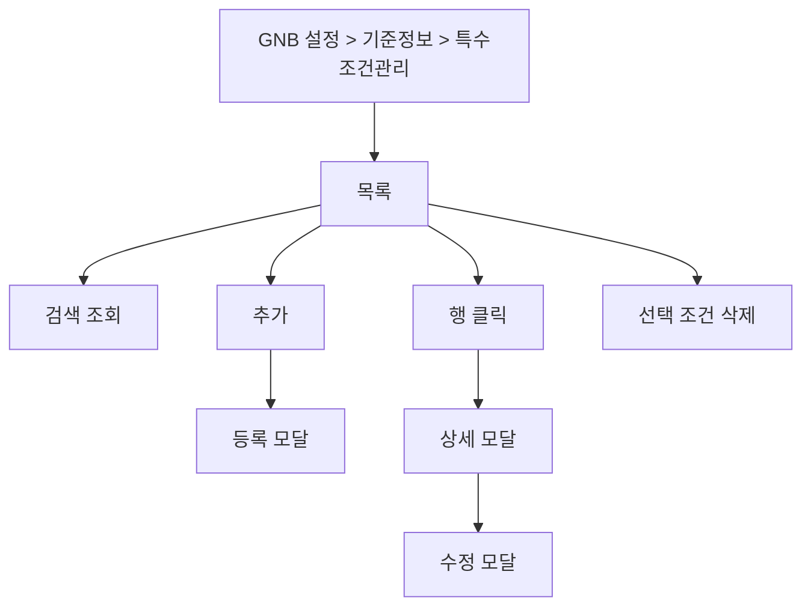

# 설정-특수조건관리

## 개요

- **경로**: `/setting`
- **역할**: 배차·주문에 반영할 특수 조건(스킬) 목록 조회·등록·수정·삭제. 주문/차량(드라이버) 매칭 시 사용.
- **진입 경로**: GNB "설정" → 좌측 "기준 정보 관리" 내 "특수 조건 관리" 선택.
- **권한**:
  - `관리자(1), 매니저(2)`만 활성.
  - `Free(1)`시 업그레이드 안내.

## ScreenShot

## 검색

| 라벨(표시명)      | 옵션/기본값·초기화                         |
| ----------------- | ------------------------------------------ |
| 검색 항목(셀렉트) | 팀 이름 / 조건 이름 / 소속 차량 중 선택.   |
| 키워드            | 선택 항목에 따라 검색. [조회]로 목록 조회. |

## 목록

- **컬럼명**: 선택(체크박스), 조건 이름, 조건 설명, 소속 팀, 소속 차량.
- **행 선택**: 다중 선택(체크박스). 선택 후 하단 버튼으로 일괄 삭제 가능.
- **행 클릭**: 행 클릭 시 해당 특수 조건 상세 모달 오픈. 상세 모달에서 조건 이름·조건 설명 수정 후 [저장] 시 수정 반영·목록 갱신.
- **[조건 삭제]**: 선택한 행이 1개 이상일 때만 활성. 클릭 시 삭제 확인 모달("선택한 조건 N 개를 삭제하시겠습니까?" 등) → [확인] 시 선택한 조건 일괄 삭제 후 목록 갱신.

## Actions

- **조건 추가**
  - **트리거**: 화면 상단 [조건 추가] 버튼 클릭.
  - **플로우**: 등록 모달 오픈
  - **최종 동작**: 성공 시 모달 닫힘·목록 갱신.

## User Flow

## 모달 상세

### 특수 조건 등록/수정 모달

- **진입 경로**: 상단 [조건추가]버튼 클릭(추가), 상세모달 내 [수정] 버튼 클릭(수정).
- **내부 구성**:
  - **필드**: 조건 이름(필수), 조건 설명.
  - **버튼**: [저장/추가], [취소]. [취소]/배경 클릭 시 모달 닫힘.
  - **유효성**: 조건 이름 필수. 동일 팀 내 조건 이름 중복 불가.
- **동작**: [저장/추가] → 유효성 통과 시 저장 요청 → 성공 시 모달 닫힘·목록 갱신.

  
  

### 특수 조건 상세 모달

- **진입 경로**: 목록 행 클릭.
- **내부 구성**:
  - **표시**: 소속팀, 조건이름, 조건설명, 소속차량(소속 차량은 이 화면에서 추가·수정하지 않으며, 설정 > 리소스 관리 > 차량 관리에서 차량 등록/수정 시 ‘특수 조건’ 필드로 해당 차량에 조건을 지정하면, 그 차량이 이 조건의 소속 차량으로 집계되어 조회된다.).
  - **버튼**: [수정], [취소] 등. [취소]/배경 클릭 시 모달 닫힘.
- **동작**: [수정] → 수정 모달 오픈.

  

### 업그레이드 안내 모달(Free 요금제)

- **진입 경로**: Free 요금제 사용자가 설정 > 앱 메뉴 클릭 또는 [설정]/[연동] 클릭 시.
- **내부 구성**: 유료 전환·업그레이드 안내 문구, [확인] 또는 [업그레이드] 버튼. [닫기] 시 모달 닫힘.

  

### 기타 모달

- **삭제 확인**: "선택한 조건 N 개를 삭제하시겠습니까?" 등. [취소], [확인]. 확인 시 선택한 조건 일괄 삭제 후 목록 갱신.

## 특수 조건 관리 사용 흐름

여기서 등록한 **특수 조건(스킬)** 은 주문과 차량(드라이버)을 매칭할 때 사용된다.

1. **설정** — 이 화면에서 팀별로 특수 조건(조건 이름, 조건 설명)을 등록·수정·삭제한다. 한 조건에 여러 차량이 소속될 수 있고, 한 차량에 여러 조건이 붙을 수 있다.
2. **납품처·주문** — **납품처 관리**에서 납품처에 특수 조건을 지정할 수 있다. **주문** 등록 시 해당 주문의 배송지(납품처)에 연결된 특수 조건이 주문에 따라붙거나, 주문에 직접 특수 조건을 지정할 수 있다.
3. **차량(드라이버)** — **설정 > 차량 관리** 등에서 차량(드라이버)에게 특수 조건을 부여한다. 예: "냉동", "위험물" 등. 조회 시 소속 차량(어떤 차량이 이 조건에 붙는지)은 설정 > 차량 관리의 차량 추가/수정 모달에서 ‘특수 조건’으로 지정한다.
4. **배차** — 배차 계획·자동 최적화 시 주문이 요구하는 특수 조건과 차량이 보유한 특수 조건을 맞춰 배차한다. 조건이 맞지 않으면 해당 차량에는 해당 주문이 배정되지 않도록 할 수 있다.

→ 특수 조건을 등록해 두지 않으면 주문·차량 매칭 시 조건 기준으로 나누거나 제한하는 기능을 쓰기 어렵다.

---

## API

| 순서 | Method | Path                                                                            | 설명                                      | 트리거                            |
| ---- | ------ | ------------------------------------------------------------------------------- | ----------------------------------------- | --------------------------------- |
| 1    | GET    | [`/skill/list`](../../../interface/00.roouty/skill.md#get-skilllist)            | 특수 조건 목록 조회 (searchItem, keyword) | 페이지 진입, [조회하기]           |
| 2    | POST   | [`/skill`](../../../interface/00.roouty/skill.md#post-skill)                    | 특수 조건 생성                            | [조건 추가] 모달 → [저장]         |
| 3    | GET    | [`/skill/:skillId`](../../../interface/00.roouty/skill.md#get-skillskillid)     | 특수 조건 상세 조회                       | 수정 모달 오픈 시                 |
| 4    | PUT    | [`/skill/:skillId`](../../../interface/00.roouty/skill.md#put-skillskillid)     | 특수 조건 수정                            | 수정 모달 → [저장]                |
| 5    | PUT    | [`/skill/delete`](../../../interface/00.roouty/skill.md#put-skilldelete)        | 특수 조건 삭제                            | [삭제] 버튼                       |
| 6    | GET    | [`/skill/check/name`](../../../interface/00.roouty/skill.md#get-skillcheckname) | 조건명 중복 확인                          | 조건 추가/수정 모달에서 이름 입력 |
| 7    | GET    | [`/skill/list/team`](../../../interface/00.roouty/skill.md#get-skilllistteam)   | 팀별 스킬 목록                            | 조건 추가 모달 (팀 연동)          |
