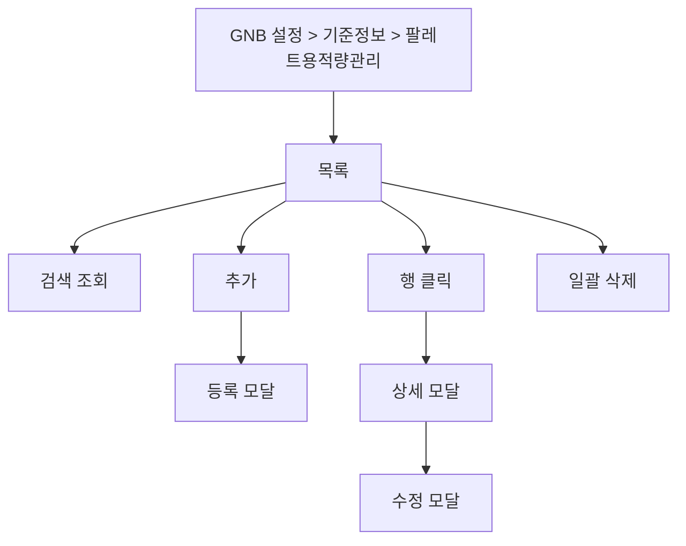

# 설정-팔레트용적량관리

## 개요

- **경로**: `/setting` (좌측 메뉴: 기준 정보 관리 > 팔레트 용적량 관리)
- **역할**: 팀별·납품처별 팔레트 용적량(팔레트 그룹) 목록 조회·등록·수정·삭제. 배차 시 업체 유형에 따라 팔레트 용적이 자동 합산되도록 설정.
- **진입 경로**: GNB "설정" → 좌측 "기준 정보 관리" 내 "팔레트 용적량 관리" 선택.
- **권한**:
  - `관리자(1), 매니저(2)`만 활성.
  - 동서·요금제에 따라 메뉴 노출 분기

## ScreenShot

## 검색

| 라벨(표시명)      | 옵션/기본값·초기화                         |
| ----------------- | ------------------------------------------ |
| 검색 항목(셀렉트) | 팀 이름 / 납품처명 / 설정명 중 선택.       |
| 키워드            | 선택 항목에 따라 검색. [조회]로 목록 조회. |

## 목록

- **컬럼명**: 선택(체크박스), 설정명, 팀 이름, 납품처(개), 팔레트 용적량 사용 여부.
- **행 선택**: 다중 선택(체크박스). 선택 후 하단 버튼으로 일괄 삭제 가능.
- **행 클릭**: 행 클릭 시 해당 팔레트 용적량 상세 모달 오픈. 상세 모달 내 [수정] 클릭 시 수정 모달 오픈 → 팀·납품처·설정명 등 수정 후 [저장] 시 목록 갱신.
- **[용적량 삭제]**: 선택한 행이 1개 이상일 때만 활성. 클릭 시 삭제 확인 모달("팔레트 용적량을 삭제하시겠습니까?" 또는 "선택한 팔레트 용적량 N 건을 삭제하시겠습니까?" 등) → [확인] 시 선택 건 일괄 삭제 후 목록 갱신.

## Actions

- **팔레트 용적량 등록**
  - **트리거**: 화면 상단 [용적량 추가] 버튼 클릭.
  - **플로우**: 등록 모달 오픈.
  - **최종 동작**: 성공 시 모달 닫힘·목록 갱신.

## User Flow

## 모달·드로어 상세

### 팔레트 용적량 등록 모달

- **진입 경로**: 상단 [추가] 클릭.
- **내부 구성**:
  - **필드**: 설정명(필수, 동일 이름 불가), 팀 선택(필수), 납품처 선택(필수, 선택한 팀에 속한 납품처 목록에서 선택)등. (등록된 납품처가 없으면 "등록된 납품처가 없습니다." 등 안내.)
  - **버튼**: [추가], [닫기]. [닫기]/배경 클릭 시 모달 닫힘.
- **동작**: [저장] → 유효성 통과 시 저장 요청 → 성공 시 모달 닫힘·목록 갱신.

  

### 팔레트 용적량 수정 모달

- **진입 경로**: 목록 행 클릭 → 상세 모달에서 [수정] 클릭.
- **내부 구성**:
  - **필드**: 사용여부(필수), 설정명(필수), 팀 선택(필수), 납품처(필수), 용적량 조건 등. 기존 값 로드 후 수정. 용적량 관련 수치는 소수점 3자리까지 입력 가능(가이드에 따라 정수만 안내할 수 있음).
  - **버튼**: [저장], [닫기]. [닫기]/배경 클릭 시 모달 닫힘.
  - **유효성**: 설정명 등. 동일 이름의 팔레트 그룹이 이미 있으면 안내.
- **동작**: [저장] → 유효성 통과 시 수정 저장 → 성공 시 모달 닫힘·목록 갱신.

  

### 팔레트 용적량 상세 모달

- **진입 경로**: 목록 행 클릭.
- **내부 구성**: 설정명, 팀 이름, 납품처 정보, 팔레트 용적량 사용 여부, 조건 정보 등 표시. [수정] 버튼으로 수정 모달 진입.
- **동작**: [수정] 클릭 시 수정 모달 오픈. [삭제], [닫기]

  

### 기타 모달

- **삭제 확인**: "팔레트 용적량을 삭제하시겠습니까?" 또는 "선택한 팔레트 용적량 N 건을 삭제하시겠습니까?" 등. [취소], [확인]. 확인 시 일괄 삭제 후 목록 갱신.

## 팔레트 용적량 관리 사용 흐름

여기서 등록한 **팔레트 용적량(팔레트 그룹)** 설정은 “어떤 배송지(납품처)에, 어떤 규칙으로 용적을 계산해 넣을지”를 팀·납품처 단위로 정해 두는 것이다. 주문에 입력한 용적량을 이 규칙으로 보정한 값이 배차 시 한 차량에 실리는 용적 합산에 반영된다.

1. **설정** — 이 화면에서 팀을 선택하고, 그 팀에 속한 **납품처**(납품처 관리에 등록된 주문지) 중에서 “같은 용적 규칙을 쓰고 싶은 납품처”를 여러 개 골라 하나의 그룹(설정명)으로 묶는다. 그룹마다 “어떤 입력값(용적량1·용적량2·품목 수 등)을 어떤 식으로 나누고 곱해서 합산 용적으로 쓸지” 규칙을 둘 수 있다. 한 팀에 그룹을 여러 개 둘 수 있고, 한 납품처는 한 그룹에만 속한다.
2. **주문** — 주문을 등록할 때 배송지(납품처)와 용적량·품목 수 등이 들어간다. 시스템은 그 배송지가 속한 팔레트 그룹을 찾고, 그 그룹에 정해 둔 규칙으로 “자동으로 계산된 용적”을 주문에 더해 둔다. 그래서 같은 납품처로 가는 주문들은 모두 그 그룹의 규칙이 적용된 상태로 저장된다.
3. **배차** — 배차 계획·자동 최적화 시, 한 차량에 실리는 주문들을 볼 때 “주문에 적힌 용적”과 “위 규칙으로 계산된 용적”을 합쳐서 한 차량의 적재량으로 쓴다. “팔레트 용적량 사용”을 끄면 해당 그룹 규칙은 적용되지 않고, 그 납품처로 가는 주문은 입력한 용적만 반영된다.
4. **다른 설정과의 관계** — 여기서 그룹에 넣는 납품처는 반드시 **납품처 관리**에 미리 등록되어 있어야 한다. **주문 분할 관리**에서 “동일 배송지가 한 차량 한도를 넘으면 분할”할 때 쓰는 용적 한도·합산에도, 이렇게 계산된 용적이 포함된다.

→ 팔레트 용적량을 설정해 두지 않으면, 해당 납품처로 가는 주문에는 “업체 유형에 따라 자동으로 더해지는 용적”이 없어, 배차 시 용적 합산이 주문에 입력한 값만으로만 이루어진다.

---

## API

| 순서 | Method | Path                                                                                                  | 설명                                                                        | 트리거                                      |
| ---- | ------ | ----------------------------------------------------------------------------------------------------- | --------------------------------------------------------------------------- | ------------------------------------------- |
| 1    | GET    | [`/v2/pallet`](../../../interface/00.roouty/team-pallet-capacity-v2.md#get-v2pallet)                  | 팔레트 설정 목록 조회 (검색 포함)                                           | 페이지 진입, [조회하기]                     |
| 2    | GET    | [`/v2/pallet/:id`](../../../interface/00.roouty/team-pallet-capacity-v2.md#get-v2palletid)            | 팔레트 설정 상세                                                            | 행 클릭 (수정 모달)                         |
| 3    | POST   | [`/v2/pallet`](../../../interface/00.roouty/team-pallet-capacity-v2.md#post-v2pallet)                 | 팔레트 설정 생성                                                            | [용적량 추가] 모달 → [저장]                 |
| 4    | PUT    | [`/v2/pallet/:palletGroupId`](../../../interface/00.roouty/team-pallet-capacity-v2.md#put-v2palletid) | 팔레트 설정 수정                                                            | 수정 모달 → [저장]                          |
| 5    | DELETE | [`/v2/pallet`](../../../interface/00.roouty/team-pallet-capacity-v2.md#delete-v2pallet)               | 팔레트 설정 삭제 (palletGroupIds 배열)                                      | [삭제] 버튼                                 |
| 6    | GET    | [`/team/list`](../../../interface/00.roouty/team.md#get-teamlist)                                     | 팀 목록 (팀 선택 드롭다운)                                                  | 페이지 진입                                 |
| 7    | GET    | [`/masterOrder/list`](../../../interface/00.roouty/master-order.md#get-masterorderlist)               | 전체 납품처 목록                                                            | 페이지 진입                                 |
| 8    | GET    | [`/v2/master-orders`](../../../interface/00.roouty/master-order-v2.md#get-v2master-orders)            | 팀별 납품처 목록 (teamId 쿼리)                                              | 페이지 진입 (각 팀별 납품처 존재 여부 확인) |
| 9    | GET    | [`/v2/teams`](../../../interface/00.roouty/team-v2.md#get-v2teams)                                    | 팔레트 생성 가능 팀 목록 확인 (`getCheckPossibleCreateMasterPalletOpacity`) | 팔레트 추가 시 팀 확인                      |
