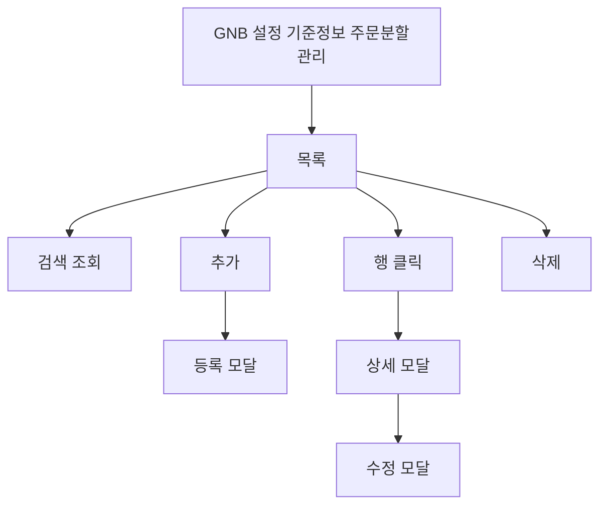

# 설정-주문분할관리

## 개요

- **경로**: `/setting`
- **역할**: 팀별 주문 분할 설정 목록 조회·등록·수정·삭제. 동일 배송지 주문이 한 차량의 허용 부피·중량·팔레트 수 중 하나 이상을 초과할 때 주문을 분할하는 데 사용.
- **진입 경로**: GNB "설정" → 좌측 "기준 정보 관리" 내 "주문 분할 관리" 선택.
- **권한**: `관리자(1), 매니저(2)`만 활성

## ScreenShot

## 검색

| 라벨(표시명)      | 옵션/기본값·초기화                                                |
| ----------------- | ----------------------------------------------------------------- |
| 검색 항목(셀렉트) | 팀 이름 / 소속 매니저 / 소속 차량 / 납품처명 / 하위 구분 중 선택. |
| 키워드            | 선택 항목에 따라 검색. [조회]로 목록 조회.                        |

## 목록

- **컬럼명**: 선택(체크박스), 팀 이름, 소속 매니저(명), 소속 차량(대), 납품처(개), 주문 분할 사용 여부, 하위 구분.
- **행 선택**: 다중 선택(체크박스). 선택 후 일괄 삭제 가능.
- **행 클릭**: 행 클릭 시 해당 팀의 주문 분할 설정 상세 모달 오픈.
- **[분할 조건 삭제]**: 선택한 행 1개 이상일 때 활성. 클릭 시 삭제 확인 모달 → [확인] 시 선택한 설정 일괄 삭제 후 목록 갱신.

## Actions

- **분할 조건 추가**
  - **트리거**: 화면 상단 [분할 조건 추가] 버튼 클릭.
  - **플로우**: 등록 모달 오픈
  - **최종 동작**: 성공 시 모달 닫힘·목록 갱신.
  - **실패/예외**: 모든 팀이 이미 등록된 경우 추가 불가 안내. 필수 미입력·저장 실패 시 에러 안내.

## User Flow

## 모달상세

### 주문 분할 설정 등록 모달

- **진입**: 상단 [분할 조건 추가] → "주문 분할 조건 추가하기" 모달. [취소]/[추가하기]. 취소·배경 클릭 시 닫힘.
- **기본 정보**: 소속 팀(필수, 검색 셀렉트). 팀 관리에 등록된 팀만 노출되고, 이미 주문 분할 설정이 있는 팀은 제외.
- **기본 분할 조건**: "동일 배송지 주문이 한 차량 허용량을 초과할 때" 안내 툴팁. 차량 용적량1·2·3(%) — 숫자 0~100, 기본 100.
- **용적량 제한 설정**: "사용 안 함" 해제 시만 활성. 용적량1·2·3별로 납품처 유형을 다중 선택(주문에서 쓰는 납품처 유형 목록 사용). 선택된 항목은 칩으로 표시·전체 삭제 가능. 미등록 납품처 유형은 저장 시 에러.
- **수량 분할 선택**: "사용 안 함" 해제 시만 활성. 아이템 코드(추가 시 필수)·아이템명 입력 후 [추가]로 목록에 넣음. 중복 코드는 "이미 추가된 아이템 코드입니다." 에러. 선택된 아이템 칩·전체 삭제.
- **아이템 분할 선택**: 수량 분할과 같은 구조(아이템 코드·이름 추가, 칩·전체 삭제).
- **저장**: [추가하기] → 팀 필수·형식 검사 통과 시 등록 → 성공 시 모달 닫힘·목록 갱신. 팀 없음·업체 유형 없음 시 백엔드 에러.

  

### 주문 분할 설정 수정 모달

- **진입**: 목록 행 클릭 → 상세 모달 [수정] → "주문 분할 조건 수정하기". [취소], [저장하기]. 변경 없으면 [저장하기] 비활성.
- **등록과의 차이**: 소속 팀은 표시만 되고 변경 불가. 사용 여부(사용/미사용) 라디오가 추가됨. 나머지 필드는 기존 값 로드 후 동일하게 수정 가능. 저장 시 수정 API 호출, 설정 없음·권한 없음·비활성 설정이면 에러.

### 주문 분할 설정 상세 모달

- **진입**: 목록 행 클릭. [삭제], [닫기], [수정]. [수정] 시 수정 모달로 전환.
- **표시**: 기본 정보(팀 이름, 사용 여부), 기본 분할 조건(용적량1·2·3 %), 세부 조건 — 용적량 제한(용적량1·2·3별 납품처 유형 뱃지), 수량 분할 제한(아이템 코드·이름 뱃지), 아이템 분할 제한(아이템 뱃지). 없으면 "-".

### 기타 모달

- **삭제 확인**: "선택한 분할 조건을 삭제하시겠습니까?" 또는 "선택한 분할 조건 N 건을 삭제하시겠습니까?" 등. [취소], [확인]. 확인 시 일괄 삭제 후 목록 갱신.

## 주문 분할 설정 사용 흐름

**역할**: 동일 배송지(납품처) 주문이 한 차량 허용량(부피·중량·팔레트)을 넘을 때, 그 주문을 여러 대로 나누어 배차할지 팀별로 정하는 기준.

- **설정**: 이 화면에서 팀별로 사용 여부·용적량 %·용적량 제한(납품처 유형)·수량/아이템 분할을 설정. 팀당 1건, 모든 팀이 설정되면 [추가] 불가.
- **적용 시점**
  - **배차·경로 계산**: 균등 배차·경로 편집/최적화 실행 시, 설정이 자동으로 조회되어 “어떤 주문이 분할 대상인지” 정보가 알고리즘에 전달됨. 사용 여부가 미사용이면 해당 팀에는 적용 안 함.
  - **주문 분할 실행**: 배차 확정 또는 경로 최적화 화면에서 [주문 분할] → 미배차 주문 선택 후 자동/수동 분할 실행 → [주문 분할 확정]. 이때 설정의 용적량 %·조건으로 차량별 여유 용적을 계산해 분할함.
- **연관 설정**: 용적 판단 시 **팔레트 용적량 관리** 참고. 납품처·팀 데이터는 **납품처 관리**, **팀 관리** 사용.
- 설정이 없거나 미사용이면 동일 배송지 초과 분할이 적용되지 않거나 기본값으로만 동작할 수 있음.

---

## API

| 순서 | Method | Path                                                                                                                                   | 설명                                   | 트리거                         |
| ---- | ------ | -------------------------------------------------------------------------------------------------------------------------------------- | -------------------------------------- | ------------------------------ |
| 1    | GET    | [`/v2/order/split-setting/list`](../../../interface/00.roouty/order-split-setting-v2.md#get-v2ordersplit-settinglist)                  | 분할 설정 목록 조회 (검색 포함)        | 페이지 진입, [조회하기]        |
| 2    | POST   | [`/v2/order/split-setting/add`](../../../interface/00.roouty/order-split-setting-v2.md#post-v2ordersplit-settingadd)                   | 분할 설정 추가                         | [분할 조건 추가] 모달 → [저장] |
| 3    | PUT    | [`/v2/order/split-setting/modify/:id`](../../../interface/00.roouty/order-split-setting-v2.md#put-v2ordersplit-settingmodifysettingid) | 분할 설정 수정                         | 수정 모달 → [저장]             |
| 4    | POST   | [`/v2/order/split-setting/delete-batch`](../../../interface/00.roouty/order-split-setting-v2.md#post-v2ordersplit-settingdelete-batch) | 분할 설정 삭제 (settingIds 배열)       | [삭제] 버튼                    |
| 5    | GET    | [`/team/list`](../../../interface/00.roouty/team.md#get-teamlist)                                                                      | 팀 목록 (팀 선택, 전체 등록 여부 확인) | 페이지 진입                    |
