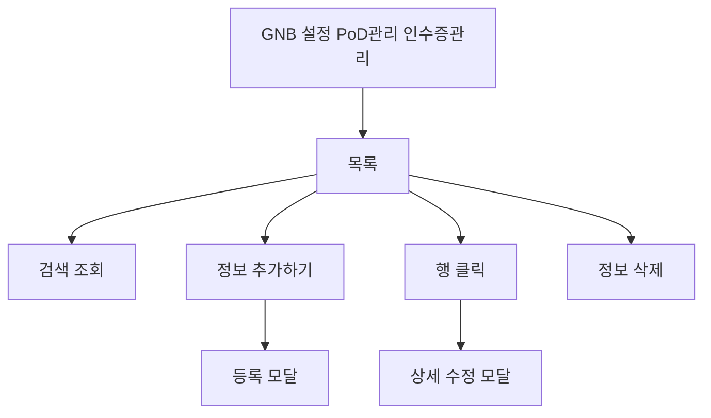
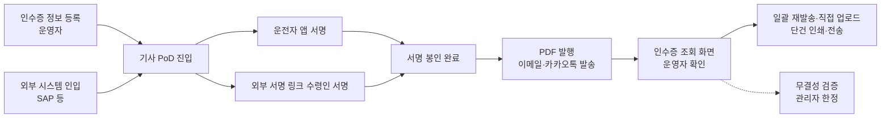

# 설정-인수증관리

## 개요

- **경로**: `/setting`
- **역할**: 인수증에 사용되는 화주사 주소(인수증 정보) 목록·등록·수정·삭제 및 사용 여부 설정.
- **진입 경로**: GNB "설정" → 좌측 "PoD관리" 내 "인수증 관리" 선택.
- **권한**:
  - `관리자(1), 매니저(2), 영업매니저` 활성. 영업매니저는 GNB "인수증" 메뉴도 접근 가능.
  - 인수증 추가 서비스(4) 가입 시 사용 (설정 LNB의 "인수증 관리" 메뉴는 항상 노출되며, 주문관리·배차확정 상세의 인수증 컬럼/버튼 노출도 동일 조건.)
  - **통합 인수증 가입 회사**: 부가서비스 6 (통합 인수증) 가입 시, 일반 인수증과 별개로 통합 인수증 발행·조회 기능 활성. 미가입 회사의 영업매니저가 GNB "인수증" 메뉴 접근 시 빈 페이지 노출 가능성 있어 운영자 안내 필요.

## ScreenShot

## 검색

| 라벨(표시명)      | 옵션/기본값·초기화                        |
| ----------------- | ----------------------------------------- |
| 검색 항목(셀렉트) | 업체명 / 팀 / 주소 중 선택.               |
| 키워드            | 선택 항목에 따라 검색. [조회하기]로 조회. |

## 목록

- **컬럼명**: 선택(체크박스), 소속 팀, 업체명, 주소, 전화번호.
- **행 클릭**: 행 클릭 시 해당 인수증 정보 상세·수정 모달 오픈.
- **행 선택**: 다중 선택(체크박스).
- **[정보 삭제]버튼**: 선택한 행이 1개 이상일 때만 활성. 클릭 시 삭제 확인 모달 오픈 → 확인 시 선택한 정보 일괄 삭제 후 목록 갱신.

## Actions

- **사용 여부 토글**
  - **트리거**: 화면 상단 활성화/비활성화 토글 클릭.
  - **플로우**: 인수증 서비스 사용 여부 변경 요청.
  - **최종 동작**: 실제 서버에 요청하지 않고 모달에서 [문의하기] 클릭시 구글 폼 이 새창으로 열림.

- **정보 추가하기**
  - **트리거**: 화면 상단 [정보 추가하기] 버튼 클릭.
  - **플로우**: 등록 모달 오픈.
  - **최종 동작**: 성공 시 모달 닫힘·목록 갱신.
  - **실패/예외**: 유료 서비스 비활성 시 "해당 메뉴는 유료 서비스입니다." 안내. 동일 팀 내 업체명+전화번호 중복 시 중복 에러. 그 외 유효성·저장 실패 시 에러 안내.

## 모달·드로어 상세

### 인수증 정보 등록 모달

- **진입 경로**: 상단 [정보 추가하기] 클릭.
- **내부 구성**:
  - **필드**(필수): 소속 팀(팀 검색·선택), 납품처, 납품처 주소(주소 검색 연동), 상세주소, 전화번호.
  - **버튼**: [저장], [취소]. [취소]/배경 클릭 시 모달 닫힘.
  - **유효성**: 업체명·전화번호·주소·팀 등. (동일 팀 내 업체명+전화번호 중복 불가).
- **동작**: [저장] → 유효성 통과 시 저장 요청 → 성공 시 모달 닫힘·목록 갱신.

  

### 인수증 정보 상세·수정 모달

- **진입 경로**: 목록 행 클릭.
- **내부 구성**:
  - **필드**(필수): 소속 팀(팀 검색·선택), 납품처, 납품처 주소(주소 검색 연동), 상세주소, 전화번호.
  - **버튼**: [저장], [취소]. [취소]/배경 클릭 시 모달 닫힘.
  - **유효성**: 등록과 동일. 수정 시 자기 레코드 제외 중복 검사.
- **동작**: [저장] → 유효성 통과 시 수정 저장 → 성공 시 모달 닫힘·목록 갱신.

  

### 기타 모달

- **삭제 확인**: "선택한 정보 N 개를 삭제하시겠습니까?", "삭제 이후 복구는 불가하며 다시 추가할 수 있습니다.", [취소], [확인]. 확인 시 선택한 정보 일괄 삭제 후 목록 갱신.
- **유료 서비스 안내**: "해당 메뉴는 유료 서비스입니다." 등. [닫기], [문의하기] 등.

## User Flow

## ETC

### 인수증 관리 사용 흐름

여기서 등록한 화주사 정보는 **배송 인수증**에만 사용.

1. **설정** — 이 화면에서 팀별로 화주사(업체명, 전화번호, 주소·상세주소) 등록·관리.
2. **주문** — 주문·상품에는 화주사명·화주사 연락처 입력 (엑셀/수동 입력 등).
3. **배송 인수증** — 주문 상세 등에서 인수증 보기·다운로드 시, 주문의 화주사명·연락처와 **같은 팀·같은 업체명·같은 전화번호**로 등록된 건을 찾아 그 **주소·상세주소**를 인수증에 채워 표시.

→ 인수증 관리에 등록해 두지 않으면, 해당 화주사에 대한 주소는 인수증에 빈 칸 또는 미채움 가능성.

### 인수증 전체 흐름

운영자 등록·기사 서명·봉인·발행·조회·검증까지의 전체 생명주기. 운영자 관점에서 인수증 1건이 거치는 단계 한눈 정리.

1. **인수증 데이터 생성** — 이 화면(인수증 관리)에서 화주사 정보 등록 또는 외부 시스템(SAP 등) 자동 인입.
2. **기사 PoD 진입** — 기사 배송 완료 시점에 인수증 발행 진입. 운전자 앱 서명 또는 수령인 모바일 외부 서명 링크 중 하나로 분기.
3. **서명 봉인 완료** — 수령인 서명 입력 완료 시점에 거래 내용 자동 봉인 (수량·금액·품목 사후 변경 차단).
4. **PDF 발행 · 알림 발송** — 봉인 직후 인수증 PDF 발행 및 이메일·카카오톡 자동 발송 (운영자·수령인).
5. **운영자 조회·재처리** — "인수증 조회" 화면에서 전체 목록 필터·검색, 단건 인쇄·전송, 일괄 재발송, 직접 업로드 수행.
6. **무결성 검증** — 사후 변조 의심 시 운영자가 봉인 인수증의 무결성 검증 요청 (관리자 권한 한정).

> **통합 인수증 가입 회사 분기**: 부가서비스 6 통합 인수증 가입 회사는 위 흐름과 별개로 **매일 새벽 자동 발행 작업** 동작 (전일 거래분 일괄 봉인 시도). 자동 발행 실패 건은 "인수증 조회" 화면 통합 인수증 탭에서 운영자 수동 재시도.

### 부가서비스 6 통합 인수증

- **개념**: 일반 인수증과 별도로, 가입 회사 대상 **통합 인수증** 발행 지원. 거래명세서 통합 발행 대상 회사 한정 노출.
- **운영자 일괄 발행·조회**: GNB "인수증" 메뉴 → "인수증 조회" 화면에서 통합 인수증 발행 이력 조회·재발행·재시도 가능. 발행 상태별 (발행 완료 / 봉인 완료 / 보류) 필터 노출.
- **자동 발행**: 매일 새벽 자동 발행 작업 수행 — 전일 거래분에 대해 통합 인수증 자동 발행 및 발행 완료 상태로 전환.
- **수동 재시도**: 자동 발행 실패 건은 "인수증 조회" 화면에서 운영자가 재시도 가능.
- **권한**: 관리자, 매니저, 영업매니저 모두 접근 가능. 단, 미가입 회사는 메뉴 자체는 노출되나 데이터 없음.

### 서명 봉인

- **서명 필수 옵션**: 팀 설정에 "서명 필수" 옵션 노출. 옵션 활성 팀은 수령인 서명 미완료 인수증은 발행 보류 상태로 유지.
- **서명 봉인 시점**: 수령인 서명 완료 시점에 거래 내용 (수량·금액·품목 등) 봉인 처리. 봉인 이후에는 거래 내용 사후 변경 불가, 사진 추가 외 정정 차단.
- **봉인 표시**: 인수증 상세 화면에 "봉인 완료" 라벨 노출. 봉인 후 수정 시도 시 "서명 완료된 인수증은 수정 불가" 안내 노출.
- **검증용 해시**: 봉인 완료 인수증은 내부적으로 검증용 해시를 보유하여 위변조 식별 가능 (운영자 화면에는 노출되지 않음, 분쟁 대응용).

### 외부 서명 링크

- **개념**: 수령인 또는 외부 사용자에게 SMS/카카오톡으로 **서명 링크** 발송, 외부에서 모바일 브라우저로 서명 받기 가능.
- **발송 트리거**: 인수증 상세에서 [서명 링크 발송] 버튼 클릭 → 수령인 연락처로 링크 발송. 발송 이력은 인수증 상세에 노출.
- **링크 만료**: 일정 시간 경과 시 링크 자동 만료. 만료 후 접근 시 "링크가 만료되었습니다. 담당자에게 재요청해 주세요." 안내 노출.
- **재발급**: 운영자가 인수증 상세에서 [서명 링크 재발급] 클릭 시 새 링크 발송, 기존 링크 무효화.
- **이미 서명 완료**: 서명 완료된 인수증의 링크 접근 시 "이미 서명이 완료된 인수증입니다." 안내 노출, 재서명 차단.

### 사진 수량 분배

- **개념**: 수량 조절이 발생한 주문 (예: 원 수량 10 → 실제 8 인계) 의 인수증 발행 시, 사진을 분배 비율에 따라 자동 배분 노출.
- **운영자 관점 동작**: 운영자는 별도 조작 없이 인수증 상세에서 배분된 사진 그대로 확인. 분배 비율 산식은 내부 자동 처리, 운영자 수동 지정 불가.
- **결과 노출**: 인수증 상세의 사진 영역에 분배 결과대로 사진 정렬·노출. 분배 결과 0장 인 라인은 사진 미노출.

---

## API

| 순서 | Method | Path                                                                                                                | 설명                                                | 트리거                        |
| ---- | ------ | ------------------------------------------------------------------------------------------------------------------- | --------------------------------------------------- | ----------------------------- |
| 1    | GET    | [`/team/consignor-info`](../../../interface/00.roouty/team.md#get-teamconsignor-info)                               | 위탁자(화주사) 정보 목록 조회 (searchItem, keyword) | 페이지 진입, [조회하기]       |
| 2    | POST   | [`/team/consignor-info`](../../../interface/00.roouty/team.md#post-teamconsignor-info)                              | 위탁자 정보 추가                                    | [정보 추가하기] 모달 → [저장] |
| 3    | PUT    | [`/team/consignor-info/:teamConsignorInfoSettingId`](../../../interface/00.roouty/team.md#put-teamconsignor-infoid) | 위탁자 정보 수정                                    | 수정 모달 → [저장]            |
| 4    | DELETE | [`/team/consignor-info`](../../../interface/00.roouty/team.md#delete-teamconsignor-info)                            | 위탁자 정보 삭제                                    | [삭제] 버튼                   |
| 5    | PUT    | [`/team/consignor-info/usage`](../../../interface/00.roouty/team.md#put-teamconsignor-infousage)                    | 인수증 기능 활성화/비활성화 토글                    | 상단 토글 스위치              |
| 6    | GET    | [`/team/consignor-info/check`](../../../interface/00.roouty/team.md#get-teamconsignor-infocheck)                    | 위탁자 정보 중복 확인 (teamId, phone, name)         | 정보 추가 모달에서 입력 시    |

> **참고**: 토글 비활성화 시 실제 사용 여부 변경 호출 미수행. 대신 "서비스 해지를 원하시는 경우 1:1 문의해주시기 바랍니다" 안내 모달 노출.
