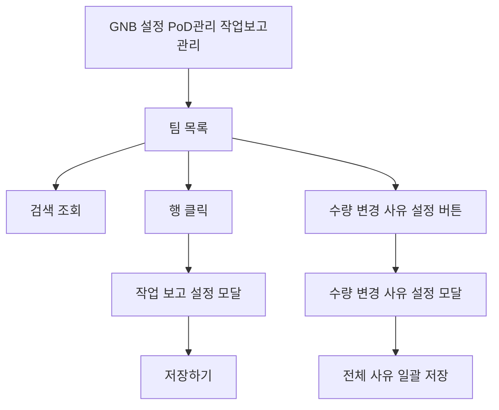

# 설정-작업보고관리

## 개요

- **경로**: `/setting` (좌측 메뉴: PoD관리 → 작업 보고 관리)
- **역할**: 팀별 작업 보고(PoD) 항목(완료 보고·작업 완료 사진·인수증 서명)의 필수 여부 설정 조회·수정, 수량 변경 사유 마스터 관리.
- **권한**:
  - `관리자(1), 매니저(2)`만 활성.
  - 팀 차량 주행 중 시 해당 팀 설정 저장 제한.
  - 인수증(부가서비스 6, 통합 인수증) 가입 회사에 한해 목록의 "인수증" 컬럼 및 설정 모달의 "인수증" 필수 토글 노출.

## ScreenShot

## 구성

- 검색:
  - 필드:
    - 검색 항목(셀렉트): 팀 이름 고정
    - 키워드
  - 버튼: [조회], [초기화], [수량 변경 사유 설정]

- 목록
  - 컬럼: 팀 이름(오너 태그), 소속 매니저(명), 소속 차량(대), 작업 완료 보고(PoD) 사용중/미사용, 작업 완료 사진 필수/선택, 인수증 필수/선택(통합 인수증 가입 시)

## Actions

### 수량 변경 사유 설정

- 구성
  - 필드: 사유 입력(30자 이내)
  - 정보: 등록 사유 카운터 (N/30), 등록된 사유 항목 list(드래그 핸들·삭제 아이콘)
  - 버튼: [추가], [닫기], [저장하기]
- 플로우:
  - 페이지 헤더 [수량 변경 사유 설정] 클릭 → 모달 오픈
  - 사유 입력 → [추가] → 등록 list 적재
  - 항목 드래그로 순서 변경, 삭제 아이콘으로 항목 제거
  - [저장하기] → 전체 사유 set 일괄 반영·모달 닫힘
  - 동일 사유 중복 시 인라인 안내 노출, 30개 초과 시 [추가] 비활성
  - 변경사항 있는 상태에서 [닫기] 클릭 시 작성 취소 확인 모달 노출

### 작업 보고 설정 저장 (목록 행 클릭)

- 구성
  - 정보: 팀명(오너 태그)
  - 필드:
    - 작업 완료 보고(PoD) 토글
    - 작업 완료 사진 필수/선택 스위치(PoD 활성 시만 조작 가능)
    - 인수증 필수/선택 스위치(통합 인수증 가입 회사·PoD 활성 시만 조작 가능)
  - 버튼: [초기화], [닫기], [저장하기]
- 플로우:
  - 목록 행 클릭 → 작업 보고 설정 모달 오픈
  - 토글·스위치 조작 → [저장하기]
  - 성공 시 토스트("작업 보고 설정이 변경되었습니다.") 노출·모달 닫힘·목록 갱신
  - 팀 차량 주행 중일 경우 주행 중 안내 모달 노출
  - 그 외 저장 실패 시 에러 모달 노출
  - [초기화] 클릭 시 인수증·작업 완료 사진·작업 완료 보고 옵션 모두 해제
  - 닫기·배경 클릭 시 모달 닫힘

### 기타 안내 모달

- 구성
  - 주행 중 Warning 정보: "팀 차량이 주행 중입니다.", "주행을 완료한 뒤 다시 시도해 주세요.", "[모니터링 > 배차 목록 보기 > 주행 완료] 에서 확인할 수 있습니다."
  - 저장 실패 Error 정보: "작업 보고 설정을 변경하지 못했습니다."
  - 버튼: [확인]
- 플로우:
  - 주행 중 Warning [확인] → 모달 닫힘·목록 재조회
  - 저장 실패 Error [확인] → 모달 닫힘

## User Flow

## ETC

### 사진 수량 분배

- **개념**: 수량 변경 사유가 등록된 회사에서, 차량 앱에서 수량 조절된 주문은 인수증 발행 시 인계 비율에 따라 PoD 사진이 자동 분배되어 노출.
- **운영자 관점 동작**: 운영자는 별도 조작 없이 인수증 상세에서 분배된 사진을 그대로 확인. 분배 산식·표시 정책은 내부 자동 처리, 운영자 수동 지정 불가.
- **연관 화면**: 인수증 상세 화면의 사진 영역 — 인수증 조회(53.인수증-조회) 또는 81.설정-인수증관리 § 사진 수량 분배 참고.

---

## API

| 순서 | Method | Path                                                                                                                                 | 설명                                                 | 트리거                                |
| ---- | ------ | ------------------------------------------------------------------------------------------------------------------------------------ | ---------------------------------------------------- | ------------------------------------- |
| 1    | GET    | [`/team/list/setting`](../../../interface/00.roouty/team.md#get-teamlistsetting)                                                     | 팀별 작업 보고 설정 목록 (검색 포함)                 | 페이지 진입, 검색 콜백                |
| 2    | PUT    | [`/team/setting/:teamId`](../../../interface/00.roouty/team.md#put-teamsettingteamid)                                                | 작업 보고 설정 수정 (PoD·완료 사진·인수증 필수 여부) | 작업 보고 설정 모달 → [저장하기]      |
| 3    | GET    | [`/v2/quantity-adjustment-reason/`](../../../interface/00.roouty/quantity-adjustment-reason-v2.md#get-v2quantity-adjustment-reason)  | 등록된 수량 변경 사유 목록 조회                      | 수량 변경 사유 설정 모달 진입         |
| 4    | POST   | [`/v2/quantity-adjustment-reason/`](../../../interface/00.roouty/quantity-adjustment-reason-v2.md#post-v2quantity-adjustment-reason) | 수량 변경 사유 일괄 저장(전체 set 교체)              | 수량 변경 사유 설정 모달 → [저장하기] |
