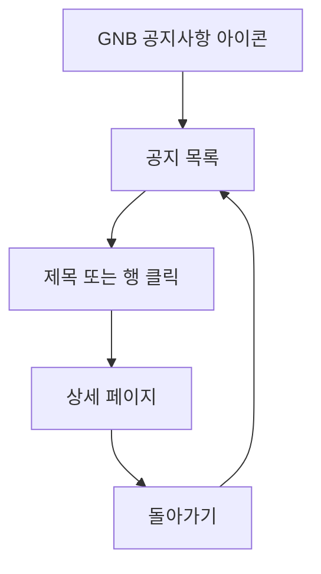
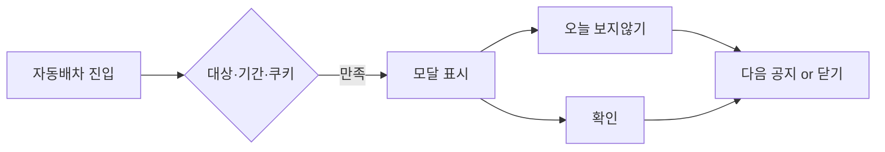

# 공지사항

## 개요

- **경로**: `/notice`, `/notice/:id`
- **진입 경로**: GNB 우측 공지사항 아이콘 → `/notice`.
- **권한**: 로그인 필요.
- **데이터 소스**: 목록·상세 모두 API 미사용. 정적 공지 데이터(프론트 하드코딩)만 사용.

## ScreenShot

## 목록

- **표시 항목**: 제목, 작성일. 고정 공지 일때 "공지" 배지 표시.
- **정렬·노출 규칙**
  - 고정 공지는 **항상 상단 고정**. 고정/일반 각각 **날짜 내림차순**.
  - 매 페이지에서 **고정 항목 + 해당 페이지의 일반 항목**만 표시.
- **행 클릭**: 제목(또는 행) 클릭 → `/notice/:id` 상세 페이지로 이동.

## 상세

- **진입**: 목록에서 제목(행) 클릭 → `/notice/:id` 페이지 전환.
- **본문 표시 분기**
  - **이미지**: 항목에 이미지가 있으면 본문 상단에 이미지 표시.
  - **본문**: `content`가 배열이면 첫 번째 요소만, 단일이면 그대로 HTML 렌더.
  - **링크**: 링크가 있으면 "링크로 이동하기" 표시, 클릭 시 새 탭으로 열기.

## User Flow

## 공지 팝업

목록/상세와 별개로, **배차계획-자동 페이지**(`/manage/order/auto`, `/manage/order/auto/unassigned`) 진입 시 조건 만족하면 화면 중앙에 모달로 자동 노출. 여러 건은 중요도 순으로 한 건씩 표시. (프론트 하드코딩)

- **노출 조건**: 진입 경로가 대상 페이지 + 오늘이 공지 표시 기간(시작일~종료일) + "오늘 하루 보지 않기" 쿠키 없음(또는 만료).
- **오늘 하루 보지 않기**: 클릭 시 해당 공지에 쿠키 저장(만료: 다음날 0시 KST). 만료 전까지 해당 공지는 팝업에서 제외.
- **확인**: 다음 공지 있으면 다음으로 전환, 마지막이면 모달만 닫기(쿠키 없음 → 다음 진입 시 다시 표시 가능).

  

---

## API

> 이 페이지는 API를 호출하지 않는다. 공지 데이터는 프론트엔드에 하드코딩된 정적 데이터를 사용한다.
