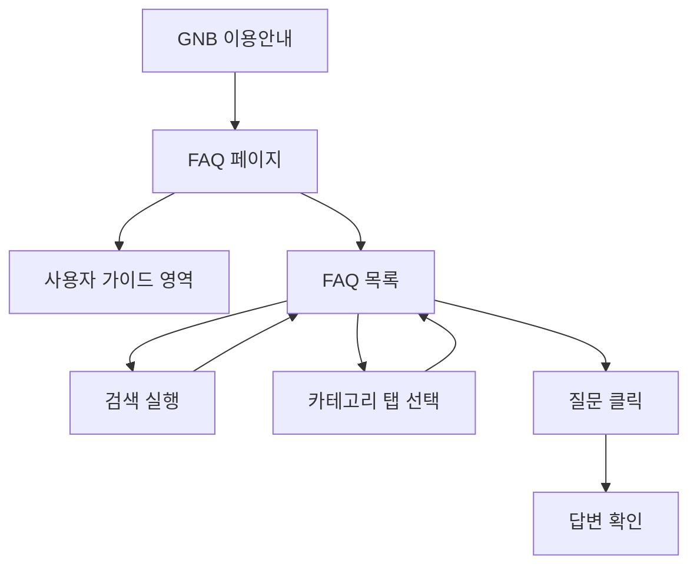

# 이용안내

## 개요

- **경로**: `/faq`
- **역할**: 상단 **사용자 가이드**(정적 카드) + 하단 **자주 묻는 질문(FAQ)** 목록·검색·카테고리 필터·아코디언 답변 보기.
- **진입 경로**: GNB 우측 이용안내(도움말) 아이콘, 툴팁 "이용안내" → `/faq` 이동.
- **권한**: 로그인 필요.

## ScreenShot

### 사용자 가이드

### 자주 묻는 질문

## 구성

- **상단**: 사용자 가이드 — 정적 카드 영역.
- **하단**: 자주 묻는 질문 — 검색 입력란, 카테고리 탭, 아코디언 목록

### 사용자 가이드

- 각 영역은 고정영역(하드코딩)으로 되어 있고, 클릭시 다운로드 받을 수 있는 파일은 백오피스에서 관리하고 있음
- 목로: 회원가입, 기본설정, 주문관리, 배차계획, 모니터링, 보고서, 메시지 관리, 앱

### 자주 묻는 질문

- 검색: 질문 키워드 입력
- FAQ 영역
  - **목록(탭) 필터**: 클라이언트에서만 적용되며 API 재요청 없음. 현재 페이지(목록/검색 결과) 데이터를 탭값으로 필터링.
  - **탭 목록**(고정): 전체, 계정, 글로벌, 기타, 차량, 매니저관리, 모니터링, 배차계획, 서비스, 설정, 요금제, 주문관리.
- 목록·아코디언: 질문(제목) + 답변(내용) + 카테고리 태그. 아코디언 형태.

## User Flow

## ETC

- 사용자 가이드 문서는 "백오피스 > 유저가이드 관리" 에서 관리됨.
- 자주 묻는 질문은 "백오피스 > FAQ 관리" 에서 관리됨.

---

## API

| 순서 | Method | Path                                                                                          | 설명                               | 트리거                    |
| ---- | ------ | --------------------------------------------------------------------------------------------- | ---------------------------------- | ------------------------- |
| 1    | GET    | [`/v2/admin/user-guide`](../../../interface/00.roouty/user-guide-v2.md#get-v2adminuser-guide) | 사용자 가이드 목록 (카드 영역)     | 페이지 진입               |
| 2    | GET    | [`/v2/faq`](../../../interface/00.roouty/faq-v2.md#get-v2faq)                                 | FAQ 목록 (page, size 페이지네이션) | 페이지 진입, 페이지 변경  |
| 3    | GET    | [`/v2/faq/search`](../../../interface/00.roouty/faq-v2.md#get-v2faqsearch)                    | FAQ 검색 (keyword, page, size)     | 검색 키워드 입력 → [검색] |
