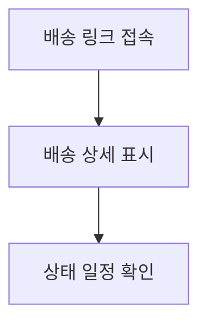

# 배송-상태(카카오톡)

## 개요

- **경로**: `/delivery/:id`
- **역할**: 배송 상태 조회. 카카오톡·이메일 등 외부 링크로 진입. GNB 없음(별도 레이아웃).
- **진입 경로**: 카카오톡·이메일 등으로 전달된 URL 클릭.
- **권한**: 인증 없이 링크만으로 접근 가능한 공개 페이지(구현에 따름).

## ScreenShot

## 구성

- 상단
  - 처리중: 도착예정시간 (완료 예정시간 -2시간 ~ 완료예정시간 +2시간), [새로고침] 버튼으로 실시간 확인
  - 처리완료: 완료시간
- 정보: 고객명, 주소, 차량
- 지도: 출발지, 도착지, 실제 주행경로(10초마다 조회 후 갱신)
- 타임라인: 출발예정(작업대기) -> 기사님 출발(이동중) -> 도착예정(이동중) -> 주문 처리 완료(처리 완료)

## User Flow

## 배송 알림톡

| 대상   | 일정확정                                                       | 방문예정                                                       | 완료예정                                                       | 완료                                                   |
| ------ | -------------------------------------------------------------- | -------------------------------------------------------------- | -------------------------------------------------------------- | ------------------------------------------------------ |
| 고객   |    |    |    |    |
| 중개사 |  |  |  |  |
| 화주사 |                                                                |                                                                |                                                                |  |

## 수신자별 알림 발송 내역

> 발송 채널: **카카오 알림톡(SendKakao) 단일 채널** — 이메일 발송 없음

### 발송

| 단계              | 트리거                 |                  고객                   |      기사      |      영업매니저       |       화주사        |
| ----------------- | ---------------------- | :-------------------------------------: | :------------: | :-------------------: | :-----------------: |
| 배차확정          | 배차저장               |          서비스 일정 확정 안내          | 경로 확정 안내 | 서비스 일정 확정 안내 |          —          |
| 출발 (processing) | 첫 기사 주행시작       | 서비스 예정 안내, 서비스 완료 예정 안내 |       —        | 서비스 완료 예정 안내 |          —          |
| 50% 배송          | 주문 완료/보류 시 집계 |                    —                    |       —        |           —           | 배차 진행상황 보고  |
| 100% 배송         | 개별 주문 완료 시      |            서비스 완료 안내             |       —        |   서비스 완료 안내    | 배차 업무 완료 보고 |

### 화주사 알림 집계 로직

- **단위**: 경로(Route) 내 화주사별 상품 기준 (개별 주문 단위 아님)
- **계산식**: `((보류 + 완료) / 전체) × 100`
- **50%**: 진행률 ≥ 50% 도달 시 1회 발송
- **100%**: 진행률 = 100% 도달 시 1회 발송
- **중복방지**: `MessageAutoHistory` 테이블에서 동일 경로/화주사 조합 발송 이력 체크

---

## API

| 순서 | Method | Path                                                                                                                                                   | 설명                                          | 트리거                                                                      |
| ---- | ------ | ------------------------------------------------------------------------------------------------------------------------------------------------------ | --------------------------------------------- | --------------------------------------------------------------------------- |
| 1    | GET    | [`/message/delivery/:encryptId`](../../../interface/00.roouty/message.md#get-messagedeliveryencryptid)                                                 | 배송 상태 조회 (주문 정보, 이력, S3 사진 URL) | 페이지 진입 (encryptId는 URL의 :id), 5분 간격 자동 refetch, [새로고침] 버튼 |
| 2    | GET    | [`/message/delivery/location/actual/:encryptId/:driverId`](../../../interface/00.roouty/message.md#get-messagedeliverylocationactualencryptiddriverid) | 기사 실주행 경로 (GeoJSON)                    | 지도 표시 (DeliveryMap 컴포넌트)                                            |
| 3    | POST   | [`/route/mapbox/usage`](../../../interface/00.roouty/route.md#post-routemapboxusage)                                                                   | Mapbox 사용량 기록 (postMapboxCount)          | 지도 로드 시 (DeliveryMap 컴포넌트)                                         |
